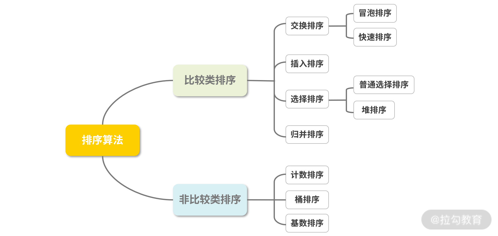

数据结构算法中排序有很多种，常见的、不常见的，至少包含十种以上。根据它们的特性，可以大致分为两种类型：比较类排序和非比较类排序。

- **比较类排序**：通过比较来决定元素间的相对次序，其时间复杂度不能突破 O(n log(n))，因此也称为非线性时间比较类排序。

- **非比较类排序**：不通过比较来决定元素间的相对次序，它可以突破基于比较排序的时间下界，以线性时间运行，因此也称为线性时间非比较类排序。

非比较类的排序在实际情况中用的比较少，故本讲主要围绕比较类排序展开讲解。其实根据排序的稳定性，也可以分为稳定排序和不稳定排序，例如快速排序就是不稳定的排序、冒泡排序就是稳定的排序。我在最后总结的部分会帮助你再次区分。
