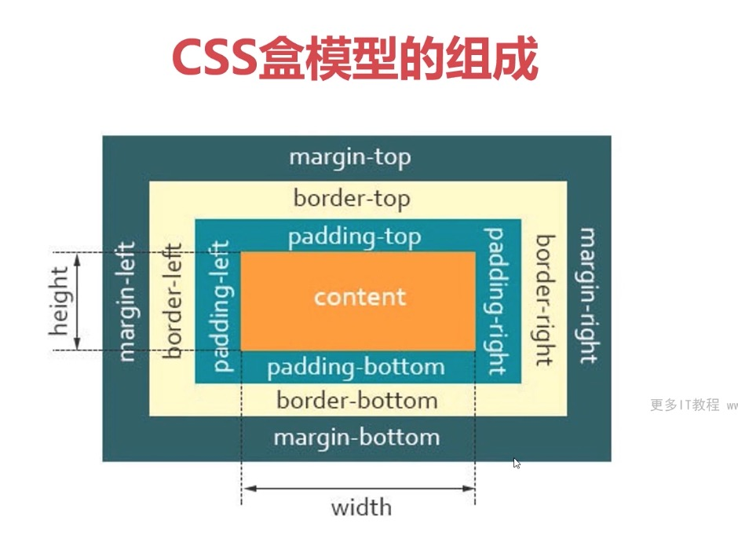

## 题目：谈一谈你对 `CSS` 盒模型的认识

专业的面试，一定会问 `CSS` 盒模型。对于这个题目，需要回答一下几个方面：

1. 基本概念：内容 `content`、内填充 `padding`、边框 `border`、外边距 `margin`。

2. 标准盒模型、`IE` 盒模型的区别。不要漏说了 `IE` 盒模型，通过这个问题，可以筛选一部分人。

3. `CSS` 如何设置这两种模型（即：如何设置某个盒子为其中一个模型）？如果回答了上面的第二条，还会继续追问这一条。

4. `JS` 如何设置、获取盒模型对应的宽和高？这一步，已经有很多人答不上来了。

5. 实例题：根据盒模型解释**边距重叠**。

前四个方面是逐渐递增，第五个方面，却鲜有人知。

6. `BFC`（边距重叠解决方案）或 `IFC`。

如果能回答第五条，就会引出第六条。`BFC` 是面试频率较高的。

**总结**：以上几点，从上到下，知识点逐渐递增，知识面从理论、`CSS`、`JS`，又回到 `CSS` 理论。

接下来，将把上面的六条，依次讲解。

## 标准盒模型和 IE 盒子模型



1. 标准盒子模型：

宽度 = 内容的宽度（content）+ border + padding + margin


2. 低版本 IE 盒子模型：

宽度 = 内容宽度（content + border + padding）+ margin


上图显示：

在 `CSS` 盒子模型 (Box Model) 规定了元素处理元素的几种方式：

- `width` 和 `height`：**内容区域（content）**的宽度、高度（不是盒子的宽度、高度）。
- `padding`：内边距。
- `border`：边框。
- `margin`：外边距。

`CSS` 盒模型和 `IE` 盒模型的区别：

- 在**标准盒子模型**中，**`width` 和 `height` 指的是内容区域（content）**的宽度和高度。增加内边距、边框和外边距不会影响内容区域（content）的尺寸，但是会增加元素框的总尺寸。

- **IE 盒子模型**中，**`width` 和 `height` 指的是`content + border + padding`**的宽度和高度。

## CSS 如何设置这两种模型

`box-sizing` 属性，用来控制元素的盒子模型的解析模式，默认为 `content-box`。

`context-box`：W3C 的标准盒子模型，设置元素的 `height/width` 属性指的是 `content` 部分的高/宽

`border-box`：IE 传统盒子模型。设置元素的 `height/width` 属性指的是 `border + padding + content` 部分的高/宽

代码如下：

```css
div.content-box {
  /* 设置当前盒子为 标准盒模型（默认） */
  box-sizing: content-box;
}

div.border-box {
  /* 设置当前盒子为 IE盒模型 */
  box-sizing: border-box;
}
```

备注：盒子默认为标准盒模型。

还可以在标签上设置 `doctype`

## JS 如何设置、获取盒模型对应的宽和高

1. 方式一：通过 DOM 节点的 style 样式获取

```javascript
element.style.width / height;
```

缺点：通过这种方式，只能获取**行内样式**，不能获取`内嵌`的样式和`外链`的样式。

这种方式有局限性，但应该了解。

2. 方式二（通用型）

```javascript
window.getComputedStyle(element).width / height;
```

方式二能兼容 Chrome、火狐。是通用型方式。

3. 方式三（IE 独有的）

```javascript
element.currentStyle.width / height;
```

和方式二相同，但这种方式只有 IE 独有。获取到的即时运行完之后的宽高（三种 css 样式都可以获取）。

4. 方式四

```javascript
element.getBoundingClientRect().width / height;
```

此 api 的作用是：获取一个元素的绝对位置。绝对位置是视窗 viewport 左上角的绝对位置。

此 api 可以拿到四个属性：left、top、width、height。

**总结：**

上面的四种方式，要求能说出来区别，以及哪个的通用型更强。

[CSS 盒模型详解（图文教程）](https://www.cnblogs.com/qianguyihao/p/7256371.html)

[CSS 盒模型之内边距、边框、外边距 十九问](https://juejin.cn/post/6880111680153059341)
