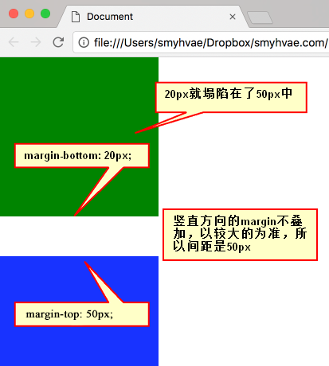
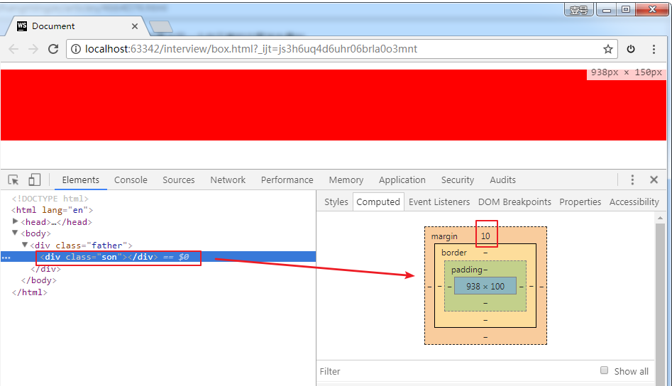
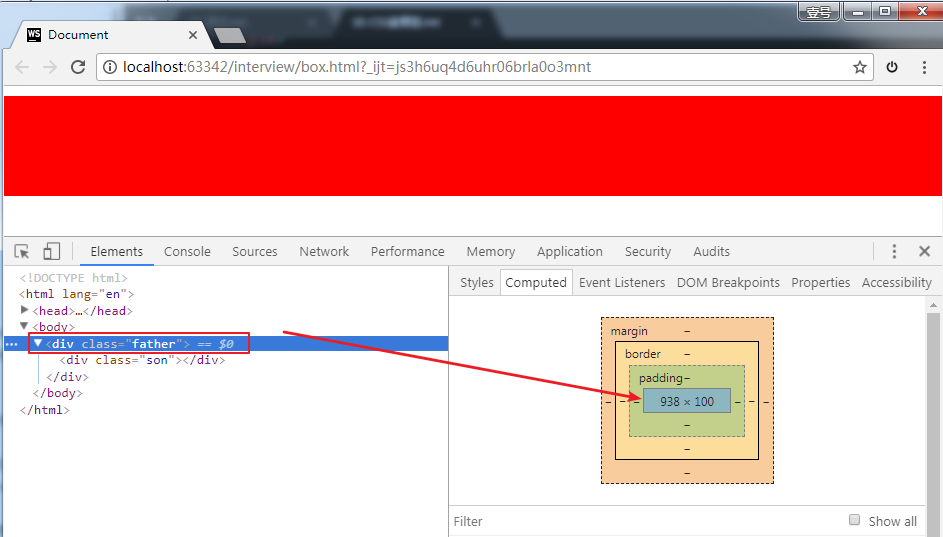
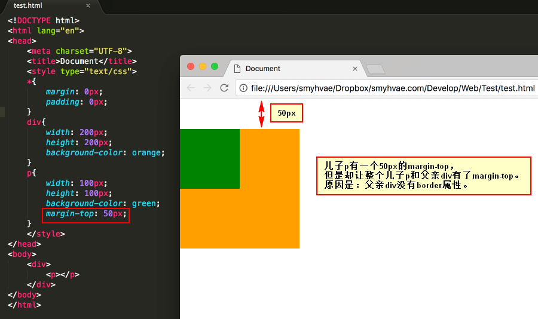
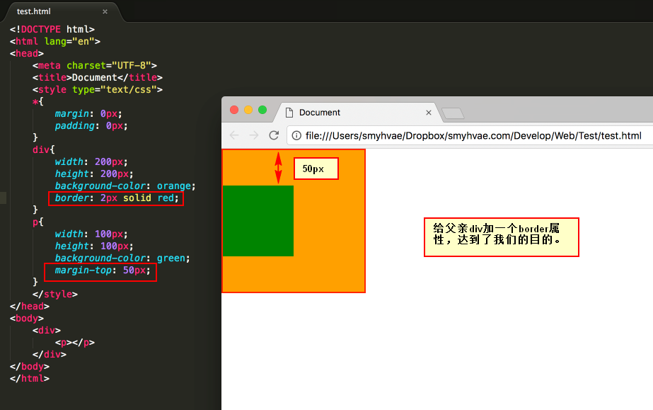

## margin 塌陷/margin 重叠

**标准文档流中，竖直方向的 margin 不叠加，只取较大的值作为 margin**(水平方向的 margin 是可以叠加的，即水平方向没有塌陷现象)。

PS：如果不在标准流，比如盒子都浮动了，那么两个盒子之间是没有 margin 重叠的现象的。

我们来看几个例子。

### 兄弟元素之间

如下图所示：



### 子元素和父元素之间

```html
<!DOCTYPE html>
<html lang="en">
  <head>
    <meta charset="UTF-8" />
    <title>Document</title>
    <style>
      * {
        margin: 0;
        padding: 0;
      }

      .father {
        background: green;
      }

      /* 给儿子设置margin-top为10像素 */
      .son {
        height: 100px;
        margin-top: 10px;
        background: red;
      }
    </style>
  </head>
  <body>
    <div class="father">
      <div class="son"></div>
    </div>
  </body>
</html>
```

上面的代码中，儿子的 height 是 100px，magin-top 是 10px。注意，此时父亲的 height 是 100，而不是 110。因为儿子和父亲在竖直方向上，共一个 margin。

儿子这个盒子：



父亲这个盒子：



上方代码中，如果我们给父亲设置一个属性：`overflow: hidden`，就可以避免这个问题，此时父亲的高度是 110px，这个用到的就是 BFC（下一段讲解）。

### 善于使用父亲的 padding，而不是儿子的 margin

> 其实，这一小段讲的内容与上一小段相同，都是讲父子之间的 margin 重叠。

我们来看一个奇怪的现象。现在有下面这样一个结构：（div 中放一个 p）

```
	<div>
		<p></p>
	</div>
```

上面的结构中，我们尝试通过给儿子`p`一个`margin-top:50px;`的属性，让其与父亲保持 50px 的上边距。结果却看到了下面的奇怪的现象：



此时我们给父亲 div 加一个 border 属性，就正常了：



如果父亲没有 border，那么儿子的 margin 实际上踹的是“流”，踹的是这“行”。所以，父亲整体也掉下来了。

**margin 这个属性，本质上描述的是兄弟和兄弟之间的距离； 最好不要用这个 marign 表达父子之间的距离。**

所以，如果要表达父子之间的距离，我们一定要善于使用父亲的 padding，而不是儿子的 margin。

## 盒模型的外边距合并（ `margin` 的折叠）

折叠都是垂直方向的折叠，水平方向不存在折叠。

标准模式下，上下兄弟的块级元素，`margin` 会以最大的间距重叠。父子组件之间没有间隙 ( `padding` 或者 `border` )，没有空余内容，且同时具有 `margin` 值会触发外边距合并以最大的间距在垂直方向折叠。

外边距合并规则：

- 浮动的盒模型不会 `margin` 折叠

- 设置定位的盒模型不会 `margin` 折叠

- 行内块级元素的盒模型不会 `margin` 折叠

- 兄弟元素盒模型有间隙不会 `margin` 折叠

- 父级盒模型，子级盒模型有间隙、浮动不会 `margin` 折叠

- `height` 为 `auto`、`min-height`为 0 的块级盒模型，和它的最后一个没有 `border` 和 `padding` 的子级盒模型低边距折叠，且子级盒模型的底部外边距和被清除浮动上边距有间隙不折叠

- 如果 `min-height` 为 0 ，上下 `border`、上下 `padding` 都为 0 ，`height` 为 0 或者 auto ，且没有行内盒模型，它的子级盒模型都会折叠

- 创建 BFC 与子级盒模型不折叠

总结：

- 同为正值，取较大值为两者间距

- 一正一负，正负相加为间距；结果为负值两者部分重合

- 同为负值，两者重合，且重合部分为绝对值大者

## margin 负值问题

- margin-top 和 margin-left 负值，元素向上、向左移动

- margin-right 负值，右侧元素向左移，自身不受影响

- margin-bottom 负值，下方元素向上移，自身不受影响
