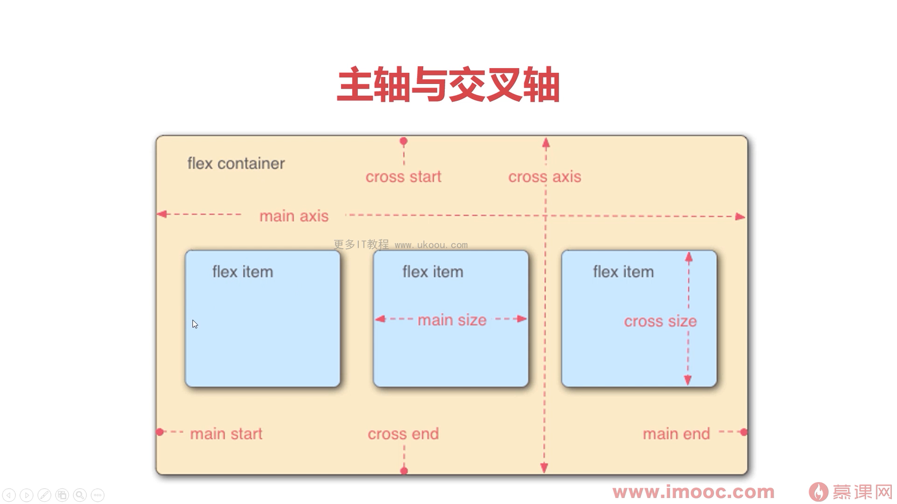

## Flex 布局是什么？

Flex 是 Flexible Box 的缩写，意为"弹性布局"，用来为盒状模型提供最大的灵活性。

弹性盒子是一种用于按行或者按列布局元素的一维布局方法。元素可以膨胀以填充额外的空间，收缩以适应更小的空间。

该布局模型的目的是提供一种更加高效的方式来对容器中的条目进行布局、对齐和分配空间。在传统的布局方式中，`block` 布局是把块在垂直方向从上到下依次排列的；而 `inline` 布局则是在水平方向来排列。弹性盒子布局并没有这样内在的方向限制，可以由开发人员自由操作。

适用场景：弹性布局适合于移动前端开发，在 `Android` 和 `IOS` 上也完美支持。

注意，设为 Flex 布局以后，子元素的 float、clear 和 vertical-align 属性将失效。

## 主轴与交叉轴



## flex 容器

1. 属性

- `flex-direction` 改变轴方向 属性值 `row`（默认）/ `row-reverse` / `column` / `column-reveres`

- `flex-wrap` 换行与缩写 属性值 `nowrap`（默认）/ `wrap` / `wrap-reverese`

- `flex-flow` = `flex-direction` + `flex-wrap`

- `justify-content` 主轴对齐 属性值 `flex-start`（默认）/ `flex-end` / `center` / `space-around` / `space-between` / `space-evenly`

- `align-content` 交叉轴对齐，没有折行时不生效 属性值 `stretch`（默认）/ `flex-start` / `flex-end` / `center` / `space-around` / `space-between` / `space-evenly`

- `align-items` 每行之内的对齐方式 属性值 `stretch`（默认）/ `flex-start` / `flex-end` / `center` / `baseline`

2.  应用

- 1. 内联与块的上下左右居中布局

```html
<style>
  .box {
    width: 500px;
    height: 500px;
    background: skyblue;
    display: flex;
    justify-content: center;
    align-items: center;
  }
  .box div {
    width: 200px;
    height: 200px;
    background: pink;
  }
</style>

<div class="box">
  <div>1</div>
  <div>2</div>
  <div>3</div>
</div>
```

- 2. 不定项居中布局 —— 轮播图底部小圆点

```html
<style>
  .box {
    width: 500px;
    height: 500px;
    background: skyblue;
    display: flex;
    justify-content: center;
    align-items: flex-end;
  }
  .box div {
    width: 20px;
    height: 20px;
    background: pink;
    border-radius: 50%;
    margin: 10px;
  }
</style>

<div class="box">
  <div></div>
  <div></div>
  <div></div>
</div>
```

- 3. 均分列布局 —— 微信底部菜单

```html
<style>
  .box {
    width: 500px;
    height: 500px;
    background: skyblue;
    display: flex;
    justify-content: space-between;
    align-items: flex-end;
  }
  .box div {
    width: 20px;
    height: 20px;
    background: pink;
    border-radius: 50%;
    margin: 10px;
  }
</style>

<div class="box">
  <div></div>
  <div></div>
  <div></div>
</div>
```

- 4. 子项分组布局 —— 顶部导航左右分组

```html
<style>
  .box {
    width: 500px;
    height: 500px;
    background: skyblue;
    display: flex;
    align-items: flex-end;
  }
  .box div {
    width: 50px;
    height: 100px;
    background: pink;
    margin-right: 10px;
  }
  /* 第几个开始分组，就加 margin: auto; */
  .box div:nth-of-type(1) {
    margin-right: auto;
  }
</style>

<div class="box">
  <div>1</div>
  <div>2</div>
  <div>3</div>
</div>
```

## flex 子项

1. 属性

- `flex-grow` 扩展比例 属性值默认是 0，表示不占用剩余的空白间隙扩展自己的宽度。不可为负数。
  实际宽度 = 自身宽度 + 剩余宽度 \* 扩展比例
  如果比例大于等于 1， 就占满剩余的所有空间。
  如果比例小于 1，还会有剩余空间。
  多个子项按比例进行分配。

- `flex-shrink` 收缩比例 属性值默认是 1，自动收缩，跟容器大小相同。
  小于 1 时，溢出部分按比例收缩。0 时为自身大小，不收缩。
  多个子项按比例进行分配：
  默认为 1 时：实际宽度 = 自身宽度 - 自身宽度 / 所有子项宽度 _ 溢出宽度
  各个子项设置大于 1 时：实际宽度 = 自身宽度 - (自身宽度 _ 收缩比例) / (子项宽度 _ 子项收缩比例 的和) _ 溢出宽度

- `flex-basis` 默认值是 auto，指定了 flex 元素在主轴方向上的初始大小，优先级大于主轴大小。

- `flex` = `flex-grow` + `flex-shrink` + `flex-basis`

- `order` 默认值是 0，改变某一个 `flex` 子项的排序位置

- `align-self` 默认值是 `auto`，控制单独某一个 flex 子项的垂直对齐方式

2. 应用

- 1. 等高布局

```html
<style>
  .main {
    width: 500px;
    background: skyblue;
    display: flex;
    justify-content: space-between;
  }

  .main div {
    width: 100px;
    background: pink;
  }
</style>

<div class="main">
  <div>
    <p>测试内容</p>
    <p>测试内容</p>
    <p>测试内容</p>
    <p>测试内容</p>
    <p>测试内容</p>
  </div>
  <div>
    <p>测试内容</p>
  </div>
</div>
```

- 2. 两列与三列布局

```html
<style>
  body {
    margin: 0;
  }
  .main {
    width: 100vh;
    background: skyblue;
    display: flex;
  }
  .col1 {
    width: 200px;
    background: pink;
  }
  .col2 {
    flex-grow: 1;
    background: springgreen;
  }
  .col2 {
    width: 200px;
    background: tomato;
  }
</style>

<div class="main">
  <div class="col1"></div>
  <div class="col2"></div>
  <div class="col3"></div>
</div>
```

- 3. Sticky Footer 布局

这种布局将页面分成上、中、下三个部分，上、下部分都为固定高度，中间部分高度不定。当页面高度小于浏览器高度时，下部分应固定在屏幕底部；当页面高度超出浏览器高度时，下部分应该随中间部分被撑开，显示在页面最底部。

```html
<style>
  body {
    margin: 0;
  }
  .main {
    min-height: 100vh;
    background: skyblue;
    display: flex;
    flex-direction: column;
  }
  .main .header {
    height: 100px;
    background: pink;
  }
  .main .content {
    flex-grow: 1;
    background: springgreen;
  }
  .main .footer {
    height: 100px;
    background: tomato;
  }
</style>

<div class="main">
  <div class="header"></div>
  <div class="content"></div>
  <div class="footer"></div>
</div>
```

- 4. 溢出项布局 —— 顶部菜单右滑

```html
<style>
  body {
    margin: 0;
  }
  .main {
    height: 100px;
    background: skyblue;
    display: flex;
    align-items: center;
  }
  .main div {
    height: 50px;
    width: 70px
    background: pink;
    margin: 0 10px;
    flex-shrink: 0;
  }
</style>

<div class="main">
  <div></div>
  <div></div>
  <div></div>
  <div></div>
  <div></div>
</div>
```

[Flexbox 布局中不为人知的细节](https://juejin.cn/post/6938292463605907492)
