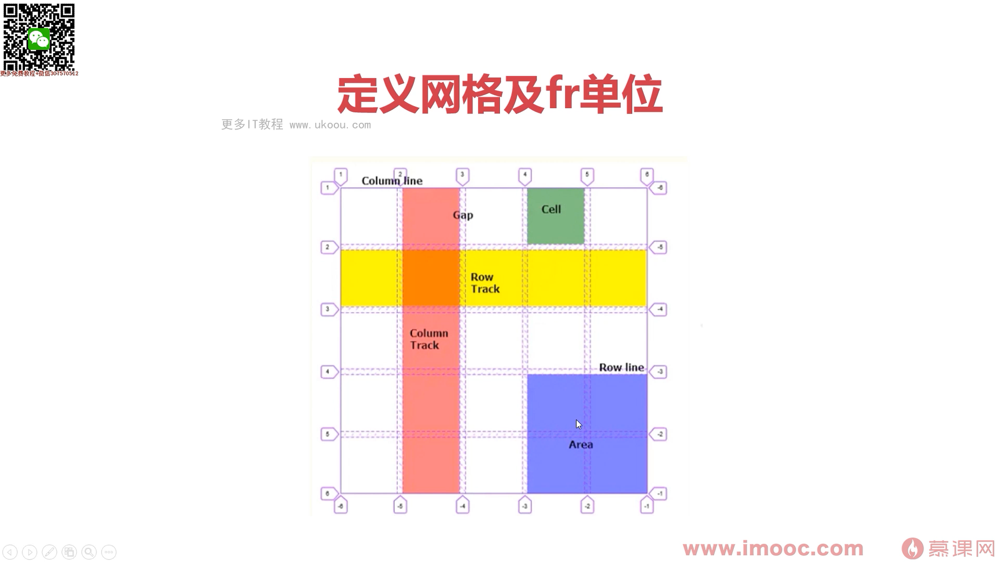

`Grid` 网格是一种用于 web 的二维布局系统。利用网格，可以把内容按照行与列的格式进行排版。另外，网格还可以非常轻松的实现一些复杂的布局。

## `Grid` 容器

[grid-MDN](https://developer.mozilla.org/zh-CN/docs/Web/CSS/grid)

[最强大的 CSS 布局 —— Grid 布局](https://juejin.cn/post/6854573220306255880)

[精读《用 css grid 重新思考布局》](https://github.com/ascoders/weekly/blob/master/%E5%89%8D%E6%B2%BF%E6%8A%80%E6%9C%AF/124.%E7%B2%BE%E8%AF%BB%E3%80%8A%E7%94%A8%20css%20grid%20%E9%87%8D%E6%96%B0%E6%80%9D%E8%80%83%E5%B8%83%E5%B1%80%E3%80%8B.md)
