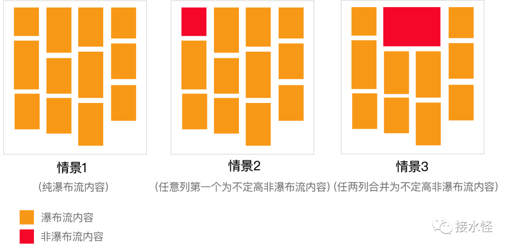
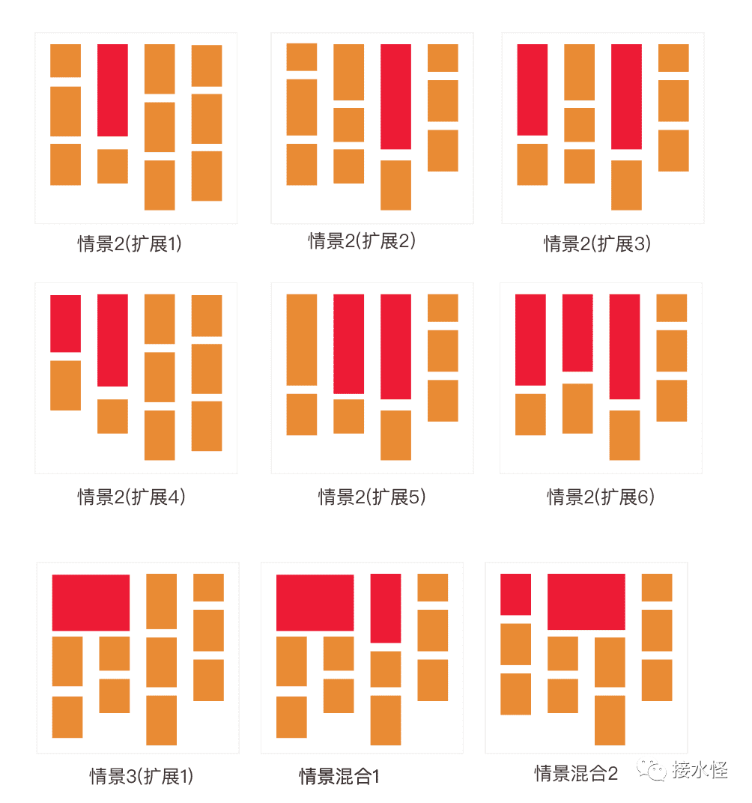

## 瀑布流是什么

瀑布流, 又称瀑布流式布局。是比较流行的一种网站页面布局，视觉表现为宽度相等高度不定的元素组成的参差不齐的多栏布局，随着页面向下滚动，新的元素附加到最短的一列而不断向下加载。

## 瀑布流的实现原理

寻找各列之中高度最小者，并将新的元素添加到该列上，然后继续寻找所有列的高度最小者，继续添加到高度最小列上，一直到所有元素均按要求排列完成为止。

第一排元素的顶部会处于同一个高度，依次排列在顶端，第一排排满之后，后面的元素放在最短的一列进行排列。以此类推。

瀑布流滑动的时候会不停的出现新的东西，吸引你不断向下探索，巧妙的利用视觉层级，视线的任意流动来缓解视觉的疲劳，采用这种方案可以延长用户停留视觉，提高用户粘度，适合那些随意浏览，不带目的性的使用场景，就像逛街一样，边走边看，所以比较适合图片、商品、资讯类的场景，很多电商相关的网站都使用了瀑布流进行承载。


上图效果是在基础瀑布流的基础上做了扩展改造, 在瀑布流顶部某一列或某几列插入其他非瀑布流内容。本文将介绍这种扩展瀑布流的四列实现场景，适用基础场景如下：



## 瀑布流的的实现有哪些问题&如何解决

- 非瀑布流内容如何插入？
- 如何寻找所有列的高度最小者？
- 如何渲染瀑布流？

1. 技术选型

采用 Vue 框架来实现瀑布流，其一些自带属性使我们的瀑布流实现更加简单。

- 通过 ref 可以很方便的获取每列高度。通过比较算法算出高度最小列。

- 拿到高度最小列之后，将下个要插入的元素数据放到最小列的数据列表（columnList\*）中，通过操作数据完成元素渲染。

- 利用 Vue 的具名插槽在瀑布流顶部插入其他非瀑布内容。

- 通过 watch 监测元素渲染，判断是否继续进行渲染和请求更多元素数据。

2. 非瀑布流内容如何插入

通过 Vue 的具名插槽（slot）,将非瀑布流元素作为父组件的内容传递给瀑布流子组件。

- 父组件通过 HTML 模板上的槽属性关联具名插槽，非瀑布流内容作为具名插槽的内容提供给子组件。

- 具名插槽有：first-col、second-col、 third-col、 last-col、 merge-slot 分别代表第一、二、三、四、合并列。

- 子组件通过插槽名字判断将非瀑布流内容放在哪一列。如果插槽存在,则将其所携带的内容插入到置顶位置。

- 因为合并列的特殊性，如果包含合并列，则将合并列绝对定位到顶部，合并列占的瀑布流对应的列进行下移，父组件传合并列相关的参数给子组件：merge(判断是否包含合并列), mergeHeight(合并列的高度)，mergeColunms(合并的是哪 2 列)。

```html
<!-- 父组件 -->
<div class="parent">
  <Waterfall :merge="true" :mergeHeight="800" mergeColumns="[2,3]">
    <template slot="first-col">
      <!-- 一列内容 -->
    </template>
    <template slot="merge-col">
      <!-- 合并内容 -->
    </template>
  </Waterfall>
</div>
<!-- 子组件（waterfall） -->
<div class="child">
  <!-- 第一列 -->
  <div
    ref="column1"
    :style="{marginTop: merge && mergeColumns.indexOf(1) > -1 ? mergeHeight + 'px':''}"
  >
    <template v-if="$slots['first-col']">
      <slot name="first-col"></slot>
    </template>
    <template v-for="(item, index) in columnList1">
      <!-- 一列瀑布流内容 -->
    </template>
  </div>
  <!-- 合并块非瀑布流内容 -->
  <div
    class="column-merge"
    v-if="merge"
    :style="{left: (mergeColumns[0] - 1)*330 + 'px'}"
  >
    <slot name="merge-col"></slot>
  </div>
</div>
```

3. 如何寻找所有列的高度最小者

每一列都定义一个ref，通过ref获取当前列的高度，如果该列上方有合并块，则高度要加上合并块的高度，然后比较4列高度取到最小高度，再通过最小高度算出其对应的列数。

```javascript
// 通过ref获取每列高度，column1，column2，column3，column4分别代表第一、二、三、四列
let columsHeight = [this.$refs.column1.offsetHeight, this.$refs.column2.offsetHeight, this.$refs.column3.offsetHeight, this.$refs.column4.offsetHeight]

// 如果包含合并块, 则更新高度,合并块下的列高要增加合并块的高度
if (this.merge) {
  // 如果有合并列，则合并列下的列高度要加合并内容的高度。
  columsHeight[0] = this.mergeColumns.indexOf(1) > -1 ? columsHeight[0] + this.mergeHeight : columsHeight[0];
  columsHeight[1] = this.mergeColumns.indexOf(2) > -1 ? columsHeight[1] + this.mergeHeight : columsHeight[1];
}

// 获取各列最小高度
let minHeight = Math.min.apply(null, columsHeight);

// 通过最小高度,得到第几列高度最小
this.getMinhIndex(columsHeight, minHeight).then(minIndex => {
  // 渲染加载逻辑
});

// 获取高度最小索引函数
getMinhIndex (arr, value) {
  return new Promise((reslove) => {
    let minIndex = 0;
    for(let i in arr){
      if(arr[i] == value){
        minIndex = i;
        reslove(minIndex);
      }
    }
  });
}
```

4. 如何渲染瀑布流

瀑布流常用在无限下拉加载或者加载数据量很大,且包含很多图片元素的情景，所以通常不会一次性拿到所有数据，也不会一次性将拿到的数据全部渲染到页面上, 否则容易造成页面卡顿影响用户体验, 所以何时进行渲染、何时继续请求数据就很关键。

**何时渲染**

选择渲染的区域为滚动高度+可视区域高度的1.5倍，即可以防止用户滚动到底部的时候白屏，也可以防止渲染过多影响用户体验。如果：最小列的高度 - 滚 动高度 < 可视区域高*1.5 则继续渲染元素，否则不再继续渲染。

**何时请求数据**

当已渲染的元素+可视区域可以展示的预估元素个数大于已请求到的个数的时候才去继续请求更多数据，防止请求浪费。如果：已加载的元素个数 + 一屏可以展示的元素预估个数 > 所有请求拿到的元素个数 则触发下一次请求去获取更多数据。

**瀑布流渲染核心思路**

- 监测滚动，判断是否符合渲染条件，如果符合条件则开始渲染。

- 定义一个渲染索引renderIndex, 每渲染一个元素则renderIndex+1, 实时监测renderIndex的变化, 判断是否符合渲染和数据请求条件。

- 拿到最小高度列索引后，将下一个元素插入到该列中，并触发renderIndex+1进行下一轮渲染判断。

```javascript
data(){
  return{
    columnList1: [], // 第一列元素列表
    columnList2: [],
    renderIndex: -1, // 渲染第几个item
    isRendering: false, // 是否正在渲染
    itemList: [], // 所有元素列表
    isEnd: false
  };
}

watch:{
  renderIndex(value){
    // 当前滚动条高度
    const scrollTop = document.documentElement.scrollTop || window.pageYOffset || document.body.scrollTop;

    // 最小列高度 - 滚动高度 < 可视区域高的的1.5倍
    if(renderMinTop - scrollTop < winHeight*1.5){
      this.renderWaterfall();
    }

    // 已加载的元素个数 + 一屏可以展示元素预估个数 > 所有请求拿到的元素个数
    if(loadedItemNum + canShowItemNum > this.itemList.length && !this._requesting && !this.isEnd){
      // 请求瀑布流数据
      this.getData();
    }
  }
}


scroll () {
  // 当前滚动条高度
  const scrollTop = document.documentElement.scrollTop || window.pageYOffset || document.body.scrollTop;

  // 底部检测高度
  const bottomDetectionTop = this.$refs.bottomDetection.offsetTop;

  const tempLastScrollTop = lastScrollTop; // lastScrollTop:上次一滚动高度
  lastScrollTop = scrollTop;

  if (tempLastScrollTop === -1) {
    this.renderWaterfall();
  }

  // 如果是向下滚动则判断是否需要继续渲染
  if (scrollTop > tempLastScrollTop) {
    if(bottomDetectionTop - tempLastScrollTop < winHeight*1.5 && !this.isRendering) {
      this.renderWaterfall();
    }
  }
}

renderWaterfall(){
  // 如果还没有数据、所有数据已经渲染完成、正在渲染则不进行渲染计算操作
  if (this.itemList.length === 0 || this.renderIndex >= this.itemList.length - 1 || this.isRendering) {
    if (this.renderIndex === this.feedList.length - 1 && !this._requesting && !this.isEnd) {
      this.getData();
    }

    return;
  }
  this.isRendering = true;

  // 获取最小高度
  this.getMinhIndex(columnsHeight, minHeight).then(minIndex => {
    const key = `columnList${minIndex + 1}`;
    let itemData = this.itemList[this.renderIndex + 1];
    this[key] = this[key].concat(itemData);

    this.$nextTick(() => {
      this.renderIndex = this.renderIndex + 1;
      this.isRendering = false;
    });
  });
}
```

## 可扩展使用场景

为了灵活使用瀑布流，在设计的时候就做好了扩展准备，通过HTML模板代码可以看出来，具名插槽的内容可以放在任意列，并没有限制死，所以可以扩展使用到以下各个场景。




[解析图片的瀑布流（含懒加载）原理，并搭配服务端交互数据](https://juejin.cn/post/7012924144618569764)

[纯 CSS 实现瀑布流布局](https://blog.csdn.net/luviawu/article/details/70313096)
