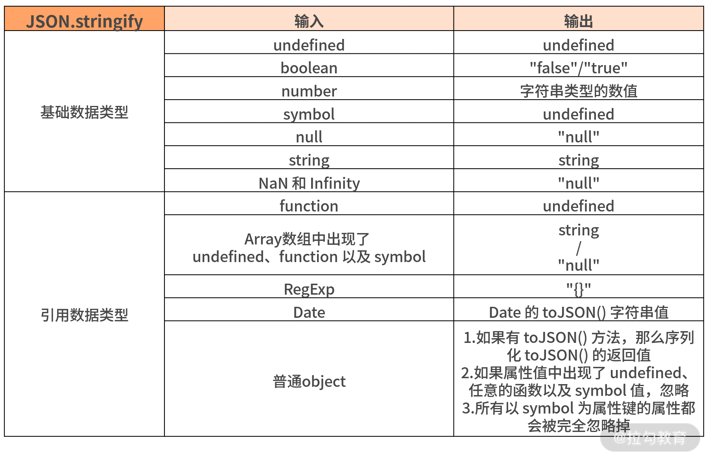

`JSON.stringify` 方法能够站在全局考察对 JS 各种数据类型理解的深度，对各种极端的边界情况处理能力，以及 JS 的编码能力。

## 方法基本介绍

JSON 对象包含两个方法：一是用于解析成 JSON 对象的 `parse`；二是用于将对象转换为 JSON 字符串方法的 `stringify`。

### `JSON.parse`

`JSON.parse` 方法用来解析 JSON 字符串，构造由字符串描述的 JavaScript 值或对象。

```javaScript
/**
 * @param text    必选参数，要转换的对象
 * @param reviver 可选参数，函数，用在返回之前对所得到的对象执行变换操作
 * */ 
JSON.parse(text[, reviver])
```

`reviver` 参数的用法，如下所示。

```javaScript
JSON.parse('{"p": 5}', function (k, v) {
    if(k === '') return v;     // 如果k不是空，
    return v * 2;              // 就将属性值变为原来的2倍返回
});                            // { p: 10 }
```

### `JSON.stringify`

`JSON.stringify` 方法是将一个 JavaScript 对象或值转换为 JSON 字符串。

```javaScript
/**
 * @param value    必选参数，需要解析处理的 JSON 字符串
 * @param replacer 可选参数，函数，比如指定的 replacer 是数组，则可选择性地仅处理包含数组指定的属性
 * @param space    可选参数，用来控制结果字符串里面的间距 
 * */ 
JSON.stringify(value[, replacer [, space]])
```

下面通过一段代码来看看后面几个参数的妙用，如下所示。

```javaScript
JSON.stringify({ x: 1, y: 2 });
// "{"x":1,"y":2}"

JSON.stringify({ x: [10, undefined, function(){}, Symbol('')] })
// "{"x":[10,null,null,null]}"

/* 第二个参数的例子 */
function replacer(key, value) {
  if (typeof value === "string") {
    return undefined;
  }
  return value;
}
var foo = {foundation: "Mozilla", model: "box", week: 4, transport: "car", month: 7};
var jsonString = JSON.stringify(foo, replacer);
console.log(jsonString);
// "{"week":4,"month":7}"

/* 第三个参数的例子 */
JSON.stringify({ a: 2 }, null, " ");
// '{\n "a": 2\n}'
/* "{
 "a": 2
}"*/

JSON.stringify({ a: 2 }, null, "");
// '{"a":2}'
```



特殊情况需要注意：对于包含循环引用的对象执行此方法，会抛出错误。

## 代码逻辑实现

先利用 `typeof` 把基础数据类型和引用数据类型分开，分开之后再根据不同情况来分别处理不同的情况，按照这个逻辑代码实现如下。

```javaScript
function jsonStringify(data) {
  let type = typeof data;

  if(type !== 'object') {
    let result = data;
    //data 可能是基础数据类型的情况在这里处理
    if (Number.isNaN(data) || data === Infinity || data === -Infinity) {
       //NaN 和 Infinity 序列化返回 "null"
       result = "null";
    } else if (type === 'function' || type === 'undefined' || type === 'symbol') {
      // 由于 function 序列化返回 undefined，因此和 undefined、symbol 一起处理
       return undefined;
    } else if (type === 'string') {
       result = '"' + data + '"';
    }
    return String(result);
  } else if (type === 'object') {
     if (data === null) {
        return "null"
     } else if (data.toJSON && typeof data.toJSON === 'function') {
        return jsonStringify(data.toJSON());
     } else if (data instanceof Array) {
        let result = [];
        //如果是数组，那么数组里面的每一项类型又有可能是多样的
        data.forEach((item, index) => {
        if (typeof item === 'undefined' || typeof item === 'function' || typeof item === 'symbol') {
               result[index] = "null";
           } else {
               result[index] = jsonStringify(item);
           }
         });
         result = "[" + result + "]";
        //  把里面的单引号全局处理成双引号，统一一下返回的字符串 result 结果
         return result.replace(/'/g, '"');
      } else {
         // 处理普通对象
         let result = [];
         Object.keys(data).forEach((item, index) => {
            if (typeof item !== 'symbol') {
              //key 如果是 symbol 对象，忽略
              if (data[item] !== undefined && typeof data[item] !== 'function' && typeof data[item] !== 'symbol') {
                //键值如果是 undefined、function、symbol 为属性值，忽略
                result.push('"' + item + '"' + ":" + jsonStringify(data[item]));
              }
            }
         });
         return ("{" + result + "}").replace(/'/g, '"');
        }
    }
}
```

手工实现一个 `JSON.stringify` 方法的基本代码如上面所示，有几个问题还是需要注意一下：

1. 由于 `function` 返回 'null'， 并且 `typeof function` 能直接返回精确的判断，故在整体逻辑处理基础数据类型的时候，会随着 `undefined`，`symbol` 直接处理了；

2. 由于 `typeof null` 的时候返回 'object'，故 `null` 的判断逻辑整体在处理引用数据类型的逻辑里面；

3. 关于引用数据类型中的数组，由于数组的每一项的数据类型又有很多的可能性，故在处理数组过程中又将 `undefined`，`symbol`，`function` 作为数组其中一项的情况做了特殊处理；

4. 同样在最后处理普通对象的时候，`key` （键值）也存在和数组一样的问题，故又需要再针对上面这几种情况（`undefined`，`symbol`，`function`）做特殊处理；

5. 最后在处理普通对象过程中，对于循环引用的问题暂未做检测，如果是有循环引用的情况，需要抛出 `Error`；

6. 根据官方给出的 `JSON.stringify` 的第二个以及第三个参数的实现，本段模拟实现的代码并未实现。

整体来说这段代码还是比较复杂的，如果在面试过程中让你当场手写，其实整体还是需要考虑很多东西的。当然上面的代码根据每个人的思路不同，你也可以写出自己认为更优的代码，比如你也可以尝试直接使用 `switch` 语句，来分别针对特殊情况进行处理，整体写出来可能看起来会比上面的写法更清晰一些，这些可以根据自己情况而定。
