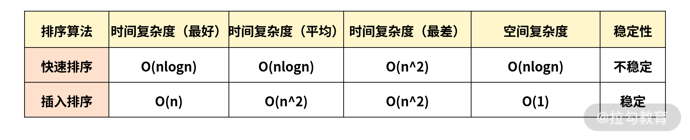

## sort 方法的基本使用

sort 方法是用原地算法对对数组元素进行排序，默认排序顺序是先将元素转换为字符串，然后再进行排序。

```javaScript
/**
 * @param compareFunction 可选 用来指定按某种顺序进行排列的函数。
 *        @param firstEl  第一个用于比较的元素。
 *        @param secondEl 第二个用于比较的元素。
 * */
Array.prototype.sort([compareFunction])
```

如果没有指明 `compareFunction` ，那么元素会按照转换为的字符串的诸个字符的 Unicode 位点进行排序。例如 "Banana" 会被排列到 "cherry" 之前。当数字按由小到大排序时，9 出现在 80 之前，但因为（没有指明 compareFunction），比较的数字会先被转换为字符串，所以在 Unicode 顺序上 "80" 要比 "9" 要靠前。

如果指明了 `compareFunction` ，那么数组会按照调用该函数的返回值排序。即 a 和 b 是两个将要被比较的元素：

- 如果 `compareFunction(a, b)` 小于 0 ，那么 a 会被排列到 b 之前；

- 如果 `compareFunction(a, b)` 等于 0 ， a 和 b 的相对位置不变。

- 如果 `compareFunction(a, b)` 大于 0 ， b 会被排列到 a 之前。

- `compareFunction(a, b)` 必须总是对相同的输入返回相同的比较结果，否则排序的结果将是不确定的。

## sort 方法的底层实现

sort 方法在 V8 内部相较于其他方法而言是一个比较难的算法，对于很多边界情况结合排序算法做了反复的优化，这里不直接拿源码来讲，而是根据源码的思路，循序善诱地实现一个跟引擎性能类似的排序算法，并且一步步拆解其中的奥秘。

需要插入排序和快速排序的相关知识。

### 底层 sort 源码分析

先大概来梳理一下源码中排序的思路（下面的源码均来自 V8 源码中关于 sort 排序的摘要，地址：[V8 源码 sort 排序部分](https://github.com/v8/v8/blob/98d735069d0937f367852ed968a33210ceb527c2/src/js/array.js#L709)）。

通过研究源码先直接看一下结论，如果要排序的元素个数是 n 的时候，那么就会有以下几种情况：

1. 当 n<=10 时，采用插入排序；

2. 当 n>10 时，采用三路快速排序；

3. 10<n <=1000，采用中位数作为哨兵元素；

4. n>1000，每隔 200~215 个元素挑出一个元素，放到一个新数组中，然后对它排序，找到中间位置的数，以此作为中位数。

在得出这个结论之前，我觉得有必要让你了解为什么这么做。下面就一起来思考两个问题。

**1. 为什么元素个数少的时候要采用插入排序？**

虽然插入排序理论上是平均时间复杂度为 O(n^2) 的算法，快速排序是一个平均 O(nlogn) 级别的算法。但是别忘了，这只是理论上平均的时间复杂度估算，但是它们也有最好的时间复杂度情况，而插入排序在最好的情况下时间复杂度是 O(n)。

在实际情况中两者的算法复杂度前面都会有一个系数，当 n 足够小的时候，快速排序 nlogn 的优势会越来越小。倘若插入排序的 n 足够小，那么就会超过快排。而事实上正是如此，插入排序经过优化以后，对于小数据集的排序会有非常优越的性能，很多时候甚至会超过快排。因此，对于很小的数据量，应用插入排序是一个非常不错的选择。

**2. 为什么要花这么大的力气选择哨兵元素？**

因为快速排序的性能瓶颈在于递归的深度，最坏的情况是每次的哨兵都是最小元素或者最大元素，那么进行 partition（一边是小于哨兵的元素，另一边是大于哨兵的元素）时，就会有一边是空的。如果这么排下去，递归的层数就达到了 n , 而每一层的复杂度是 O(n)，因此快排这时候会退化成 O(n^2) 级别。

这种情况是要尽力避免的，那么如何来避免？就是让哨兵元素尽可能地处于数组的中间位置，让最大或者最小的情况尽可能少。这时候，你就能理解 V8 里面所做的各种优化了。

接下来，我们看一下官方实现的 sort 排序算法的代码基本结构。

```javaScript
function ArraySort(comparefn) {
	  CHECK_OBJECT_COERCIBLE(this,"Array.prototype.sort");
	  var array = TO_OBJECT(this);
	  var length = TO_LENGTH(array.length);
	  return InnerArraySort(array, length, comparefn);
}
function InnerArraySort(array, length, comparefn) {
  // 比较函数未传入
  if (!IS_CALLABLE(comparefn)) {
	    comparefn = function (x, y) {
	      if (x === y) return 0;
	      if (%_IsSmi(x) && %_IsSmi(y)) {
	        return %SmiLexicographicCompare(x, y);
	      }
	      x = TO_STRING(x);
	      y = TO_STRING(y);
	      if (x == y) return 0;
	      else return x < y ? -1 : 1;
	 };
  }
  function InsertionSort(a, from, to) {
    // 插入排序
    for (var i = from + 1; i < to; i++) {
	      var element = a[i];
	      for (var j = i - 1; j >= from; j--) {
	        var tmp = a[j];
	        var order = comparefn(tmp, element);
	        if (order > 0) {
	          a[j + 1] = tmp;
	        } else {
	          break;
	        }
	      }
	    a[j + 1] = element;
	 }
  }
  function GetThirdIndex(a, from, to) {   // 元素个数大于1000时寻找哨兵元素
    var t_array = new InternalArray();
	var increment = 200 + ((to - from) & 15);
	var j = 0;
	from += 1;
	to -= 1;
	for (var i = from; i < to; i += increment) {
	   t_array[j] = [i, a[i]];
	   j++;
	}
	t_array.sort(function(a, b) {
	   return comparefn(a[1], b[1]);
	});
	var third_index = t_array[t_array.length >> 1][0];
	return third_index;
  }
  function QuickSort(a, from, to) {  // 快速排序实现
        //哨兵位置
	    var third_index = 0;
	    while (true) {
	      if (to - from <= 10) {
	        InsertionSort(a, from, to); // 数据量小，使用插入排序，速度较快
	        return;
	      }
	      if (to - from > 1000) {
	        third_index = GetThirdIndex(a, from, to);
	      } else {
            // 小于1000 直接取中点
	        third_index = from + ((to - from) >> 1);
	      }
          // 下面开始快排
	      var v0 = a[from];
	      var v1 = a[to - 1];
	      var v2 = a[third_index];
	      var c01 = comparefn(v0, v1);
	      if (c01 > 0) {
	        var tmp = v0;
	        v0 = v1;
	        v1 = tmp;
	      }
	      var c02 = comparefn(v0, v2);
	      if (c02 >= 0) {
	        var tmp = v0;
	        v0 = v2;
	        v2 = v1;
	        v1 = tmp;
	      } else {
	        var c12 = comparefn(v1, v2);
	        if (c12 > 0) {
	          var tmp = v1;
	          v1 = v2;
	          v2 = tmp;
	        }
	      }
	      a[from] = v0;
	      a[to - 1] = v2;
	      var pivot = v1;
	      var low_end = from + 1; 
	      var high_start = to - 1;
	      a[third_index] = a[low_end];
	      a[low_end] = pivot;
	      partition: for (var i = low_end + 1; i < high_start; i++) {
	        var element = a[i];
	        var order = comparefn(element, pivot);
	        if (order < 0) {
	          a[i] = a[low_end];
	          a[low_end] = element;
	          low_end++;
	        } else if (order > 0) {
	          do {
	            high_start--;
	            if (high_start == i) break partition;
	            var top_elem = a[high_start];
	            order = comparefn(top_elem, pivot);
	          } while (order > 0);
	          a[i] = a[high_start];
	          a[high_start] = element;
	          if (order < 0) {
	            element = a[i];
	            a[i] = a[low_end];
	            a[low_end] = element;
	            low_end++;
	          }
	        }
	      }
          // 快排的核心思路，递归调用快速排序方法
	      if (to - high_start < low_end - from) {
	        QuickSort(a, high_start, to);
	        to = low_end;
	      } else {
	        QuickSort(a, from, low_end);
	        from = high_start;
	      }
	  }
  }
```

从上面的源码分析来看，当数据量小于 10 的时候用插入排序；当数据量大于 10 之后采用三路快排；当数据量为 10~1000 时候直接采用中位数为哨兵元素；当数据量大于 1000 的时候就开始寻找哨兵元素。

我们直接从上面的源码中就可以看到整个 sort 源码的编写逻辑，也就是上面总结分析的逻辑对应实现。如果你还是没有理解得很好，我建议你再重新看一下插入排序和快速排序的核心逻辑。其实关键点在于根据数据量的大小，从而确定用什么排序来解决；时间复杂度是根据数据量的大小，从而进行变化的，这一点需要深入理解。

## sort 方法的底层实现

参考文章 [(建议精读)原生JS灵魂之问(中)，检验自己是否真的熟悉JavaScript？—— 第十七篇: 能不能实现数组sort方法？](https://juejin.cn/post/6844903986479251464#heading-33)

```javaScript
const sort = (arr, comparefn) => {
  let array = Object(arr);
  let length = array.length >>> 0;
  return InnerArraySort(array, length, comparefn);
}

const InnerArraySort = (array, length, comparefn) => {
  // 比较函数未传入
  if (Object.prototype.toString.call(comparefn) !== "[object Function]") {
    comparefn = function (x, y) {
      if (x === y) return 0;
      x = x.toString();
      y = y.toString();
      if (x == y) return 0;
      else return x < y ? -1 : 1;
    };
  }
  const insertSort = (arr, start = 0, end) => {
    end = end || arr.length;
    for (let i = start; i < end; i++) {
      let e = arr[i];
      let j;
      for (j = i; j > start && comparefn(arr[j - 1], e) > 0; j--)
        arr[j] = arr[j - 1];
      arr[j] = e;
    }
    return;
  }
  const getThirdIndex = (a, from, to) => {
    let tmpArr = [];
    // 递增量，200~215 之间，因为任何正数和15做与操作，不会超过15，当然是大于0的
    let increment = 200 + ((to - from) & 15);
    let j = 0;
    from += 1;
    to -= 1;
    for (let i = from; i < to; i += increment) {
      tmpArr[j] = [i, a[i]];
      j++;
    }
    // 把临时数组排序，取中间的值，确保哨兵的值接近平均位置
    tmpArr.sort(function (a, b) {
      return comparefn(a[1], b[1]);
    });
    let thirdIndex = tmpArr[tmpArr.length >> 1][0];
    return thirdIndex;
  };

  const _sort = (a, b, c) => {
    let arr = [];
    arr.push(a, b, c);
    insertSort(arr, 0, 3);
    return arr;
  }

  const quickSort = (a, from, to) => {
    //哨兵位置
    let thirdIndex = 0;
    while (true) {
      if (to - from <= 10) {
        insertSort(a, from, to);
        return;
      }
      if (to - from > 1000) {
        thirdIndex = getThirdIndex(a, from, to);
      } else {
        // 小于1000 直接取中点
        thirdIndex = from + ((to - from) >> 2);
      }
      let tmpArr = _sort(a[from], a[thirdIndex], a[to - 1]);
      a[from] = tmpArr[0]; a[thirdIndex] = tmpArr[1]; a[to - 1] = tmpArr[2];
      // 现在正式把 thirdIndex 作为哨兵
      let pivot = a[thirdIndex];
      [a[from], a[thirdIndex]] = [a[thirdIndex], a[from]];
      // 正式进入快排
      let lowEnd = from + 1;
      let highStart = to - 1;
      a[thirdIndex] = a[lowEnd];
      a[lowEnd] = pivot;
      // [lowEnd, i)的元素是和pivot相等的
      // [i, highStart) 的元素是需要处理的
      for (let i = lowEnd + 1; i < highStart; i++) {
        let element = a[i];
        let order = comparefn(element, pivot);
        if (order < 0) {
          a[i] = a[lowEnd];
          a[lowEnd] = element;
          lowEnd++;
        } else if (order > 0) {
          do{
            highStart--;
            if (highStart === i) break;
            order = comparefn(a[highStart], pivot);
          }while (order > 0) ;
          // 现在 a[highStart] <= pivot
          // a[i] > pivot
          // 两者交换
          a[i] = a[highStart];
          a[highStart] = element;
          if (order < 0) {
            // a[i] 和 a[lowEnd] 交换
            element = a[i];
            a[i] = a[lowEnd];
            a[lowEnd] = element;
            lowEnd++;
          }
        }
      }
      // 永远切分大区间
      if (lowEnd - from > to - highStart) {
        // 单独处理小区间
        quickSort(a, highStart, to);
        // 继续切分lowEnd ~ from 这个区间
        to = lowEnd;
      } else if (lowEnd - from <= to - highStart) {
        quickSort(a, from, lowEnd);
        from = highStart;
      }
    }
  }
  quickSort(array, 0, length);
}
```

## 总结

那么关于 sort 排序方法我就介绍到这里了。这一讲，我把 JS 中的 sort 方法详细讲解了一遍，同时又带你剖析了 sort 方法中内部的原理实现，你需要好好学习排序相关的算法，才能真正理解 V8 源码中实现的排序逻辑。

此外，关于排序时间复杂度也不用死记硬背，在不同的数据量情况下，不代表某种排序一定就要比另外一种排序速度快，这点你要牢记，然后根据不同的场景进行不同的分析。

那么讲到这里，我们再来整理一下快速排序和插入排序的最好以及最快情况下的时间复杂度的对比，请看下面的表格。



将这两个排序的时间复杂度对比来看，如果当 n 足够小的时候，最好的情况下，插入排序的时间复杂度为 O(n) 要优于快速排序的 O(nlogn)，因此就解释了这里当 V8 实现 JS 数组排序算法时，数据量较小的时候会采用插入排序的原因了。

在日常的前端开发工作中，对此的应用会比较多，研究源码的机会也是相对较少的。通过本讲的学习，我还是希望你能够多想想日常工作中经常用到的 JS 方法，及其底层源代码的实现逻辑，从而整体提升 JS 的编程能力和理解能力。