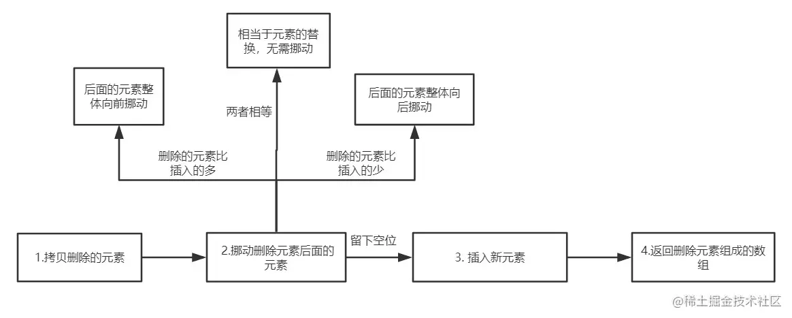

这里解释一下，`length >>> 0`，字面意思是指"右移 0 位"，但实际上是把前面的空位用 0 填充，这里的作用是保证 `len` 为数字且为整数。

[Properties of the Array Prototype Object](https://tc39.es/ecma262/#sec-properties-of-the-array-prototype-object)

## push 方法的底层实现

[ECMA 数组的 push 标准](https://tc39.es/ecma262/#sec-array.prototype.push)

```javaScript
Array.prototype.push = function(...items) {
  let O = Object(this);  // ecma 中提到的先转换为对象
  let len = this.length >>> 0;
  let argCount = items.length >>> 0;
  // 2 ^ 53 - 1 为JS能表示的最大正整数
  if (len + argCount > 2 ** 53 - 1) {
    throw new TypeError("The number of array is over the max value restricted!")
  }
  for(let i = 0; i < argCount; i++) {
    O[len + i] = items[i];
  }
  let newLength = len + argCount;
  O.length = newLength;
  return newLength;
}
```

## pop 方法的底层实现

[ECMA 数组的 pop 标准](https://tc39.es/ecma262/#sec-array.prototype.pop)

```javaScript
Array.prototype.pop = function() {
  let O = Object(this);
  let len = this.length >>> 0;
  if (len === 0) {
    O.length = 0;
    return undefined;
  }
  len --;
  let value = O[len];
  delete O[len];
  O.length = len;
  return value;
}
```

## map 方法的底层实现

[ECMA 数组的 map 标准](https://tc39.es/ecma262/#sec-array.prototype.map)

```javaScript
Array.prototype.map = function(callbackFn, thisArg) {
  // 处理数组类型异常
  if (this === null || this === undefined) {
    throw new TypeError("Cannot read property 'map' of null or undefined");
  }
  // 处理回调类型异常
  if (Object.prototype.toString.call(callbackfn) != "[object Function]") {
    throw new TypeError(callbackfn + ' is not a function')
  }
  // 草案中提到要先转换为对象
  let O = Object(this);
  let T = thisArg;

  let len = O.length >>> 0;
  let A = new Array(len);
  for(let k = 0; k < len; k++) {
    // in 表示在原型链查找 如果用 hasOwnProperty 是有问题的，它只能找私有属性
    if (k in O) {
      let kValue = O[k];
      // 依次传入this, 当前项，当前索引，整个数组
      let mappedValue = callbackfn.call(T, KValue, k, O);
      A[k] = mappedValue;
    }
  }
  return A;
}
```

## reduce 方法的底层实现

[ECMA 数组的 reduce 标准](https://tc39.es/ecma262/#sec-array.prototype.reduce)

```javaScript
Array.prototype.reduce  = function(callbackfn, initialValue) {
  // 异常处理，和 map 类似 处理数组类型异常
  if (this === null || this === undefined) {
    throw new TypeError("Cannot read property 'reduce' of null or undefined");
  }
  // 处理回调类型异常
  if (Object.prototype.toString.call(callbackfn) != "[object Function]") {
    throw new TypeError(callbackfn + ' is not a function')
  }
  let O = Object(this);
  let len = O.length >>> 0;
  let k = 0;
  let accumulator = initialValue;  // reduce方法第二个参数作为累加器的初始值
  if (accumulator === undefined) {
      throw new Error('Each element of the array is empty');
      // 初始值不传的处理
    for(; k < len ; k++) {
      if (k in O) {
        accumulator = O[k];
        k++;
        break;
      }
    }
  }
  // 表示数组全为空
  for(;k < len; k++) {
    if (k in O) {
      // 注意 reduce 的核心累加器
      accumulator = callbackfn.call(undefined, accumulator, O[k], O);
    }
  }
  return accumulator;
}
```

## filter 方法的底层实现

```javaScript
Array.prototype.filter = function(callbackfn, thisArg) {
  // 处理数组类型异常
  if (this === null || this === undefined) {
    throw new TypeError("Cannot read property 'filter' of null or undefined");
  }
  // 处理回调类型异常
  if (Object.prototype.toString.call(callbackfn) != "[object Function]") {
    throw new TypeError(callbackfn + ' is not a function')
  }
  let O = Object(this);
  let len = O.length >>> 0;
  let resLen = 0;
  let res = [];
  for(let i = 0; i < len; i++) {
    if (i in O) {
      let element = O[i];
      if (callbackfn.call(thisArg, O[i], i, O)) {
        res[resLen++] = element;
      }
    }
  }
  return res;
}
```

## splice 方法的底层实现

梳理一下用法:

1. splice(position, count) 表示从 position 索引的位置开始，删除count个元素

2. splice(position, 0, ele1, ele2, ...) 表示从 position 索引的元素后面插入一系列的元素

3. splice(postion, count, ele1, ele2, ...) 表示从 position 索引的位置开始，删除 count 个元素，然后再插入一系列的元素

4. 返回值为被删除元素组成的数组。

参考文章 [(建议精读)原生JS灵魂之问(中)，检验自己是否真的熟悉JavaScript？—— 第十六篇: 能不能实现数组splice方法 ?](https://juejin.cn/post/6844903986479251464#heading-29)



```javaScript
const sliceDeleteElements = (array, startIndex, deleteCount, deleteArr) => {
  for (let i = 0; i < deleteCount; i++) {
    let index = startIndex + i;
    if (index in array) {
      let current = array[index];
      deleteArr[i] = current;
    }
  }
};

const movePostElements = (array, startIndex, len, deleteCount, addElements) => {
  // 如果添加的元素和删除的元素个数相等，相当于元素的替换，数组长度不变，被删除元素后面的元素不需要挪动
  if (deleteCount === addElements.length) return;
  // 如果添加的元素和删除的元素个数不相等，则移动后面的元素
  else if(deleteCount > addElements.length) {
    // 删除的元素比新增的元素多，那么后面的元素整体向前挪动
    // 一共需要挪动 len - startIndex - deleteCount 个元素
    for (let i = startIndex + deleteCount; i < len; i++) {
      let fromIndex = i;
      // 将要挪动到的目标位置
      let toIndex = i - (deleteCount - addElements.length);
      if (fromIndex in array) {
        array[toIndex] = array[fromIndex];
      } else {
        delete array[toIndex];
      }
    }
    // 注意注意！这里我们把后面的元素向前挪，相当于数组长度减小了，需要删除冗余元素
    // 目前长度为 len + addElements - deleteCount
    for (let i = len - 1; i >= len + addElements.length - deleteCount; i --) {
      delete array[i];
    }
  } else if(deleteCount < addElements.length) {
    // 删除的元素比新增的元素少，那么后面的元素整体向后挪动
    // 思考一下: 这里为什么要从后往前遍历？从前往后会产生什么问题？
    for (let i = len - 1; i >= startIndex + deleteCount; i--) {
      let fromIndex = i;
      // 将要挪动到的目标位置
      let toIndex = i + (addElements.length - deleteCount);
      if (fromIndex in array) {
        array[toIndex] = array[fromIndex];
      } else {
        delete array[toIndex];
      }
    }
  }
};

const computeStartIndex = (startIndex, len) => {
  // 处理索引负数的情况
  if (startIndex < 0) {
    return startIndex + len > 0 ? startIndex + len: 0;
  } 
  return startIndex >= len ? len: startIndex;
}

const computeDeleteCount = (startIndex, len, deleteCount, argumentsLen) => {
  // 删除数目没有传，默认删除startIndex及后面所有的
  if (argumentsLen === 1) 
    return len - startIndex;
  // 删除数目过小
  if (deleteCount < 0) 
    return 0;
  // 删除数目过大
  if (deleteCount > len - startIndex) 
    return len - startIndex;
  return deleteCount;
}

Array.prototype.splice = function(startIndex, deleteCount, ...addElements)  {
  let argumentsLen = arguments.length;
  let array = Object(this);
  let len = array.length >>> 0;
  let deleteArr = new Array(deleteCount);

  startIndex = computeStartIndex(startIndex, len);
  deleteCount = computeDeleteCount(startIndex, len, deleteCount, argumentsLen);

  // 判断 sealed 对象和 frozen 对象, 即 密封对象 和 冻结对象
  if (Object.isSealed(array) && deleteCount !== addElements.length) {
    throw new TypeError('the object is a sealed object!')
  } else if(Object.isFrozen(array) && (deleteCount > 0 || addElements.length > 0)) {
    throw new TypeError('the object is a frozen object!')
  }
   
  // 拷贝删除的元素
  sliceDeleteElements(array, startIndex, deleteCount, deleteArr);
  // 移动删除元素后面的元素
  movePostElements(array, startIndex, len, deleteCount, addElements);

  // 插入新元素
  for (let i = 0; i < addElements.length; i++) {
    array[startIndex + i] = addElements[i];
  }

  array.length = len - deleteCount + addElements.length;

  return deleteArr;
}

```

## filter 方法的底层实现


## filter 方法的底层实现


[「前端练习场」原生 JavaScript 手写各种 数组 API](https://mp.weixin.qq.com/s?__biz=MzUyNDYxNDAyMg==&mid=2247484243&idx=1&sn=54bc440a2d49efe3096cc9bb3ef4e32d&chksm=fa2be3bacd5c6aac00fb6a39bd1ba435ce9cc3a78ee35a67a238cf9f4a64ec8fbe52f0724202&scene=126&&sessionid=1664420298#rd)
