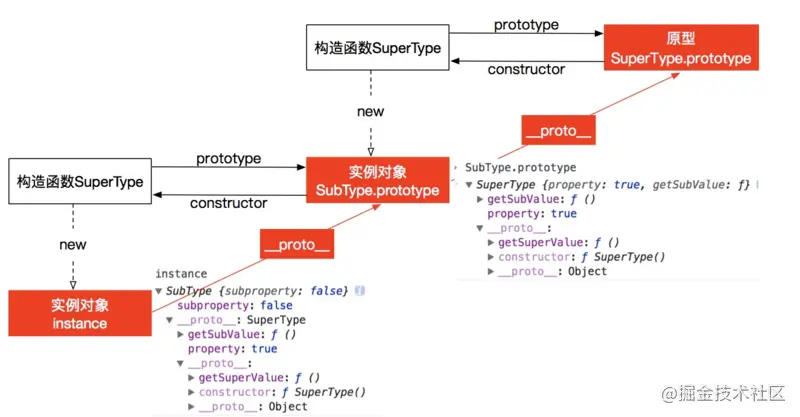
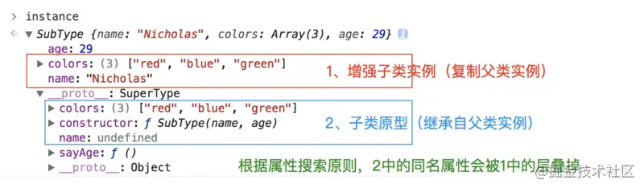
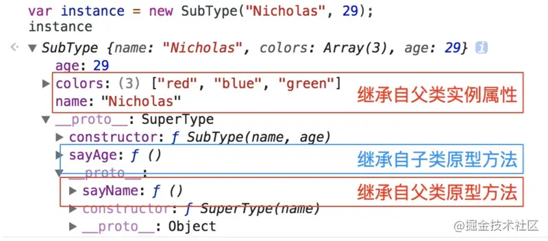

> 继承：子类可以使用父类的所有功能，并且对这些功能进行扩展。继承的过程，就是从一般到特殊的过程。

## 原型链继承

构造函数、原型和实例之间的关系：每个构造函数都有一个原型对象（ `prototype` ），原型对象都包含一个指向构造函数的指针（ `constructor` ），而实例都包含一个原型对象的指针（ `__proto__` ）。

继承的本质就是**复制，即重写子类型的原型对象，代之以一个父类型的一个实例对象**。

```javaScript
  function SuperType() {
      this.property = true;
  }

  SuperType.prototype.getSuperValue = function() {
      return this.property;
  }

  function SubType() {
      this.subproperty = false;
  }

  // 这里是关键，创建 SuperType 的实例，并将该实例赋值给 SubType.prototype
  SubType.prototype = new SuperType();

  SubType.prototype.getSubValue = function() {
      return this.subproperty;
  }

  var instance = new SubType();
  console.log(instance.getSuperValue()); // true
```



- 优点：

  简单易于实现，父类的新增的实例与属性子类都能访问

- 缺点：

  1. 来自父类型原型对象的所有属性被所有实例共享，多个实例对引用类型的操作会被篡改。

```javaScript
  function SuperType(){
    this.colors = ["red", "blue", "green"];
  }

  function SubType(){}

  SubType.prototype = new SuperType();

  var instance1 = new SubType();
  instance1.colors.push("black");
  alert(instance1.colors); //"red,blue,green,black"

  var instance2 = new SubType();
  alert(instance2.colors); //"red,blue,green,black"
```

2. **可以在子类中增加实例属性。如果要新增加原型属性和方法或者是重写父类的方法需要在 `new 父类构造函数` 的后面。**

3. 创建子类实例时，不能向父类构造函数中传参数

4. 无法实现多继承

## 借用构造函数继承（伪造对象、经典继承）

使用父类的构造函数来增强子类实例，等同于复制父类的实例给子类（不使用原型），**在子类型构造函数中通用 call()调用父类型构造函数。**

```javaScript
  function  SuperType(){
      this.color=["red","green","blue"];
  }
  function  SubType(){
      //继承自SuperType
      SuperType.call(this);
  }
  var instance1 = new SubType("instance1");
  instance1.color.push("black");
  alert(instance1.name);
  alert(instance1.color); //"red,green,blue,black"

  var instance2 = new SubType("instance2");
  alert(instance1.name);
  alert(instance2.color); //"red,green,blue"
```

核心代码是 `SuperType.call(this)`，创建子类实例时调用 `SuperType` 构造函数，于是 `SuperType` 的每个实例都会将 `SuperType` 中的属性复制一份。

优点：?

1. 解决了原型链继承中子类实例共享父类引用属性的问题

2. 创建子类实例时，可以向父类传递参数

3. 可以实现多继承（call 或者 apply 多个父类）

缺点：

1. 方法都在构造函数中定义，无法复用

2. 只能继承父类的实例属性和方法（实例成员），不能继承原型属性/方法（静态成员）

3. 无法实现函数复用，每个子类都有父类实例函数的副本，影响性能

4. 实例并不是父类的实例，只是子类的实例

## 组合继承

组合上述两种方法（原型链+借用构造函数）就是组合继承。**用原型链实现对原型属性和方法（静态成员）的继承，用借用构造函数技术来实现实例属性（实例成员）的继承，即继承父类的属性并保留传参的优点，然后通过将父类实例作为子类原型，实现函数复用。**。

```javaScript
  function SuperType(name){
    this.name = name;
    this.colors = ["red", "blue", "green"];
  }
  SuperType.prototype.sayName = function(){
    alert(this.name);
  };

  function SubType(name, age){
    // 继承属性
    // 第二次调用SuperType()
    SuperType.call(this, name);
    this.age = age;
  }

  // 继承方法
  // 构建原型链
  // 第一次调用SuperType()
  SubType.prototype = new SuperType();
  // 重写SubType.prototype的constructor属性，指向自己的构造函数SubType
  SubType.prototype.constructor = SubType;
  SubType.prototype.sayAge = function(){
      alert(this.age);
  };

  var instance1 = new SubType("Nicholas", 29);
  instance1.colors.push("black");
  alert(instance1.colors); //"red,blue,green,black"
  instance1.sayName(); //"Nicholas";
  instance1.sayAge(); //29

  var instance2 = new SubType("Greg", 27);
  alert(instance2.colors); //"red,blue,green"
  instance2.sayName(); //"Greg";
  instance2.sayAge(); //27
```



优点：

1. 函数可以复用

2. 不存在引用属性问题

3. 可以继承属性和方法，并且可以继承原型的属性和方法

4. 可传参

5. `instanceof` 和 `isPrototypeOf()` 也能用于识别基于组合继承创建的对象

缺点：

1. 第一次调用 `SuperType()` ：给 `SubType.prototype` 写入两个属性 `name`，`color`。

2. 第二次调用 `SuperType()` ：给 `instance1` 写入两个属性 `name`，`color`。

实例对象 `instance1` 上的两个属性就屏蔽了其原型对象 `SubType.prototype` 的两个同名属性。所以，**组合模式的缺点就是在使用子类创建实例对象时，其原型中会存在两份相同的属性/方法。**

## 实例继承（原型式继承）

利用一个空对象作为中介，将某个对象直接赋值给空对象构造函数的原型。

```javaScript
  function object(obj){
    function F(){}
    F.prototype = obj;
    return new F();
  }
```

`object()` 对传入其中的对象执行了一次`浅复制`，将构造函数 F 的原型直接指向传入的对象。

```javaScript
  var person = {
    name: "Nicholas",
    friends: ["Shelby", "Court", "Van"]
  };

  var anotherPerson = object(person);
  anotherPerson.name = "Greg";
  anotherPerson.friends.push("Rob");

  var yetAnotherPerson = object(person);
  yetAnotherPerson.name = "Linda";
  yetAnotherPerson.friends.push("Barbie");

  alert(person.friends);   //"Shelby,Court,Van,Rob,Barbie"
```

缺点：

1. 原型链继承多个实例的引用类型属性指向相同，存在篡改的可能。

2. 无法传递参数。

在 `ECMAScript5` 中,通过新增 `Object.create()` 方法规范化了上面的原型式继承。

## 寄生式继承

核心：在原型式继承的基础上，增强对象，返回构造函数

```javaScript
  function createAnother(original){
    var clone = object(original); // 通过调用 object() 函数创建一个新对象
    clone.sayHi = function(){  // 以某种方式来增强对象
      alert("hi");
    };
    return clone; // 返回这个对象
  }
```

函数的主要作用是为构造函数新增属性和方法，以**增强函数**

```javaScript
  var person = {
    name: "Nicholas",
    friends: ["Shelby", "Court", "Van"]
  };
  var anotherPerson = createAnother(person);
  anotherPerson.sayHi(); //"hi"
```

缺点（同原型式继承）：

1. 原型链继承多个实例的引用类型属性指向相同，存在篡改的可能。

2. 无法传递参数。

## 寄生组合式继承

寄生组合式继承是为了降低调用父类构造函数的开销而出现的， 结合借用构造函数传递参数和寄生模式实现继承。

借助原型可以基于已有的对象来创建对象，var B = Object.create(A) 以 A 对象为原型，生成了 B 对象。B 继承了 A 的所有属性和方法。

```javaScript
  // 核心代码
  function extend(subType, superType){
    var prototype = Object.create(superType.prototype); // 创建对象，创建父类原型的一个副本
    prototype.constructor = subType;  // 增强对象，弥补因重写原型而失去的默认的constructor 属性
    subType.prototype = prototype;  // 指定对象，将新创建的对象赋值给子类的原型
  }

  // 父类初始化实例属性和原型属性
  function SuperType(name){
    this.name = name;
    this.colors = ["red", "blue", "green"];
  }
  SuperType.prototype.sayName = function(){
    alert(this.name);
  };

  // 借用构造函数传递增强子类实例属性（支持传参和避免篡改）
  function SubType(name, age){
    SuperType.call(this, name);
    this.age = age;
  }

  // 将父类原型指向子类
  extend(SubType, SuperType);

  // 新增子类原型属性
  SubType.prototype.sayAge = function(){
    alert(this.age);
  }

  var instance1 = new SubType("xyc", 23);
  var instance2 = new SubType("lxy", 23);

  instance1.colors.push("2"); // ["red", "blue", "green", "2"]
  instance1.colors.push("3"); // ["red", "blue", "green", "3"]
```



这个例子的高效率体现在它只调用了一次 `SuperType` 构造函数，并且因此避免了在 `SubType.prototype` 上创建不必要的、多余的属性。于此同时，原型链还能保持不变；因此，还能够正常使用 `instanceof` 和 `isPrototypeOf()`。

**这是最成熟的方法，也是现在库实现的方法。**

来看下 `extend` 的另一种更为有效的扩展

```javaScript
function extend(subClass, superClass) {
  var F = function() {};
  F.prototype = superClass.prototype;
  subClass.prototype = new F();
  subClass.prototype.constructor = subClass;

  subClass.superclass = superClass.prototype;
  if(superClass.prototype.constructor == Object.prototype.constructor) {
    superClass.prototype.constructor = superClass;
  }
}

```

## 混入方式继承多个对象

```javaScript
  function MyClass() {
      SuperClass.call(this);
      OtherSuperClass.call(this);
  }

  // 继承一个类
  MyClass.prototype = Object.create(SuperClass.prototype);
  // 混合其它
  Object.assign(MyClass.prototype, OtherSuperClass.prototype);
  // 重新指定constructor
  MyClass.prototype.constructor = MyClass;

  MyClass.prototype.myMethod = function() {
      // do something
  };
```

`Object.assign` 会把 `OtherSuperClass` 原型上的函数拷贝到 `MyClass` 原型上，使 `MyClass` 的所有实例都可用 `OtherSuperClass` 的方法。

## ES6 类继承 `extends`

`extends` 关键字主要用于类声明或者类表达式中，以创建一个类，该类是另一个类的子类。其中 `constructor` 表示构造函数，一个类中只能有一个构造函数，有多个会报出 `SyntaxError` 错误,如果没有显式指定构造方法，则会添加默认的 `constructor` 方法，使用例子如下。

```javaScript
  class Rectangle {
      // constructor
      constructor(height, width) {
          this.height = height;
          this.width = width;
      }

      // Getter
      get area() {
          return this.calcArea()
      }

      // Method
      calcArea() {
          return this.height * this.width;
      }
  }

  const rectangle = new Rectangle(10, 20);
  console.log(rectangle.area);
  // 输出 200

  -----------------------------------------------------------------
  // 继承
  class Square extends Rectangle {

    constructor(length) {
      super(length, length);

      // 如果子类中存在构造函数，则需要在使用“this”之前首先调用 super()。
      this.name = 'Square';
    }

    get area() {
      return this.height * this.width;
    }
  }

  const square = new Square(10);
  console.log(square.area);// 输出 100
```

`extends` 继承的核心代码如下，其实现和上述的寄生组合式继承方式一样

```javaScript
  function _inherits(subType, superType) {

      // 创建对象，创建父类原型的一个副本
      // 增强对象，弥补因重写原型而失去的默认的constructor 属性
      // 指定对象，将新创建的对象赋值给子类的原型
      subType.prototype = Object.create(superType && superType.prototype, {
          constructor: {
              value: subType,
              enumerable: false,
              writable: true,
              configurable: true
          }
      });

      if (superType) {
          Object.setPrototypeOf
              ? Object.setPrototypeOf(subType, superType)
              : subType.__proto__ = superType;
      }
  }
```

注意：

1. 函数声明和类声明的区别

函数声明会提升，类声明不会。首先需要声明你的类，然后访问它，否则像下面的代码会抛出一个 `ReferenceError`。

```javaScript
  let p = new Rectangle();
  // ReferenceError

  class Rectangle {}
```

2. ES5 继承和 ES6 继承的区别

- ES6 的继承有所不同，实质上是先创建父类的实例对象 `this` ，然后再用子类的构造函数修改 `this` 。因为子类没有自己的 `this` 对象，所以必须先调用父类的 `super()` 方法，否则新建实例报错。

- ES5 继承首先是创造子类的实例对象的 `this` 指向，然后再将父类的方法添加到 `this` 上面（`Parent.apply(this)`）。

```javaScript
  Child.prototype = new Parent() || Parent.apply(this) || Parent.call(this)
```

- ES6 继承是使用关键字先创建父类的实例对象 `this` ，最后在子类 `class` 中修改 `this` 。

**需要注意的是， `class` 关键字只是原型的语法糖，JavaScript 继承仍然是基于原型实现的。**

[JavaScript 深入之继承的多种方式和优缺点](https://github.com/mqyqingfeng/Blog/issues/16)

[JS 类继承](https://zh.javascript.info/class-inheritance)
