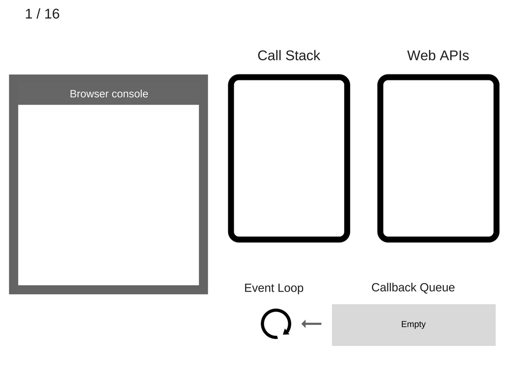

## JS 是单线程的语言

`JavaScript` 的单线程，与它的用途有关。作为浏览器脚本语言，`JavaScript` 的主要用途是与用户互动，以及操作 `DOM`。这决定了它只能是单线程，否则会带来很复杂的同步问题。比如，假定 `JavaScript` 同时有两个线程，一个线程在某个 `DOM` 节点上添加内容，另一个线程删除了这个节点，这时浏览器应该以哪个线程为准？

所以，为了避免复杂性，从一诞生，`JavaScript` 就是单线程，这已经成了这门语言的核心特征，将来也不会改变。

为了利用多核 `CPU` 的计算能力，HTML5 提出[Web Worker](http://www.ruanyifeng.com/blog/2018/07/web-worker.html)标准，允许 `JavaScript` 脚本创建多个线程，但是子线程完全受主线程控制，且不得操作 `DOM`。所以，这个新标准并没有改变 `JavaScript` 单线程的本质。

## JavaScript 的运行机制

`JavaScript` 所有任务可以分成两种，一种是同步任务（synchronous），另一种是异步任务（asynchronous）。

同步任务指的是，在主线程上排队执行的任务，只有前一个任务执行完毕，才能执行后一个任务；

异步任务指的是，不进入主线程、而进入"任务队列"（task queue）的任务，只有"任务队列"（task queue）通知主线程，某个异步任务可以执行了，该任务才会进入主线程执行。

具体来说，异步执行的运行机制如下。（同步执行也是如此，因为它可以被视为没有异步任务的异步执行。）

- 1. 所有同步任务都在主线程上执行，形成一个执行栈（execution context stack）。

- 2. 主线程之外，还存在一个"任务队列"（task queue）。只要异步任务有了运行结果，就在"任务队列"（task queue）之中放置一个事件。

- 3. 一旦"执行栈"中的所有同步任务执行完毕，系统就会读取"任务队列"（task queue），看看里面有哪些事件。那些对应的异步任务，于是结束等待状态，进入执行栈，开始执行。

- 4. 主线程不断重复上面的第三步。

只要主线程空了，就会去读取"任务队列"（task queue），这就是 `JavaScript` 的运行机制。这个过程会不断重复。

## 异步要基于回调来实现

"任务队列"（task queue）是一个事件的队列（也可以理解成消息的队列），IO 设备完成一项任务，就在"任务队列"（task queue）中添加一个事件，表示相关的异步任务可以进入"执行栈"了。主线程读取"任务队列"（task queue），就是读取里面有哪些事件。

"任务队列"（task queue）中的事件，除了 IO 设备的事件以外，还包括一些用户产生的事件（比如鼠标点击、页面滚动等等）。只要指定过回调函数，这些事件发生时就会进入"任务队列"（task queue），等待主线程读取。

所谓"回调函数"（callback），就是那些会被主线程挂起来的代码。异步任务必须指定回调函数，当主线程开始执行异步任务，就是执行对应的回调函数。

"任务队列"（task queue）是一个先进先出的数据结构，排在前面的事件，优先被主线程读取。主线程的读取过程基本上是自动的，只要执行栈一清空，"任务队列"（task queue）上第一位的事件就自动进入主线程。但是，由于存在后文提到的"定时器"功能，主线程首先要检查一下执行时间，某些事件只有到了规定的时间，才能返回主线程。

## Event Loop 就是异步回调的实现原理

主线程从"任务队列"（task queue）中读取事件，这个过程是循环不断的，所以整个的这种运行机制又称为Event Loop（事件循环）。

主线程运行的时候，产生堆（heap）和栈（stack），栈中的代码调用各种外部 API，它们在"任务队列"（task queue）中加入各种事件（click，load，done）。只要栈中的代码执行完毕，主线程就会去读取"任务队列"（task queue），依次执行那些事件所对应的回调函数。

`Call Stack` 是调用栈，`Event Loop` 就是本期的主角 - 事件循环，`Web APIs` 泛指宿主环境，此处为 前端中的浏览器。

任何同步的代码都只存在于 `Call Stack` 中，遵循先进后出，后进先出的规则，也就是只有异步的代码（不一定是回调）才会进入 `Event Loop` 中。

异步代码在执行时，都不会进入 `Call Stack`，而是进入 `Event Loop` 队列，此时 `JS` 主线程执行完毕后，且异步时机到了，就会将异步回调中的代码推入 `Call Stack` 执行。

而控制异步什么时机开始执行，是由宿主环境决定的，因为此时 `js` 主线程已经调用完毕，除非 `Event Loop` 队列有内容，推送到 `Call Stack` 中，否则 `js` 引擎也不会再执行任何代码。

### 参考文章：

- [JavaScript 运行机制详解：再谈 Event Loop](http://www.ruanyifeng.com/blog/2014/10/event-loop.html)

- [前端基础进阶（十二）：深入核心，详解事件循环机制](https://www.jianshu.com/p/12b9f73c5a4f)

- [一次弄懂 Event Loop（彻底解决此类面试问题）](https://juejin.im/post/5c3d8956e51d4511dc72c200)

- [带你彻底弄懂 Event Loop](https://segmentfault.com/a/1190000016278115)

- [这一次，彻底弄懂 JavaScript 执行机制](https://juejin.im/post/59e85eebf265da430d571f89)

[精读《Javascript 事件循环与异步》](https://github.com/ascoders/weekly/blob/master/%E5%89%8D%E6%B2%BF%E6%8A%80%E6%9C%AF/30.%E7%B2%BE%E8%AF%BB%E3%80%8AJavascript%20%E4%BA%8B%E4%BB%B6%E5%BE%AA%E7%8E%AF%E4%B8%8E%E5%BC%82%E6%AD%A5%E3%80%8B.md)
