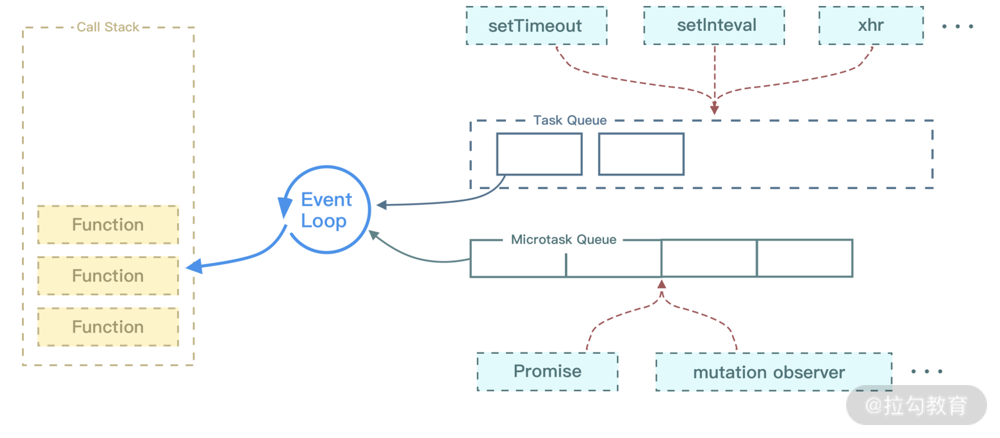

## 事件队列

事件队列按照先进先出的顺序执行，那么如果队列较长时，排在后面的事件即使较为“紧急”，也得需要等待前面的任务先执行完成。

`JavaScript` 解决这个问题的思路就是：设置多个队列，按照优先级来执行。即“宏任务队列（Macro Task Queue）”和“微任务队列（Micro Task Queue）”。

不同队列优先级不同，每次事件循环时会从优先级高的队列中获取事件，只有当优先级高的队列为空时才会从优先级低的队列中获取事件，同级队列之间的事件不存在优先级，只遵循先进先出的原则。

常见的异步函数优先级如下，从上到下优先级逐层降低：

```
process.nextTick(Node.js) >

MutationObserver(浏览器)/promise.then(catch、finnally) >

setImmediate(IE) >

setTimeout/setIntervalrequestAnimationFrame >

其他 I/O 操作 / 浏览器 DOM 事件
```

## 宏任务和微任务

在 `JavaScript` 中，任务被分为两种，一种宏任务（MacroTask）也叫 `Task`，一种叫微任务（MicroTask）。在 ES6 `规范中，microtask` 称为 ` jobs``，macrotask ` 称为 `task`。

1. `MacroTask`（宏任务）
   `script` 全部代码、`setTimeout`、`setInterval`、`setImmediate`（浏览器暂时不支持，只有 IE10 支持，具体可见 MDN）、`I/O(ajax)` （网络请求完成、文件读写完成事件）、`UI Rendering` 渲染事件（比如解析 DOM、计算布局、绘制）和用户交互事件（比如鼠标点击、滚动页面、放大缩小等）。

2. `MicroTask`（微任务）
   `Promise`、`async/await`、`Process.nextTick`（Node 独有）、`Object.observe`(废弃)、`MutationObserver`

异步队列是周而复始循环执行的，可以看作是二维数组：横排是一个队列中的每一个函数，纵排是每一个队列。

`Macrotask` 的方式是将执行函数添加到新的纵排，而 `Microtask` 将执行函数添加到当前执行到队列的横排，因此 `Microtask` 方式的插入是轻量的，最快被执行到的。

很多人有个误区，认为微任务快于宏任务，其实是错误的。因为宏任务中包括了 `script` ，浏览器会先执行一个宏任务，接下来有异步代码的话就先执行微任务。

3. 一次正确的 `Event loop` 顺序是这样的

- 执行同步代码，这属于宏任务

- 执行栈为空，查询是否有微任务需要执行

- 执行所有微任务

- 必要的话渲染 UI

- 然后开始下一轮 `Event loop`，执行宏任务中的异步代码

