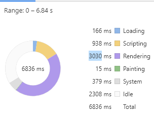
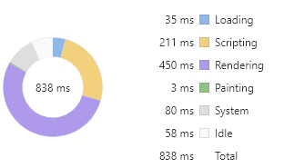

## DOM

`DOM`：`Document Object Model`，文档对象模型，是 JavaScript 操作 HTML 的接口。`DOM` 为文档提供了结构化表示，并定义了如何通过脚本来访问文档结构。目的其实就是为了能让 `js` 操作 `html` 元素而制定的一个规范。

如果查看过 [DOM V3 标准](https://dom.spec.whatwg.org/)，会发现包含多个内容，但归纳起来常用的主要由 3 个部分组成：

- `DOM` 节点

- `DOM` 事件

- 选择区域

选择区域的使用场景有限，一般用于富文本编辑类业务，不做深入讨论；DOM 事件有一定的关联性，将在下一课时中详细讨论；对于 `DOM` 节点，需与另外两个概念标签和元素进行区分：

- 标签是 `HTML` 的基本单位，比如 `p`、`div`、`input`；

- 节点是 `DOM` 树的基本单位，有多种类型，比如注释节点、文本节点；

- 元素是节点中的一种，与 `HTML` 标签相对应，比如 `p` 标签会对应 `p` 元素。

`DOM` 就是由节点组成的。本质是 `HTML` 解析而成的一棵树。

解析过程： `HTML` 加载完毕，渲染引擎会在内存中把 `HTML` 文档，生成一个 `DOM` 树。

`DOM` 树：（一切都是节点）。整个 `HTML` 文档就是一个文档节点。所有的节点都是 `Object`。

## `DOM` 元素节点的获取

1. 通过 `id` 获取元素 —— `document.getElementById`

2. 通过类名（`ClassName`）获取元素 获得到的是一个集合 —— `document.getElementsByClassName`

3. 通过标签获（`TagName`）取元素 获取的也是一组 —— `document.getElementsByTagName`

4. 通过`querySelector（css选择器）`但是只能获取一个元素（第一个）—— `document.querySelector`

5. `document.queryselectorAll(css选择器)`

## `DOM` 访问关系的获取

`DOM` 的节点并不是孤立的，因此可以通过 `DOM` 节点之间的相对关系对它们进行访问。

1. 获取父节点

调用者就是节点。一个节点只有一个父节点

```javaScript
节点.parentNode
```

2. 获取兄弟节点

- 下一个节点 | 下一个元素节点

```javaScript
下一个兄弟节点 = 节点.nextElementSibling || 节点.nextSibling
```

- 前一个节点 | 前一个元素节点

```javaScript
前一个兄弟节点 = 节点.previousElementSibling || 节点.previousSibling
```

3. 获得任意一个兄弟节点

```javaScript
节点自己.parentNode.children[index];  //随意得到兄弟节点
```

4. 获取单个的子节点

- 第一个子节点 | 第一个子元素节点

```javaScript
第一个子元素节点 = 节点.firstElementChild || 节点.firstChild
```

- 最后一个子节点 | 最后一个子元素节点

```javaScript
最后一个子元素节点 = 节点.lastElementChild || 节点.lastChild
```

5. 获取所有的子节点

- `childNodes`：标准属性。返回的是指定元素的子节点的集合（包括元素节点、所有属性、文本节点）。是 W3C 的亲儿子。火狐 谷歌等高本版会把换行也看做是子节点。

用法：

```javaScript
子节点数组 = 父节点.childNodes;   //获取所有节点。
```

- `children`：非标准属性。返回的是指定元素的子元素节点的集合。【重要】

它只返回 HTML 节点，甚至不返回文本节点。

在 IE6/7/8 中包含注释节点（在 IE678 中，注释节点不要写在里面）。

虽然不是标准的 DOM 属性，但它和 innerHTML 方法一样，得到了几乎所有浏览器的支持。

用法：（用的最多）

```javaScript
子节点数组 = 父节点.children;   //获取所有节点。用的最多。
```

## `DOM` 节点的操作

1. 创建节点

```javaScript
新的标签(元素节点) = document.createElement("标签名");
```

2. 插入节点

- 父节点的最后插入一个新的子节点

```javaScript
父节点.appendChild(新的子节点);
```

- 在参考节点前插入一个新的节点。如果参考节点为 `null`，那么将在父节点里面的最后插入一个子节点。

```javaScript
父节点.insertBefore(新的子节点,作为参考的子节点);
```

3. 删除节点

- 用父节点删除子节点。必须要指定是删除哪个子节点。

```javaScript
父节点.removeChild(子节点);
```

- 如果想删除自己这个节点

```javaScript
node1.parentNode.removeChild(node1);
```

4. 复制节点（克隆节点）

```javaScript
要复制的节点.cloneNode(); //括号里不带参数和带参数false，效果是一样的。

要复制的节点.cloneNode(true);
```

括号里带不带参数，效果是不同的。解释如下：

- 不带参数/带参数 false：只复制节点本身，不复制子节点。

- 带参数 true：既复制节点本身，也复制其所有的子节点。

5. 移动节点

## 设置节点的属性

`attribute`：修改 `DOM` 节点的 `HTML` 标签属性，会改变 `HTML` 结构。`getAttribute` & `setAttribute`

1. 获取节点的属性值

```javaScript
/**
 * 方式一
 * 注意，获取节点的类名是 class，不是 className
 * */
元素节点.属性名;
元素节点[属性名];

/**
 * 方式2
 * 注意，获取节点的类名是 class，不是 className
 * */
元素节点.getAttribute("属性名称");
```

方式 1 和方式 2 的区别在于：前者是直接操作标签，后者是把标签作为 `DOM` 节点。推荐方式 2。

2. 设置节点的属性值

```javaScript
/**
 * 方式一
 * 注意，获取节点的类名是 class，不是 className
 * */
元素节点.属性名 = 属性值;

/**
 * 方式2
 * 注意，获取节点的类名是 class，不是 className
 * */
元素节点.setAttribute("属性名", "新的属性值");
```

3. 删除节点的属性

```javaScript
元素节点.removeAttribute(属性名);
```

4. 总结

获取节点的属性值和设置节点的属性值，都有两种方式。

如果是节点的“原始属性”（比如 普通标签的 `class/className` 属性、普通标签的 `style` 属性、普通标签的 `title` 属性、`img` 标签的 `src` 属性、超链接的 `href` 属性等），方式 1 和方式 2 是等价的，可以混用。

但如果是节点的“非原始属性”，在使用这两种方式时，是有区别的。区别如下：

- 方式 1 的元素节点.属性和元素节点[属性]：绑定的属性值不会出现在标签上。`property`：修改 `DOM` 节点的对象属性，不会体现到 `HTML` 结构中

- 方式 2 的`get/set/removeAttribut`：绑定的属性值会出现在标签上。

- 这两种方式不能交换使用，`get` 值和 `set` 值必须使用同一种方法。

## 为什么说 `DOM` 操作耗时

要解释 DOM 操作带来的性能问题，不得不提一下浏览器的工作机制。

1. 线程切换

浏览器包含渲染引擎（也称浏览器内核）和 `JavaScript` 引擎，它们都是单线程运行。单线程的优势是开发方便，避免多线程下的死锁、竞争等问题，劣势是失去了并发能力。

浏览器为了避免两个引擎同时修改页面而造成渲染结果不一致的情况，增加了另外一个机制，这两个引擎具有互斥性，也就是说在某个时刻只有一个引擎在运行，另一个引擎会被阻塞。操作系统在进行线程切换的时候需要保存上一个线程执行时的状态信息并读取下一个线程的状态信息，俗称上下文切换。而这个操作相对而言是比较耗时的。

每次 `DOM` 操作就会引发线程的上下文切换 —— 从 `JavaScript` 引擎切换到渲染引擎执行对应操作，然后再切换回 `JavaScript` 引擎继续执行，这就带来了性能损耗。单次切换消耗的时间是非常少的，但是如果频繁地大量切换，那么就会产生性能问题。

比如循环读取一百万次 `DOM` 中的 `body` 元素的耗时是读取缓存 `body` 元素的 `JSON` 对象耗时的 10 倍。

2. 重新渲染

另一个更加耗时的因素是元素及样式变化引起的再次渲染，在渲染过程中最耗时的两个步骤为重排（Reflow）与重绘（Repaint）。

浏览器在渲染页面时会将 `HTML` 和 `CSS` 分别解析成 `DOM` 树和 `CSSOM` 树，然后合并进行排布，再绘制成可见的页面。如果在操作 `DOM` 时涉及到元素、样式的修改，就会引起渲染引擎重新计算样式生成 `CSSOM` 树，同时还有可能触发对元素的重新排布（简称“重排”）和重新绘制（简称“重绘”）。

可能会影响到其他元素排布的操作就会引起重排，继而引发重绘，比如：

- 修改元素边距、大小

- 添加、删除元素

- 改变窗口大小

与之相反的操作则只会引起重绘，比如：

- 设置背景图片

- 修改字体颜色

- 改变 `visibility` 属性值

更多关于重绘和重排的样式属性，参看这个网址：[https://csstriggers.com/](https://csstriggers.com/)。

下面是两段验证代码，通过 Chrome 提供的性能分析工具来对渲染耗时进行分析。

第一段代码，通过修改 `div` 元素的边距来触发重排，渲染耗时（粗略地认为渲染耗时为紫色 `Rendering` 事件和绿色 `Painting` 事件耗时之和）3045 毫秒。

```javaScript
const times = 100000
let html = ''
for(let i=0; i < times; i++) {
  html += `<div>${i}</div>`
}
document.body.innerHTML += html
const divs = document.querySelectorAll('div')
Array.prototype.forEach.call(divs, (div, i) => {
  div.style.margin = i % 2 ? '10px' : 0;
})
```



第二段代码，修改 div 元素字体颜色来触发重绘，得到渲染耗时 2359 ms。

```javaScript
const times = 100000
let html = ''
for(let i=0;i<times;i++) {
  html += `<div>${i}</div>`
}
document.body.innerHTML += html
const divs = document.querySelectorAll('div')
Array.prototype.forEach.call(divs, (div, i) => {
  div.style.color = i % 2 ? 'red' : 'green';
})
```


从两段测试代码中可以看出，重排渲染耗时明显高于重绘，同时两者的 Painting 事件耗时接近，也印证了重排会导致重绘。

## 如何高效操作 DOM

1. 在循环外操作元素

比如下面两段测试代码对比了读取 1000 次 JSON 对象以及访问 1000 次 body 元素的耗时差异，相差一个数量级。

```javaScript
const times = 10000;
console.time('switch')
for (let i = 0; i < times; i++) {
  document.body === 1 ? console.log(1) : void 0;
}
console.timeEnd('switch') // 1.873046875ms

var body = JSON.stringify(document.body)
console.time('batch')
for (let i = 0; i < times; i++) {
  body === 1 ? console.log(1) : void 0;
}
console.timeEnd('batch') // 0.846923828125ms
```

当然即使在循环外也要尽量减少操作元素，因为不知道他人调用你的代码时是否处于循环中。

2. 批量操作元素

比如说要创建 1 万个 `div` 元素，在循环中直接创建再添加到父元素上耗时会非常多。如果采用字符串拼接的形式，先将 1 万个 `div` 元素的 `html` 字符串拼接成一个完整字符串，然后赋值给 `body` 元素的 `innerHTML` 属性就可以明显减少耗时。

```javaScript
const times = 10000;
console.time('createElement')
for (let i = 0; i < times; i++) {
  const div = document.createElement('div')
  document.body.appendChild(div)
}
console.timeEnd('createElement')// 54.964111328125ms

console.time('innerHTML')
let html = ''
for (let i = 0; i < times; i++) {
  html+='<div></div>'
}
document.body.innerHTML += html // 31.919921875ms
console.timeEnd('innerHTML')
```

虽然通过修改 `innerHTML` 来实现批量操作的方式效率很高，但它并不是万能的。比如要在此基础上实现事件监听就会略微麻烦，只能通过事件代理或者重新选取元素再进行单独绑定。

批量操作除了用在创建元素外也可以用于修改元素属性样式，比如下面的例子。

创建 2 万个 `div` 元素，以单节点树结构进行排布，每个元素有一个对应的序号作为文本内容。现在通过 `style` 属性对第 1 个 `div` 元素进行 2 万次样式调整。下面是直接操作 `style` 属性的代码：

```javaScript
const times = 20000;
let html = ''
for (let i = 0; i < times; i++) {
  html = `<div>${i}${html}</div>`
}
document.body.innerHTML += html

const div = document.querySelector('div')
for (let i = 0; i < times; i++) {
  div.style.fontSize = (i % 12) + 12 + 'px'
  div.style.color = i % 2 ? 'red' : 'green'
  div.style.margin = (i % 12) + 12 + 'px'
}
```


如果将需要修改的样式属性放入 `JavaScript` 数组，然后对这些修改进行 `reduce` 操作，得到最终需要的样式之后再设置元素属性，那么性能会提升很多。代码如下：

```javaScript
const times = 20000;
let html = ''
for (let i = 0; i < times; i++) {
  html = `<div>${i}${html}</div>`
}
document.body.innerHTML += html

let queue = [] //  创建缓存样式的数组
let microTask // 执行修改样式的微任务
const st = () => {
  const div = document.querySelector('div')
  // 合并样式
  const style = queue.reduce((acc, cur) => ({...acc, ...cur}), {})
  for(let prop in style) {
    div.style[prop] = style[prop]
  }
  queue = []
  microTask = null
}
const setStyle = (style) => {
  queue.push(style)
  // 创建微任务
  if(!microTask) microTask = Promise.resolve().then(st)
}

for (let i = 0; i < times; i++) {
  const style = {
    fontSize: (i % 12) + 12 + 'px',
    color: i % 2 ? 'red' : 'green',
    margin:  (i % 12) + 12 + 'px'
  }
  setStyle(style)
}
```

从下面的耗时占比图可以看到，紫色 `Rendering` 事件耗时有所减少。


`virtualDOM` 之所以号称高性能，其实现原理就与此类似。

3. 缓存元素集合

比如将通过选择器函数获取到的 `DOM` 元素赋值给变量，之后通过变量操作而不是再次使用选择器函数来获取。

下面举例说明，假设现在要将上面代码所创建的 1 万个 `div` 元素的文本内容进行修改。每次重复使用获取选择器函数来获取元素，代码以及时间消耗如下所示。

```javaScript
for (let i = 0; i < document.querySelectorAll('div').length; i++) {
  document.querySelectorAll(`div`)[i].innerText = i
}
```


如果能够将元素集合赋值给 JavaScript 变量，每次通过变量去修改元素，那么性能将会得到不小的提升。

```javaScript
const divs = document.querySelectorAll('div')
for (let i = 0; i < divs.length; i++) {
  divs[i].innerText = i
}
```



对比两者耗时占比图可以看到，两者的渲染时间较为接近。但缓存元素的方式在黄色的 `Scripting` 耗时上具有明显优势。

4. 其他

- 尽量不要使用复杂的匹配规则和复杂的样式，从而减少渲染引擎计算样式规则生成 `CSSOM` 树的时间

- 尽量减少重排和重绘影响的区域

- 使用 `CSS3` 特性来实现动画效果

- 使用文档片段：`document.createDocumentFragment()`

- 利用绝对定位脱离文档流，这样操作定位里面的内容不会引起外部的重排

- 有动画的话，也可以考虑分层渲染的机制。加上 `will-change`
