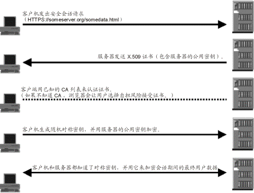

## SSL 工作原理

SSL(Server socket layer) 是一种保证网络两个节点进行安全通信的协议。SSL 和 TLS 建立在 TCP/IP 协议基础上。建立在 SSL 上的 HTTP 协议称为 HTTPS，默认端口 443。SSL 使用加密技术实现会话双方信息的安全传递。

## SSL 加密类型

有两种基本的加解密算法类型：

1. 对称加密

- 密钥只有一个，加密解密为同一个密码，且加解密速度快，典型的对称加密算法有 DES、AES，RC5，3DES 等；对称加密主要问题是共享秘钥，除你的计算机（客户端）知道另外一台计算机（服务器）的私钥秘钥，否则无法对通信流进行加密解密。

2. 非对称加密

- 使用两个秘钥：公共秘钥和私有秘钥。私有秘钥由一方密码保存（一般是服务器保存），另一方任何人都可以获得公共秘钥。

3. 对称加密和非对称加密区别

对称加密采用了对称密码编码技术，它的特点是文件加密和解密使用相同的密钥加密

也就是密钥也可以用作解密密钥，这种方法在密码学中叫做对称加密算法，对称加密算法使用起来简单快捷，密钥较短，且破译困难，除了数据加密标准（DES），另一个对称密钥加密系统是国际数据加密算法（IDEA），它比 DES 的加密性好，而且对计算机功能要求也没有那么高

与对称加密算法不同，非对称加密算法需要两个密钥：公开密钥（publickey）和私有密钥（privatekey）。

公开密钥与私有密钥是一对，如果用公开密钥对数据进行加密，只有用对应的私有密钥才能解密；如果用私有密钥对数据进行加密，那么只有用对应的公开密钥才能解密。因为加密和解密使用的是两个不同的密钥，所以这种算法叫作非对称加密算法。

非对称加密算法实现机密信息交换的基本过程是：甲方生成一对密钥并将其中的一把作为公用密钥向其它方公开；得到该公用密钥的乙方使用该密钥对机密信息进行加密后再发送给甲方；甲方再用自己保存的另一把专用密钥对加密后的信息进行解密。甲方只能用其专用密钥解密由其公用密钥加密后的任何信息。

## 证书机制

同样的问题也会出现，密钥对生成后，该怎么分发呢？

如果在客户端生成密钥对，把私钥发给服务端，那么服务端需要为每个客户端保存一个密钥，这显然是不太现实的。所以只能由服务端生成密钥对，将公钥分发给需要建立连接的客户端。

直接发送给客户端还是会被篡改，此时只能借助第三方来实现了，比如证书机制。

具体来说就是把公钥放入一个证书中，该证书包含服务端的信息，比如颁发者、域名、有效期，为了保证证书是可信的，需要由一个可信的第三方来对证书进行签名。这个第三方一般是证书的颁发机构，也称 CA（Certification Authority，认证中心）。

**证书的签名怎么检验真假呢？**

要回答这个问题先要理解证书签名的过程。证书签名就是将证书信息进行 MD5 计算，获取唯一的哈希值，然后再利用证书颁发方的私钥对其进行加密生成。

校验过程与之相反，需要用到证书颁发方的公钥对签名进行解密，然后计算证书信息的 MD5 值，将解密后的 MD5 值与计算所得的 MD5 值进行比对，如果两者一致代表签名是可信的。所以要校验签名的真伪，就需要获得证书颁发方的公钥，这个公钥就在颁发方的证书中。

这种通过签名来颁发与校验证书的方式会形成一个可追溯的链，即证书链。处于证书链顶端的证书称为根证书，这些根证书被预置在操作系统的内部。

上面所述的颁发证书与加密机制就是 HTTPS 的实现原理。

## 获取证书（经过 CA 认证过的公钥）有两种方式

1. 从权威机制购买证书。

- 安全证书由国际权威的证书机构(CA)，如 VeriSign 和 Thawte 颁发，它们保证了证书的可信性。一个安全证书只对一个 IP 有效，多个 IP 必需购买多个证书。

2. 创建自我签名的证书。

- 如果通信双方只关心数据在网络上的可以安全传输，并不需要对方进行身份验证，这种情况下，可以创建自多签名证书。这证书达不到身份认证的目的，但可以用于加密通信。

## SSL 握手

SSL 连接总是由客户端启动的。在 SSL 会话开始时执行 SSL 握手。此握手产生会话的密码参数。关于如何处理 SSL 握手的简单概述，如下图所示。此示例假设已在 Web 浏览器 和 Web 服务器间建立了 SSL 连接。

