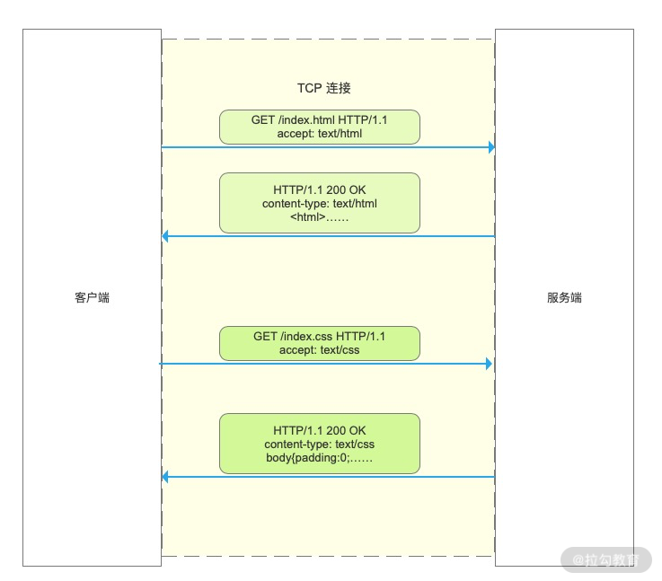

## HTTP/0.9

1991 年 HTTP 正式诞生，当时的版本是 0.9，从名字可以看出，该协议的作用是传输超文本内容 HTML。

协议定义了客户端发起请求、服务端响应请求的通信模式。请求报文内容只有 1 行，为 GET 加上请求的文件路径。服务端收到请求后返回一个以 ASCII 字符流编码的 HTML 文档。

HTTP/0.9 虽然很简单，但它作为一个“原型”，充分验证了 Web 服务的可行性，而“简
单”也正是它的优点，蕴含了进化和扩展的可能性，因为：
“把简单的系统变复杂”，要比“把复杂的系统变简单”容易得多。

## HTTP/1.0

随着互联网的发展以及浏览器的出现，单纯的文本内容已经无法满足用户需求了，浏览器希望通过 HTTP 来传输脚本、样式、图片、音频和视频等不同类型的文件。

所以在 1996 年 HTTP 更新的 1.0 版本中，针对上述问题，作出了重大改变。，例如：

1. 增加了 HEAD、POST 等新方法；

2. 增加了响应状态码，标记可能的错误原因；

3. 引入了协议版本号概念；

4. 引入了 HTTP Header（头部）的概念，让 HTTP 处理请求和响应更加灵活；

5. 传输的数据不再仅限于文本。

其中最核心的改变是增加了头部设定，头部内容以键值对的形式设置。请求头部通过 Accept 字段来告诉服务端可以接收的文件类型，响应头部再通过 Content-Type 字段来告诉浏览器返回文件的类型。

这同时也是一个相当具有前瞻性的设计，因为头部字段不仅用于解决不同类型文件传输的问题，而且其他很多功能也可以依靠头部字段实现，比如缓存、认证信息。

但 HTTP/1.0 并不是一个“标准”，只是记录已有实践和模式的一份参考文档，不具有实际的约束力，相当于一个“备忘录”。

所以 HTTP/1.0 的发布对于当时正在蓬勃发展的互联网来说并没有太大的实际意义，各方势力仍然按照自己的意图继续在市场上奋力拼杀。

## HTTP / 1.1

随着互联网的迅速发展，HTTP/1.0 也已经无法满足需求，最核心的就是连接问题。具体来说就是 HTTP/1.0 每进行一次通信，都需要经历建立连接、传输数据和断开连接三个阶段。当一个页面引用了较多的外部文件时，这个建立连接和断开连接的过程就会增加大量网络开销。

为了解决这个问题，1999 年推出的 HTTP/1.1 版本增加了一个创建持久连接的方法。主要实现是当一个连接传输完成时，并不是马上进行关闭，而是继续复用它传输其他请求的数据，这个连接保持到浏览器或者服务器要求断开连接为止。

从版本号我们就可以看到，HTTP/1.1 是对 HTTP/1.0 的小幅度修正。但一个重要的区别是：它是一个“正式的标准”，而不是一份可有可无的“参考文档”。这意味着今后互联网上所有的浏览器、服务器、网关、代理等等，只要用到 HTTP 协议，就必须严格遵守这个标准，相当于是互联网世界的一个“立法”。

不过，说 HTTP/1.1 是“小幅度修正”也不太确切，它还是有很多实质性进步的。毕竟经过了多年的实战检验，比起 0.9/1.0 少了“学术气”，更加“接地气”，同时表述也更加严谨。HTTP/1.1 主要的变更点有：

1. 增加了 PUT、DELETE 等新的方法；

2. 增加了缓存管理和控制；

3. 明确了连接管理，允许持久连接；

4. 允许响应数据分块（chunked），利于传输大文件；

5. 强制要求 Host 头，让互联网主机托管成为可能。

HTTP/1.1 的推出可谓是“众望所归”，互联网在它的“保驾护航”下迈开了大步，由此走上了“康庄大道”，开启了后续的“Web 1.0”“Web 2.0”时代。现在许多的知名网站都是在这个时间点左右创立的，例如 Google、新浪、搜狐、网易、腾讯等。

不过由于 HTTP/1.1 太过庞大和复杂，所以在 2014 年又做了一次修订，原来的一个大文档被拆分成了六份较小的文档，编号为 7230-7235，优化了一些细节，但此外没有任何实质性的改动。

## [HTTP/2](https://http2.github.io/http2-spec/)

HTTP/1.1 虽然通过长连接减少了大量创建/断开连接造成的性能消耗，但由于它的并发能力受到限制，所以传输性能还有很大提升空间。

为什么说 HTTP/1.1 的并发能力受限呢？主要表现在两个方面：

- 浏览器为了减轻服务器的压力，限制了同一个域下的 HTTP 连接数，即 6 ~ 8 个，所以在 HTTP/1.1 下很容易看到资源文件等待加载的情况，对应优化的方式就是使用多个域名来加载图片资源；

- HTTP/1.1 本身的问题，虽然 HTTP/1.1 中使用持久连接时，多个请求能共用一个 TCP 连接，但在一个连接中同一时刻只能处理一个请求，在当前的请求没有结束之前，其他的请求只能处于阻塞状态，这种情况被称为 “队头阻塞” 。

这期间也出现了一些对 HTTP 不满的意见，主要就是连接慢，无法跟上迅猛发展的互联网，但 HTTP/1.1 标准一直“岿然不动”，无奈之下人们只好发明各式各样的“小花招”来缓解这些问题，比如以前常见的切图、JS 合并等网页优化手段。

终于有一天，搜索巨头 Google 忍不住了，决定“揭竿而起”。Google 首先开发了自己的浏览器 Chrome，然后推出了新的 SPDY 协议，并在 Chrome 里应用于自家的服务器，如同十多年前的网景与微软一样，从实际的用户方来“倒逼”HTTP 协议的变革，这也开启了第二次的“浏览器大战”。

历史再次重演，不过这次的胜利者是 Google，Chrome 目前的全球的占有率超过了 60%。“挟用户以号令天下”，Google 借此顺势把 SPDY 推上了标准的宝座，互联网标准化组织以 SPDY 为基础开始制定新版本的 HTTP 协议，最终在 2015 年发布了 HTTP/2，RFC 编号 7540。

HTTP/2 的制定充分考虑了现今互联网的现状：宽带、移动、不安全，在高度兼容 HTTP/1.1 的同时在性能改善方面做了很大努力，主要的特点有：

**1. 二进制协议，不再是纯文本；**

在 HTTP/2 中新增了一个二进制分帧的机制来提升传输效率。

HTTP/2 将默认不再使用 ASCII 编码传输，而是改为二进制数据。客户端在发送请求时会将每个请求的内容封装成不同的带有编号的二进制帧，然后将这些帧同时发送给服务端。服务端接收到数据之后，会将相同编号的帧合并为完整的请求信息。同样，服务端返回结果、客户端接收结果也遵循这个帧的拆分与组合的过程。

受益于二进制分帧，对于同一个域，客户端只需要与服务端建立一个连接即可完成通信需求，自然也不再受限于浏览器的连接数限制了，这种利用一个连接来发送多个请求的方式称为“多路复用”。

相对 HTTP/2 其他的功能而言，二进制分帧属于核心功能

**2. 可发起多个请求，废弃了 1.1 里的管道；**

**3. 使用专用算法压缩头部，减少数据传输量；**

**4. 允许服务器主动向客户端推送数据；**

**5. 增强了安全性，“事实上”要求加密通信**。

## HTTP / 3

当然 HTTP/2 也并非完美，考虑一种情况，如果客户端或服务端在通信时出现数据包丢失，或者任何一方的网络出现中断，那么整个 TCP 连接就会暂停。

HTTP/2 由于采用二进制分帧进行多路复用，通常只使用一个 TCP 连接进行传输，在丢包或网络中断的情况下后面的所有数据都被阻塞。但对于 HTTP/1.1 来说，可以开启多个 TCP 连接，任何一个 TCP 出现问题都不会影响其他 TCP 连接，剩余的 TCP 连接还可以正常传输数据。这种情况下 HTTP/2 的表现就不如 HTTP/1 了。

这一次还是 Google，而且它要“革自己的命”。在 HTTP/2 还处于草案之时，Google 又发明了一个新的协议，叫做 QUIC，而且还是相同的“套路”，继续在 Chrome 和自家服务器里试验着“玩”，依托它的庞大用户量和数据量，持续地推动 QUIC 协议成为互联网上的“既成事实”。“功夫不负有心人”，当然也是因为 QUIC 确实自身素质过硬。

2018 年，互联网标准化组织 IETF 提议将“HTTP over QUIC”更名为“HTTP/3”并获得批准，HTTP/3 正式进入了标准化制订阶段。

HTTP/3 将底层依赖的 TCP 改成 UDP，从而彻底解决了这个问题。UDP 相对于 TCP 而言最大的特点是传输数据时不需要建立连接，可以同时发送多个数据包，所以传输效率很高，缺点就是没有确认机制来保证对方一定能收到数据。

## 总结

| 协议版本 | 解决的核心问题           | 解决方式                               |
| -------- | ------------------------ | -------------------------------------- |
| 0.9      | HTML 文件传输            | 确立了客户端请求、服务端响应的通信流程 |
| 1.0      | 不同类型文件传输         | 设立头部字段                           |
| 1.1      | 创建/断开 TCP 连接开销大 | 建立长连接进行复用                     |
| 2        | 并发数有限               | 二进制分帧                             |
| 3        | TCP 丢包阻塞             | 采用 UDP 协议                          |
