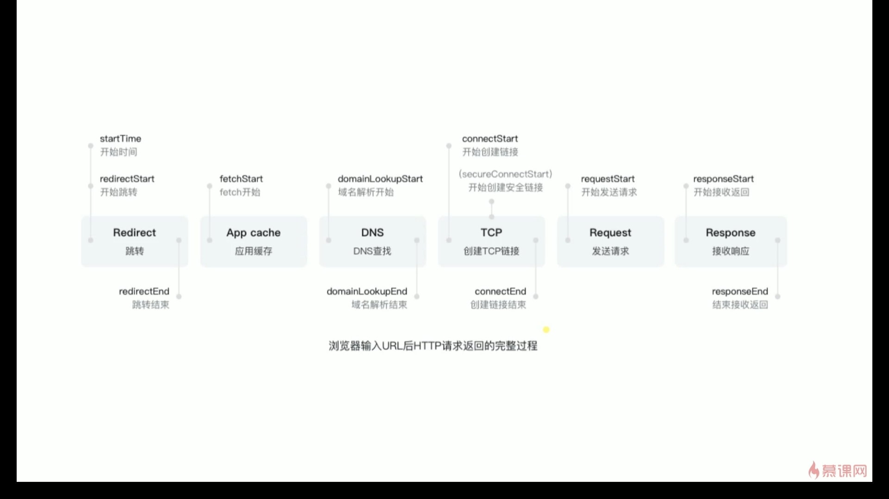

## “通信”与“通讯”傻傻分得清

传统意义上的“通讯”主要指电话、电报、电传。通讯的“讯”指消息（Message）,媒体讯息通过通讯网络从一端传递到另外一端。媒体讯息的内容主要是话音、文字、图片和视频图像。其网络的构成主要由电子设备系统和无线电系统构成，传输和处理的信号是模拟的。所以，“通讯”一词应特指采用电报、电话、网络等媒体传输系统实现上述媒体信息传输的过程。“通讯”重在内容形式，因此**通讯协议主要集中在 ISO 七层协议中的应用层**。

“通信”仅指数据通信，即通过计算机网络系统和数据通信系统实现数据的端到端传输。通信的“信”指的是信息（Information）,信息的载体是二进制的数据，数据则是可以用来表达传统媒体形式的信息，如声音、图像、动画等。“通信”重在传输手段或使用方式，从这个角度，“通信”的概念包括了信息“传输”。因此**通信协议主要集中在 ISO 七层协议中的物理层、数据链路层、网络层和传输层**。

[来源](https://zhuanlan.zhihu.com/p/27988243)

## HTTP 简介

HTTP 协议（HyperText Transfer Protocol，超文本传输协议）是用于从万维网（WWW:World Wide Web / WWW） 服务器传输超文本到本地浏览器的数据传送协议。它可以使浏览器更加高效，使网络传输减少。它不仅保证计算机正确快速地传输超文本文档，还确定传输文档中的哪一部分，以及哪部分内容首先显示(如文本先于图形)等。

HTTP 是通常承载于于 TCP/IP 通信协议来传递数据（HTML 文件, 图片文件, 查询结果等）。

有时也承载于 TLS 或 SSL 协议层之上，这个时候，就成了我们常说的 HTTPS。

[HTTP, HTTPS](https://images2018.cnblogs.com/blog/1090617/201802/1090617-20180225205151424-227704907.png "HTTP, HTTPS")

HTTP 是一个属于**应用层的面向对象的协议**，由请求和响应构成，是一个标准的客户端服务器模型。HTTP 是一个**无状态**的协议。由于其简捷、快速的方式，适用于分布式超媒体信息系统。它于 1990 年提出，经过几年的使用与发展，得到不断地完善和扩展。目前在 WWW 中使用的是 HTTP/1.0 的第六版，HTTP/1.1 的规范化工作正在进行之中，而且 HTTP-NG(Next Generation of HTTP)的建议已经提出。

HTTP 默认的端口号为**80**，HTTPS 的端口号为**443**。

HTTP 协议工作于客户端-服务端架构为上。浏览器作为 HTTP 客户端通过 URL 向 HTTP 服务端即 WEB 服务器发送所有请求。Web 服务器根据接收到的请求后，向客户端发送响应信息。

[http 请求-响应模型.jpg](http://upload-images.jianshu.io/upload_images/2964446-5a35e17f298a48e1.jpg?imageMogr2/auto-orient/strip%7CimageView2/2 "http请求-响应模型.jpg")

## 主要特点

1. **简单快速**：客户向服务器请求服务时，只需传送**请求方法**和**路径**。请求方法常用的有 GET、HEAD、POST。每种方法规定了客户与服务器联系的类型不同。由于 HTTP 协议简单，使得 HTTP 服务器的程序规模小，因而通信速度很快。

2. **灵活**：HTTP 允许**传输任意类型的数据对象**。正在传输的类型由 Content-Type 加以标记。

3. **HTTP 0.9 和 1.0 使用非持续连接**：无连接的含义是限制每次连接只处理一个请求。服务器处理完客户的请求，并收到客户的应答后，即断开连接。**HTTP 1.1 使用持续连接**：不必为每个 web 对象创建一个新的连接，一个连接可以传送多个对象。采用这种方式可以节省传输时间。

4. **无状态**：HTTP 协议是**无状态协议。无状态是指协议对于事务处理没有记忆能力**。缺少状态意味着如果后续处理需要前面的信息，则它必须重传，这样可能导致每次连接传送的数据量增大。另一方面，在服务器不需要先前信息时它的应答就较快。

5. **支持 B/S 及 C/S 模式**。
   B/S 结构（Browser/Server 结构）结构，即浏览器和服务器结构。
   C/S（Client/Server）结构，即客户机和服务器结构。

## HTTP 工作原理

HTTP 协议定义 Web 客户端如何从 Web 服务器请求 Web 页面，以及服务器如何把 Web 页面传送给客户端。HTTP 协议采用了**请求/响应**模型。客户端向服务器发送一个请求报文，请求报文包含请求的方法、URL、协议版本、请求头部和请求数据。服务器以一个状态行作为响应，响应的内容包括协议的版本、成功或者错误代码、服务器信息、响应头部和响应数据

一次 HTTP （请求/响应）操作称为一个事务，其工作整个步骤过程如下：

1. 地址解析

- 如用客户端浏览器请求这个页面：#3
- 从中分解出协议名、主机名、端口、对象路径等部分，对于我们的这个地址，解析得到的结果如下：
- 协议名：https
- 主机名：github.com
- 端口：''
- 对象路径：//issues/3
- 在这一步，需要域名系统 DNS 解析域名 github.com，得主机的 IP 地址。

2. 封装 HTTP 请求数据包

把以上部分结合本机自己的信息，封装成一个 HTTP 请求数据包

3. 封装成 TCP 包，建立 TCP 连接（TCP 的三次握手）

在 HTTP 工作开始之前，客户端（Web 浏览器）首先要通过网络与服务器建立连接，该连接是通过 TCP 来完成的，该协议与 IP 协议共同构建 Internet，即著名的 TCP/IP 协议族，因此 Internet 又被称作是 TCP/IP 网络。HTTP 是比 TCP 更高层次的应用层协议，根据规则，只有低层协议建立之后才能，才能进行更层协议的连接，因此，首先要建立 TCP 连接，一般 TCP 连接的端口号是 80。

4. 客户端发送请求命令

建立连接后，客户机发送一个文本的请求报文给 Web 服务器，请求方式的格式为：统一资源标识符（URL）、协议版本号，后边是 MIME 信息包括请求修饰符、客户端信息和内容。

通过 TCP 套接字，客户端向 Web 服务器发送一个文本的请求报文，一个请求报文由请求行、请求头部、空行和请求数据 4 部分组成。

5. 服务器接受请求并返回 HTTP 响应

Web 服务器解析请求，定位请求资源。服务器将资源复本写到 TCP 套接字，由客户端读取。一个响应由状态行、响应头部、空行和响应数据 4 部分组成。

Web 服务器接到请求后，给予相应的响应信息，其格式为一个状态行，包括信息的协议版本号、一个成功或错误的代码，后边是 MIME 信息包括服务器信息、实体信息和可能的内容。

实体消息是服务器向浏览器发送头信息后，它会发送一个空白行来表示头信息的发送到此为结束，接着，它就以 Content-Type 应答头信息所描述的格式发送用户所请求的实际数据

6. 服务器关闭 TCP 连接

一般情况下，一旦 Web 服务器向浏览器发送了请求数据，请求头 Connection: close， 则服务器主动关闭 TCP 连接，客户端被动关闭连接，释放 TCP 连接;

然后如果浏览器或者服务器在其头信息加入了这个请求头 Connection: keep-alive，TCP 连接在发送后将仍然保持打开状态一段时间，于是，浏览器在该时间内可以继续通过相同的连接发送请求。保持连接节省了为每个请求建立新连接所需的时间，还节约了网络带宽。

7. 客户端浏览器解析 HTML 内容

客户端浏览器首先解析状态行，查看表明请求是否成功的状态代码。然后解析每一个响应头，响应头告知以下为若干字节的 HTML 文档和文档的字符集。客户端浏览器读取响应数据 HTML，根据 HTML 的语法对其进行格式化，并在浏览器窗口中显示。

## 浏览器输入 URL 后 HTP 请求返回的完整过程

1. 浏览器向 DNS 服务器请求解析该 URL 中的域名所对应的 IP 地址;

2. 解析出 IP 地址后，根据该 IP 地址和默认端口 80，和服务器建立 TCP 连接;

3. 浏览器发出读取文件(URL 中域名后面部分对应的文件)的 HTTP 请求，该请求报文作为 TCP 三次握手的第三个报文的数据发送给服务器;

4. 服务器对浏览器请求作出响应，并把对应的 html 文本发送给浏览器;

5. 释放 TCP 连接;

6. 浏览器将该 html 文本并显示内容;

## HTTP 请求方法

根据 HTTP 标准，HTTP 请求可以使用多种请求方法。

HTTP1.0 定义了三种请求方法： **GET**, **POST** 和 **HEAD** 方法。

HTTP1.1 新增了五种请求方法：**OPTIONS**, **PUT**, **DELETE**, **TRACE** 和 **CONNECT** 方法。

> GET 请求指定的页面信息，并返回实体主体。

> HEAD 类似于 get 请求，只不过返回的响应中没有具体的内容，用于获取报头

> POST 向指定资源提交数据进行处理请求（例如提交表单或者上传文件）。数据被包含在请求体中。POST 请求可能会导致新的资源的建立和/或已有资源的修改。

> PUT 从客户端向服务器传送的数据取代指定的文档的内容。

> DELETE 请求服务器删除指定的页面。

> CONNECT HTTP/1.1 协议中预留给能够将连接改为管道方式的代理服务器。

> OPTIONS 允许客户端查看服务器的性能。

> TRACE 回显服务器收到的请求，主要用于测试或诊断。

## GET 和 POST 请求的区别

**GET 请求**

> GET /books/?sex=man&name=Professional HTTP/1.1
> Host: www.wrox.com
> User-Agent: Mozilla/5.0 (Windows; U; Windows NT 5.1; en-US; rv:1.7.6)
> Gecko/20050225 Firefox/1.0.1
> Connection: Keep-Alive

注意最后一行是空行

**POST 请求**

> POST / HTTP/1.1
> Host: www.wrox.com
> User-Agent: Mozilla/5.0 (Windows; U; Windows NT 5.1; en-US; rv:1.7.6)
> Gecko/20050225 Firefox/1.0.1
> Content-Type: application/x-www-form-urlencoded
> Content-Length: 40
> Connection: Keep-Alive
>
> name=Professional%20Ajax&publisher=Wiley

1. GET 提交，请求的数据会附在 URL 之后（就是把数据放置在 HTTP 协议头中），以?分割 URL 和传输数据，多个参数用&连接；例 如：login.action?name=hyddd&password=idontknow&verify=%E4%BD%A0 %E5%A5%BD。如果数据是英文字母/数字，原样发送，如果是空格，转换为+，如果是中文/其他字符，则直接把字符串用 BASE64 加密，得出如： %E4%BD%A0%E5%A5%BD，其中％XX 中的 XX 为该符号以 16 进制表示的 ASCII。

POST 提交：把提交的数据放置在是 HTTP 包的包体中。上文示例中红色字体标明的就是实际的传输数据

**因此，GET 提交的数据会在地址栏中显示出来，而 POST 提交，地址栏不会改变**

2. 传输数据的大小：首先声明：HTTP 协议没有对传输的数据大小进行限制，HTTP 协议规范也没有对 URL 长度进行限制。

而在实际开发中存在的限制主要有：

**GET**:特定浏览器和服务器对 URL 长度有限制，例如 IE 对 URL 长度的限制是 2083 字节(2K+35)。对于其他浏览器，如 Netscape、FireFox 等，理论上没有长度限制，其限制取决于操作系 统的支持。

因此对于 GET 提交时，传输数据就会受到 URL 长度的 限制。

**POST**:由于不是通过 URL 传值，理论上数据不受 限。但实际各个 WEB 服务器会规定对 post 提交数据大小进行限制，Apache、IIS6 都有各自的配置。

3. 安全性

POST 的安全性要比 GET 的安全性高。比如：通过 GET 提交数据，用户名和密码将明文出现在 URL 上，因为(1)登录页面有可能被浏览器缓存；(2)其他人查看浏览器的历史纪录，那么别人就可以拿到你的账号和密码了，除此之外，使用 GET 提交数据还可能会造成 Cross-site request forgery 攻击

4. Http get,post,soap 协议都是在 http 上运行的

（1）get：请求参数是作为一个 key/value 对的序列（查询字符串）附加到 URL 上的查询字符串的长度受到 web 浏览器和 web 服务器的限制（如 IE 最多支持 2048 个字符），不适合传输大型数据集同时，它很不安全

（2）post：请求参数是在 http 标题的一个不同部分（名为 entity body）传输的，这一部分用来传输表单信息，因此必须将 Content-type 设置为:application/x-www-form- urlencoded。post 设计用来支持 web 窗体上的用户字段，其参数也是作为 key/value 对传输。但是：它不支持复杂数据类型，因为 post 没有定义传输数据结构的语义和规则。

（3）soap：是 http post 的一个专用版本，遵循一种特殊的 xml 消息格式 Content-type 设置为: text/xml 任何数据都可以 xml 化。

Http 协议定义了很多与服务器交互的方法，最基本的有 4 种，分别是 GET,POST,PUT,DELETE. 一个 URL 地址用于描述一个网络上的资源，而 HTTP 中的 GET, POST, PUT, DELETE 就对应着对这个资源的查，改，增，删 4 个操作。 我们最常见的就是 GET 和 POST 了。GET 一般用于获取/查询资源信息，而 POST 一般用于更新资源信息.

我们看看 GET 和 POST 的区别

1. GET 提交的数据会放在 URL 之后，以?分割 URL 和传输数据，参数之间以&相连，如 EditPosts.aspx?name=test1&id=123456. POST 方法是把提交的数据放在 HTTP 包的 Body 中.

2. GET 提交的数据大小有限制（因为浏览器对 URL 的长度有限制），而 POST 方法提交的数据没有限制.

3. GET 方式需要使用 Request.QueryString 来取得变量的值，而 POST 方式通过 Request.Form 来获取变量的值。

4. GET 方式提交数据，会带来安全问题，比如一个登录页面，通过 GET 方式提交数据时，用户名和密码将出现在 URL 上，如果页面可以被缓存或者其他人可以访问这台机器，就可以从历史记录获得该用户的账号和密码.
