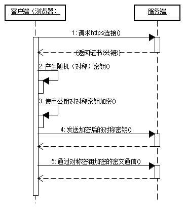

## HTTPS

HTTPS（Hypertext Transfer Protocol over Secure Socket Layer，HTTP over SSL/TLS，基于 SSL 的 HTTP 协议）

运行在 SSL/TLS 协议上的 HTTP。

SSL 的全称是“Secure Socket Layer”，由网景公司发明，提供了身份验证与加密通信方法，当发展到 3.0 时被标准化，改名为 TLS，即“Transport Layer Security”，但由于历史的原因还是有很多人称之为 SSL/TLS，或者直接简称为 SSL。现在它被广泛用于互联网上安全敏感的通信。

SSL 使用了许多密码学最先进的研究成果，综合了对称加密、非对称加密、摘要算法、数字签名、数字证书等技术，能够在不安全的环境中为通信的双方创建出一个秘密的、安全的传输通道，为 HTTP 套上一副坚固的盔甲。

你可以在今后上网时留心看一下浏览器地址栏，如果有一个小锁头标志，那就表明网站启用了安全的 HTTPS 协议，而 URI 里的协议名，也从“http”变成了“https”。

## 通信步骤

客户端在使用 HTTPS 方式与 Web 服务器通信时有以下几个步骤，如图所示。

(1) 客户使用 https 的 URL 访问 Web 服务器，要求与 Web 服务器建立 SSL 连接。

(2) Web 服务器收到客户端请求后，会将网站的证书信息（证书中包含公钥）传送一份给客户端。

(3) 客户端的浏览器与 Web 服务器开始协商 SSL 连接的安全等级，也就是信息加密的等级。

(4) 客户端的浏览器根据双方同意的安全等级，建立会话密钥，然后利用网站的公钥将会话密钥加密，并传送给网站。

(5) Web 服务器利用自己的私钥解密出会话密钥。

(6) Web 服务器利用会话密钥加密与客户端之间的通信。

[《大前端进阶 安全》系列 全网最透彻HTTPS（面试常问）](https://mp.weixin.qq.com/s/uUGy94fp3x8khCTR0gZeJA)

[谈谈 HTTPS](https://juejin.cn/post/6844903504046211079)

[深入理解https工作原理](https://mp.weixin.qq.com/s?__biz=MzUyNDYxNDAyMg==&mid=2247484269&idx=1&sn=18f5863a6b20ac85150350295c87301d&chksm=fa2be384cd5c6a9213174ad487e3c03e8588e2dc77d64462b085d883e9fb6a4fd51ec76f6ae6&scene=126&&sessionid=1664420297#rd)
