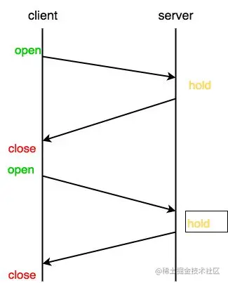
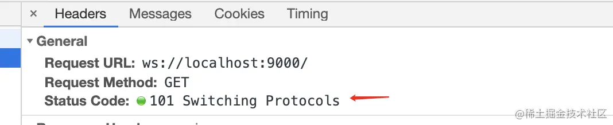

## 为什么需要 `WebSocket`

在 `WebSocket` 出现之前，大多数情况下是通过客户端发起轮询来拿到服务端实时更新的数据，因为 `HTTP1.x` 协议有一个缺陷就是通信只能由客户端发起，服务端没法主动给客户端推送。这种方式在对实时性要求比较高的场景下，比如即时通讯、即时报价等，显然会十分低效，体验也不好。

轮询效率低，非常浪费资源(需要不断发送请求，不停链接服务器)。

为了解决 `HTTP` 协议中不适用于实时通信的问题，便出现了 `WebSocket` 协议，实现了客户端和服务端双向通信的能力。

介绍 `WebSocket` 之前，先了解下轮询实现推送的方式。

1. 短轮询（Polling）

短轮询的实现思路就是浏览器端每隔几秒钟向服务器端发送 `HTTP` 请求，服务端在收到请求后，不论是否有数据更新，都直接进行响应。在服务端响应完成，就会关闭这个 `TCP` 连接，代码实现也最简单，就是利用 `XHR` ， 通过 `setInterval` 定时向后端发送请求，以获取最新的数据。

```javaScript
setInterval(function() {
  fetch(url).then((res) => {
      // success code
  })
}, 3000);
```

- 优点：实现简单。

- 缺点：会造成数据在一小段时间内不同步和大量无效的请求，安全性差、浪费资源。

2. 长轮询（Long-Polling）

客户端发送请求后服务器端不会立即返回数据，服务器端会阻塞请求连接不会立即断开，直到服务器端有数据更新或者是连接超时才返回，客户端才再次发出请求新建连接、如此反复从而获取最新数据。



客户端代码如下：

```javaScript
function async() {
    fetch(url).then((res) => {
    	async();
    	// success code
	}).catch(() => {
		// 超时
        async();
	})
}
```

- 优点：比 Polling 做了优化，有较好的时效性。

- 缺点：保持连接挂起会消耗资源，服务器没有返回有效数据，程序超时。

## `WebSocket`

`WebSocket` 是 `HTML5` 新增的协议，它的目的是在浏览器和服务器之间建立一个不受限的双向通信的通道。`WebSocket` 并不是全新的协议，而是利用了 `HTTP` 协议来建立连接。

它的最大特点就是，服务器可以主动向客户端推送信息，客户端也可以主动向服务器发送信息，是真正的双向平等对话，属于服务器推送技术的一种。

其他特点包括：

- 建立在 `TCP` 协议之上，服务器端的实现比较容易。

- 与 `HTTP` 协议有着良好的兼容性。默认端口也是 `80` 和 `443`，并且握手阶段采用 `HTTP` 协议，因此不容易屏蔽，能通过各种 `HTTP` 代理服务器。

- 数据格式比较轻量，性能开销小，通信高效。因为协议控制的数据包头部较小，而HTTP协议每次通信都需要携带完整的头部。

- 可以发送文本，也可以发送二进制数据。

- 没有同源限制，客户端可以与任意服务器通信。

- 协议标识符是 `ws`（如果加密，则为 `wss`），服务器网址就是 `URL`。

1. 通信原理

当客户端要和服务端建立 `WebSocket` 连接时，在客户端和服务器的握手过程中，客户端首先会向服务端发送一个 `HTTP` 请求，包含一个 `Upgrade` 请求头来告知服务端客户端想要建立一个 `WebSocket` 连接。

在客户端建立一个 `WebSocket` 连接非常简单：

```javaScript
let ws = new WebSocket('ws://localhost:9000');
```

类似于 `HTTP` 和 `HTTPS`，`ws` 相对应的也有 `wss` 用以建立安全连接，本地已 `ws` 为例。这时的请求头如下：

```
Accept-Encoding: gzip, deflate, br
Accept-Language: zh-CN,zh;q=0.9
Cache-Control: no-cache
Connection: Upgrade	// 表示该连接要升级协议
Cookie: _hjMinimizedPolls=358479; ts_uid=7852621249; CNZZDATA1259303436=1218855313-1548914234-%7C1564625892; csrfToken=DPb4RhmGQfPCZnYzUCCOOade; JSESSIONID=67376239124B4355F75F1FC87C059F8D; _hjid=3f7157b6-1aa0-4d5c-ab9a-45eab1e6941e; acw_tc=76b20ff415689655672128006e178b964c640d5a7952f7cb3c18ddf0064264
Host: localhost:9000
Origin: http://localhost:9000
Pragma: no-cache
Sec-WebSocket-Extensions: permessage-deflate; client_max_window_bits
Sec-WebSocket-Key: 5fTJ1LTuh3RKjSJxydyifQ==		// 与响应头 Sec-WebSocket-Accept 相对应
Sec-WebSocket-Version: 13	// 表示 websocket 协议的版本
Upgrade: websocket	// 表示要升级到 websocket 协议
User-Agent: Mozilla/5.0 (Macintosh; Intel Mac OS X 10_14_0) AppleWebKit/537.36 (KHTML, like Gecko) Chrome/76.0.3809.132 Safari/537.36
```

响应头如下：

```
Connection: Upgrade
Sec-WebSocket-Accept: ZUip34t+bCjhkvxxwhmdEOyx9hE=
Upgrade: websocket
```



此时响应行（General）中可以看到状态码 `status code` 是 `101 Switching Protocols` ， 表示该连接已经从 `HTTP` 协议转换为 `WebSocket` 通信协议。 转换成功之后，该连接并没有中断，而是建立了一个全双工通信，后续发送和接收消息都会走这个连接通道。

注意，请求头中有个 `Sec-WebSocket-Key` 字段，和相应头中的 `Sec-WebSocket-Accept` 是配套对应的，它的作用是提供了基本的防护，比如恶意的连接或者无效的连接。`Sec-WebSocket-Key` 是客户端随机生成的一个 `base64` 编码，服务器会使用这个编码，并根据一个固定的算法：

```
GUID = "258EAFA5-E914-47DA-95CA-C5AB0DC85B11";    //  一个固定的字符串
accept = base64(sha1(key + GUID));	// key 就是 Sec-WebSocket-Key 值，accept 就是 Sec-WebSocket-Accept 值
```

其中 `GUID` 字符串是 [RFC6455](https://link.juejin.cn/?target=https%3A%2F%2Ftools.ietf.org%2Fhtml%2Frfc6455%23section-5.5.2) 官方定义的一个固定字符串，不得修改。

客户端拿到服务端响应的 `Sec-WebSocket-Accept` 后，会拿自己之前生成的 `Sec-WebSocket-Key` 用相同算法算一次，如果匹配，则握手成功。然后判断 `HTTP Response` 状态码是否为 `101`（切换协议），如果是，则建立连接，大功告成。

2.  客户端的简单示例

```javaScript
function socketConnect(url) {
    // 客户端与服务器进行连接
    let ws = new WebSocket(url); // 返回`WebSocket`对象，赋值给变量ws
    // 连接成功回调
    ws.onopen = e => {
        console.log('连接成功', e)
        ws.send('我发送消息给服务端'); // 客户端与服务器端通信
    }
    // 监听服务器端返回的信息
    ws.onmessage = e => {
        console.log('服务器端返回：', e.data)
        // do something
    }
    // 监听连接失败
    ws.onerror = () => {
        console.log('连接失败，正在重连...');
        connectWebsocket();
    };

    // 监听连接关闭
    ws.onclose = () => {
    	console.log('连接关闭');
    };
    return ws; // 返回websocket对象
}
let wsValue = socketConnect('ws://121.40.165.18:8800'); // websocket对象
```

上述栗子中 `WebSocket` 的接口地址出自：[WebSocket 在线测试](https://link.juejin.cn/?target=http%3A%2F%2Fwww.blue-zero.com%2FWebSocket%2F)，在开发的时候也可以用于测试后端给的地址是否可用。

3. 服务端的实现

常用的 `Node` 实现有以下三种

- [µWebSockets](https://link.juejin.cn/?target=https%3A%2F%2Fgithub.com%2FuWebSockets%2FuWebSockets)

- [Socket.IO](https://link.juejin.cn/?target=http%3A%2F%2Fsocket.io%2F)

- [WebSocket-Node](https://link.juejin.cn/?target=https%3A%2F%2Fgithub.com%2Ftheturtle32%2FWebSocket-Node)

## `WebSocket` 不稳定

`WebSocket` 并不稳定，在使用一段时间后，可能会断开连接，貌似至今没有一个为何会断开连接的公论，所以需要让 `WebSocket` 保持连接状态，这里推荐两种方法。

1. `WebSocket` 设置变量，判断是否手动关闭连接

设置一个变量，在 `webSocket` 关闭/报错的回调中，判断是不是手动关闭的，如果不是的话，就重新连接。

优点：请求较少(相对于心跳连接)，易设置。

缺点：可能会导致丢失数据,在断开重连的这段时间中，恰好双方正在通信。

2. `WebSocket` 心跳机制

客户端就像心跳一样每隔固定的时间发送一次 `ping` ，来告诉服务器，我还活着，而服务器也会返回 `pong` ，来告诉客户端，服务器还活着。`ping/pong` 其实是一条与业务无关的假消息，也称为心跳包。

## `WebSocket` 的 `class` 类

```javaScript
class WebSocketClass {
    /**
     * @description: 初始化实例属性，保存参数
     * @param {String} url ws的接口
     * @param {Function} msgCallback 服务器信息的回调传数据给函数
     * @param {String} name 可选值 用于区分ws，用于debugger
     */
    constructor(url, msgCallback, name = 'default') {
        this.url = url;
        this.msgCallback = msgCallback;
        this.name = name;
        this.ws = null;  // websocket对象
        this.status = null; // websocket是否关闭
    }
    /**
     * @description: 初始化 连接websocket或重连webSocket时调用
     * @param {*} 可选值 要传的数据
     */
    connect(data) {
        // 新建 WebSocket 实例
        this.ws = new WebSocket(this.url);
        this.ws.onopen = e => {
            // 连接ws成功回调
            this.status = 'open';
            console.log(`${this.name}连接成功`, e)
            // this.heartCheck();
            if (data !== undefined) {
                // 有要传的数据,就发给后端
                return this.ws.send(data);
            }
        }
        // 监听服务器端返回的信息
        this.ws.onmessage = e => {
            // 把数据传给回调函数，并执行回调
            // if (e.data === 'pong') {
            //     this.pingPong = 'pong'; // 服务器端返回pong,修改pingPong的状态
            // }
            return this.msgCallback(e.data);
        }
        // ws关闭回调
        this.ws.onclose = e => {
            this.closeHandle(e); // 判断是否关闭
        }
        // ws出错回调
        this.onerror = e => {
            this.closeHandle(e); // 判断是否关闭
        }
    }
    // heartCheck() {
    //     // 心跳机制的时间可以自己与后端约定
    //     this.pingPong = 'ping'; // ws的心跳机制状态值
    //     this.pingInterval = setInterval(() => {
    //         if (this.ws.readyState === 1) {
    //             // 检查ws为链接状态 才可发送
    //             this.ws.send('ping'); // 客户端发送ping
    //         }
    //     }, 10000)
    //     this.pongInterval = setInterval(() => {
    //         if (this.pingPong === 'ping') {
    //             this.closeHandle('pingPong没有改变为pong'); // 没有返回pong 重启webSocket
    //         }
    //         // 重置为ping 若下一次 ping 发送失败 或者pong返回失败(pingPong不会改成pong)，将重启
    //         console.log('返回pong')
    //         this.pingPong = 'ping'
    //     }, 20000)
    // }
    // 发送信息给服务器
    sendHandle(data) {
        console.log(`${this.name}发送消息给服务器:`, data)
        return this.ws.send(data);
    }
    closeHandle(e = 'err') {
        // 因为webSocket并不稳定，规定只能手动关闭(调closeMyself方法)，否则就重连
        if (this.status !== 'close') {
            console.log(`${this.name}断开，重连websocket`, e)
            // if (this.pingInterval !== undefined && this.pongInterval !== undefined) {
            //     // 清除定时器
            //     clearInterval(this.pingInterval);
            //     clearInterval(this.pongInterval);
            // }
            this.connect(); // 重连
        } else {
            console.log(`${this.name}websocket手动关闭`)
        }
    }
    // 手动关闭WebSocket
    closeMyself() {
        console.log(`关闭${this.name}`)
        this.status = 'close';
        return this.ws.close();
    }
}
function someFn(data) {
    console.log('接收服务器消息的回调：', data);
}
// const wsValue = new WebSocketClass('ws://121.40.165.18:8800', someFn, 'wsName'); // 这个链接一天只能发送消息50次
const wsValue = new WebSocketClass('wss://echo.websocket.org', someFn, 'wsName'); // 阮一峰老师教程链接
wsValue.connect('立即与服务器通信'); // 连接服务器
// setTimeout(() => {
//     wsValue.sendHandle('传消息给服务器')
// }, 1000);
// setTimeout(() => {
//     wsValue.closeMyself(); // 关闭ws
// }, 10000)
```

## 关于 `WebSocket`

1. `WebSocket` 的当前状态: `WebSocket.readyState`

- 0: 表示正在连接

- 1: 表示连接成功，可以通信了

- 2: 表示连接正在关闭

- 3: 表示连接已经关闭，或者打开连接失败

2. `WebSocket` 发送/接收 二进制数据

二进制数据包括：`blob` 对象和 `Arraybuffer` 对象，所以需要分开来处理

```javaScript
    // 接收数据
ws.onmessage = function(event){
    if(event.data instanceof ArrayBuffer){
        // 判断 ArrayBuffer 对象
    }
    
    if(event.data instanceof Blob){
        // 判断 Blob 对象
    }
}

// 发送 Blob 对象的例子
let file = document.querySelector('input[type="file"]').files[0];
ws.send(file);

// 发送 ArrayBuffer 对象的例子
var img = canvas_context.getImageData(0, 0, 400, 320);
var binary = new Uint8Array(img.data.length);
for (var i = 0; i < img.data.length; i++) {
    binary[i] = img.data[i];
}
ws.send(binary.buffer);
```

如果要发送的二进制数据很大的话，如何判断发送完毕：

`webSocket.bufferedAmount` 属性，表示还有多少字节的二进制数据没有发送出去：

```javaScript
var data = new ArrayBuffer(10000000);
socket.send(data);
if (socket.bufferedAmount === 0) {
    // 发送完毕
} else {
    // 发送还没结束
}
```


