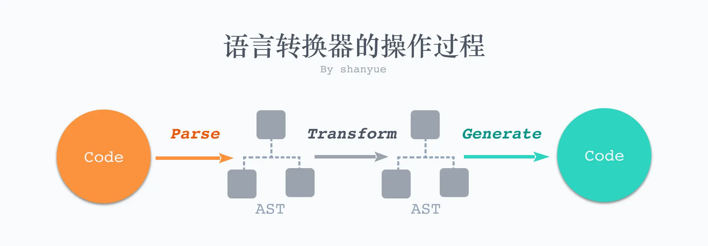
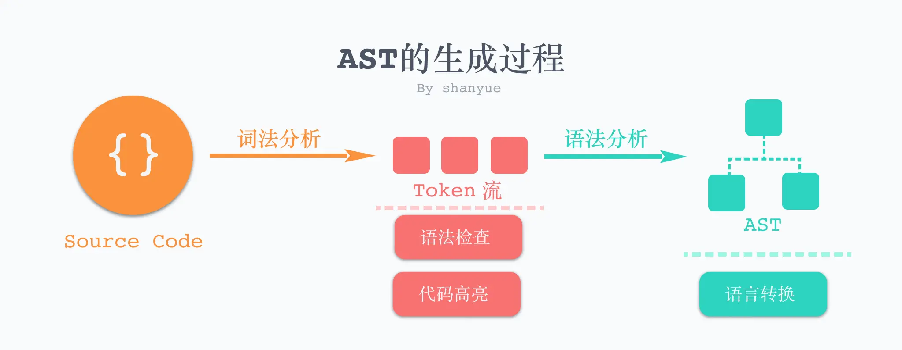

## 什么是 AST

`AST` 是 `Abstract Syntax Tree` 的简称，是前端工程化绕不过的一个名词。它涉及到工程化诸多环节的应用，比如:

- 如何将 Typescript 转化为 Javascript (typescript)
- 如何将 SASS/LESS 转化为 CSS (sass/less)
- 如何将 ES6+ 转化为 ES5 (babel)
- 如何将 Javascript 代码进行格式化 (eslint/prettier)
- 如何识别 React 项目中的 JSX (babel)
- GraphQL、MDX、Vue SFC 等等

而在语言转换的过程中，实质上就是对其 AST 的操作，核心步骤就是 AST 三步走

1. Code -> AST (Parse)

2. AST -> AST (Transform)

3. AST -> Code (Generate)



不同的语言拥有不同的解析器，比如 Javascript 的解析器和 CSS 的解析器就完全不同。

对相同的语言，也存在诸多的解析器，也就会生成多种 AST，如 babel 与 espree。

在 [AST Explorer](https://astexplorer.net/) 中，列举了诸多语言的解析器(Parser)，及转化器(Transformer)。

## AST 的生成

AST 的生成这一步骤被称为解析(Parser)，而该步骤也有两个阶段: 词法分析(Lexical Analysis)和语法分析(Syntactic Analysis)

### 词法分析 (Lexical Analysis)

词法分析用以将代码转化为 Token 流，维护一个关于 Token 的数组



词法分析后的 Token 流也有诸多应用，如:

- 代码检查，如 eslint 判断是否以分号结尾，判断是否含有分号的 token
- 语法高亮，如 highlight/prism 使之代码高亮
- 模板语法，如 ejs 等模板也离不开

### 语法分析 (Syntactic Analysis)

语法分析将 Token 流转化为结构化的 AST，方便操作

最简编译器的实现 [the super tiny compiler](https://github.com/jamiebuilds/the-super-tiny-compiler)

## Browserslist

Browserslist 是在不同的前端工具之间共用目标浏览器和 node 版本的配置工具。它主要被以下工具使用：

- Autoprefixer
- Babel
- post-preset-env
- eslint-plugin-compat
- stylelint-unsupported-browser-features
- postcss-normalize
- obsolete-webpack-plugin

[Browserslist 示例](https://github.com/browserslist/browserslist-example) 演示了上面列举的每个工具是如何使用 `browserslist` 的。所有的工具将自动的查找当前工程规划的目标浏览器范围，前提是你在前端工程的 `package.json` 里面增加如下配置：

```json
{
  "browserslist": [
    "last 1 version",
    "> 1%",
    "maintained node versions",
    "not dead"
  ]
}
```

或者在工程的根目录下存在 `.browserslistrc` 配置文件：

```shell
# 注释是这样写的，以#号开头
last 1 version
> 1%
maintained node versions
not dead
```

开发者通过设置浏览器版本查询范围(eg. last 2 versions)，使得开发者不用再频繁的手动更新浏览器版本。`browserslist` 使用 [Can I Use](https://link.juejin.cn/?target=http%3A%2F%2Fcaniuse.com%2F) 网站的数据来查询浏览器版本范围。

[前端工程基础知识点--Browserslist (基于官方文档翻译）](https://juejin.cn/post/6844903669524086797)

## [Babel](https://babel.docschina.org/)

Babel 是 JavaScript 编译器：他能让开发者在开发过程中，直接使用各类方言（如 TS、JSX）或新的语法特性，而不需要考虑运行环境，因为 Babel 可以做到按需转换为低版本支持的代码；Babel 内部原理是将 JS 代码转换为 AST，对 AST 应用各种插件进行处理，最终输出编译后的 JS 代码。

### Babel 编译流程

源代码 ——> 解析(Parsing) ——> 转换(Transformation) ——> 代码生成(Code Generation) ——> 目标代码

三大步骤：

1. 解析阶段：Babel 默认使用 `@babel/parser` 将代码转换为 AST。解析一般分为两个阶段：词法分析和语法分析。

- 词法分析：对输入的字符序列做标记化(tokenization)操作生成令牌（tokens） 流。

- 语法分析：处理标记与标记之间的关系，最终形成一颗完整的 AST 结构。

2. 转换阶段：Babel 使用 `@babel/traverse` 提供的方法对 AST 进行深度优先遍历，调用插件对关注节点的处理函数，按需对 AST 节点进行增删改操作。这是 Babel 或是其他编译器中最复杂的过程。`@babel/traverse` 参数为原始AST和自定义的转换规则，返回结果为转换后的AST

3. 生成阶段：Babel 默认使用 `@babel/generator` 将上一阶段处理后的 AST 转换为代码字符串，生成过程可以对是否压缩以及是否删除注释等进行配置，同时还会创建源码映射（source maps）支持 sourceMap。

[Babel 教程](https://www.jiangruitao.com/babel/)

[理解babel的基本原理和使用方法](https://www.cnblogs.com/jyybeam/p/13375179.html)
[[实践系列]Babel原理](https://juejin.cn/post/6844903760603398151)
[不容错过的 Babel7 知识](https://juejin.cn/post/6844904008679686152)
[解剖 Babel —— 向前端架构师迈出一小步](https://mp.weixin.qq.com/s?__biz=MzUyNDYxNDAyMg==&mid=2247488129&idx=1&sn=5d44737e538f68bd6fda4140f450a7da&chksm=fa2bf268cd5c7b7e038a6035d836c2403f2f91b99455abbc1b01c88bb6f5290753dbc60fa808&scene=126&&sessionid=1664519638#rd)
[基于 babel 手写 ts type checker](https://mp.weixin.qq.com/s?__biz=MzUyNDYxNDAyMg==&mid=2247488828&idx=2&sn=7be3310a321c21cf9d57f9791e2c8ba6&chksm=fa2bf5d5cd5c7cc3cb8e11f7bb1a0735c7faee7c1e9da00e6c56454204afc4bf62edfb44ca77&scene=126&&sessionid=1664519629#rd)

## [PostCSS](https://github.com/postcss/postcss/blob/main/docs/README-cn.md)

[解剖postCSS —— 向前端架构师迈出一小步](https://mp.weixin.qq.com/s?__biz=MzUyNDYxNDAyMg==&mid=2247488216&idx=2&sn=f29837f928b83460b041a19f921c9707&chksm=fa2bf231cd5c7b27380969ad1c28b341fda6c1d9189908fce94bbf2519f26976ef03351283cc&scene=126&&sessionid=1664519637#rd)

[零基础理解 PostCSS 的主流程](https://mp.weixin.qq.com/s?__biz=MzUyNDYxNDAyMg==&mid=2247490524&idx=2&sn=275c90fa52cd10a021e1bed50df16b64&chksm=fa2bfb35cd5c7223f0ad3bf0319a3661e17edab789958dc57152472e795d2f3b8580a9f60edd&scene=126&&sessionid=1664519598#rd)


## ESLint

[ESLint 使用教程](https://juejin.cn/post/7012798266089668645)
[零基础理解 ESLint 核心原理](https://mp.weixin.qq.com/s?__biz=MzUyNDYxNDAyMg==&mid=2247490677&idx=2&sn=94be8250b1177dad6eb9c2d6983fc0af&chksm=fa2bfc9ccd5c758a411324b6c26caeae89bc34f8ae899718ca42149c40c5d6a4f12457fcb7c3&scene=126&&sessionid=1664519597#rd)


[基于 babel 和 postcss 查找项目中的无用模块](https://mp.weixin.qq.com/s?__biz=MzUyNDYxNDAyMg==&mid=2247488876&idx=2&sn=adb18f1048ea0a8da60d1e3483c4ef1d&chksm=fa2bf585cd5c7c93870747f770d3eac5dd7872a9d61c5cf67e0a25ec119784da24a6e9ea0d55&scene=126&&sessionid=1664519627#rd)

