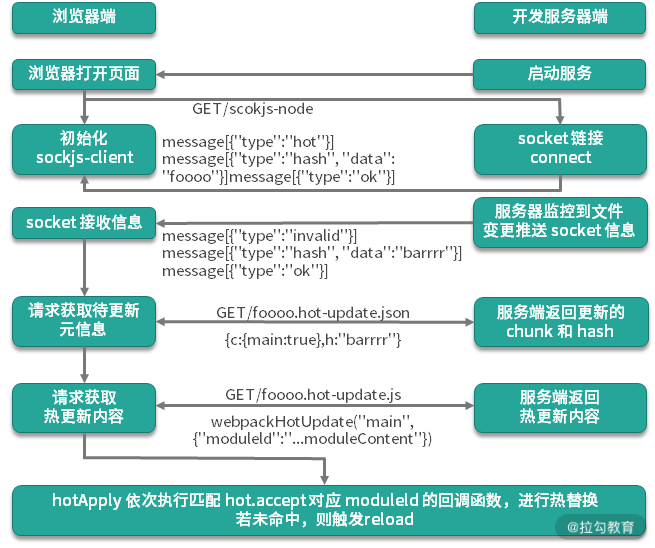

## 基本概念

`HMR` 全称 `Hot Module Replacement`，翻译过来叫作“模块热替换”或“模块热更新”。

计算机行业经常听到一个叫作热拔插的名词，指的就是可以在一个正在运行的机器上随时插拔设备，机器的运行状态不会受插拔的影响，而且插上去的设备可以立即工作，例如电脑上的 USB 端口就可以热拔插。

模块热替换中的“热”和这里提到的“热拔插”是相同的意思，都是**指在运行过程中的即时变化**。

Webpack 中的模块热替换，指的是可以在应用运行过程中，实时的去替换掉应用中的某个模块，而应用的运行状态不会因此而改变。例如，在应用运行过程中修改了某个模块，通过自动刷新会导致整个应用的整体刷新，那页面中的状态信息都会丢失；而如果使用的是 `HMR`，就可以实现只将修改的模块实时替换至应用中，不必完全刷新整个应用。

## 开启 HMR

`HMR` 已经集成在了 Webpack 模块中了，所以不需要再单独安装什么模块。

只需要将 `devServer` 对象中的 `hot` 属性设置为 `true`，然后需要载入 Webpack 内置的一个叫作 `HotModuleReplacementPlugin` 的插件。注意：Webpack5 开启 `hot` 选项，这个插件会自动引入。

```javaScript
// webpack.config.js
const webpack = require('webpack')

module.exports = {
  // ...
  devServer: {
    // 开启 HMR
    hot: true
  }
}
```

## HMR 的疑问

`CSS` 文件热替换没出现问题，而到了 `JS` 这块就不行了，当我们自己去尝试开启 `HMR` 过后，效果却不尽如人意。很明显：`HMR` 并不像 Webpack 的其他特性一样可以开箱即用，需要有一些额外的操作。

具体来说，Webpack 中的 `HMR` 需要我们手动通过代码去处理，当模块更新过后该，如何把更新后的模块替换到页面中。

### 为什么我们开启 `HMR` 过后，样式文件的修改就可以直接热更新呢？

这是因为样式文件是经过 `Loader` 处理的，在 `style-loader` 中就已经自动处理了样式文件的热更新，所以就不需要我们额外手动去处理了。

在预览页面中控制台的 Sources 面板中查看经过 `style-loader` 处理的 `style.css` 模块的代码，简化一下 `style-loader` 处理后的模块代码，只看其热替换相关的部分。

```javaScript
//为了清晰期间，将模块名称注释以及与热更新无关的逻辑省略，并将 css 内容模块路径赋值为变量 cssContentPath 以便多处引用，实际代码可从示例运行时中查看
var cssContentPath = "./node_modules/css-loader/dist/cjs.js!./src/style.css"
var api = __webpack_require__("./node_modules/style-loader/dist/runtime/injectStylesIntoStyleTag.js");
var content = __webpack_require__(cssContentPath);
...
var update = api(content, options);
...
module.hot.accept(
  cssContentPath,
  function(){
    content = __webpack_require__(cssContentPath);
    ...
    update(content);
  }
)
module.hot.dispose(function() {
  update();
});
```

从上面的代码中可以看到，在运行时调用 API 实现将样式注入新生成的 `style` 标签，并将返回函数传递给 `update` 变量。然后，在 `module.hot.accept` 方法的回调函数中执行 `update(content)`，在 `module.hot.dispose` 中执行 `update()`。通过查看上述 API 的代码，可以发现 `update(content)` 是将新的样式内容更新到原 `style` 标签中，而 `update()` 则是移除注入的 `style` 标签。

### 为什么样式就可以自动处理，而 JS 脚本就需要手动处理呢？

这个原因是因为样式模块更新过后，只需要把更新后的 `CSS` 及时替换到页面中，它就可以覆盖掉之前的样式，从而实现更新。

而我们所编写的 `JavaScript` 模块是没有任何规律的，你可能导出的是一个对象，也可能导出的是一个字符串，还可能导出的是一个函数，使用时也各不相同。所以 Webpack 面对这些毫无规律的 `JS` 模块，根本不知道该怎么处理更新后的模块，也就无法直接实现一个可以通用所有情况的模块替换方案。

那这就是为什么样式文件可以直接热更新，而 `JS` 文件更新后页面还是回退到自动刷新的原因。

### 为什么使用 `vue-cli` 或者 `create-react-app` 这种框架脚手架工具的开发的项目就没有手动处理，`JavaScript` 代码可以热替换？

这是因为使用框架开发时，项目中的每个文件就有了规律，例如 React 中要求每个模块导出的必须是一个函数或者类，那这样就可以有通用的替换办法，所以这些工具内部都已经实现了通用的替换操作，自然就不需要手动处理了。

综上所述，我们还是需要自己手动通过代码来处理，当 `JavaScript` 模块更新过后，该如何将更新后的模块替换到页面中。

## 模块热替换插件（HotModuleReplacementPlugin）

`module.hot` 实际上是一个来自 webpack 的基础插件 `HotModuleReplacementPlugin`，该插件作为热替换功能的基础插件，其为 `JavaScript` 提供了一套用于处理 `HMR` 的 API 导出到了 `module.hot` 的属性中，我们需要在我们自己的代码中，使用这套 API 将更新后的模块替换到正在运行的页面中。

接下来我们回到代码中，尝试通过 `HMR` 的 API 手动处理模块更新后的热替换。

这里我们打开 `main.js`，具体代码如下：

```javaScript
// ./src/main.js
import createEditor from './editor'
import logo from './icon.png'
import './global.css'

const img = new Image()
img.src = logo
document.body.appendChild(img)

const editor = createEditor()
document.body.appendChild(editor)
```

这是 Webpack 打包的入口文件，正常情况下，在这个文件中会加载一些其他模块。正是因为在 `main.js` 中使用了这些模块，所以一旦这些模块更新了过后，在 `main.js` 中就必须重新使用更新后的模块。

所以说，我们需要在这个文件中添加一些额外的代码，去处理它所依赖的这些模块更新后的热替换逻辑。

对于开启 `HMR` 特性的环境中，我们可以访问到全局的 `module` 对象中的 `hot` 成员，这个成员是一个对象，这个对象就是 `HMR` API 的核心对象，它提供了一个 `accept` 方法，用于注册当某个模块更新后的处理函数。`accept` 方法第一个参数接收的就是所监视的依赖模块路径（模块名称），第二个参数就是依赖模块更新后的处理函数（回调方法），当依赖模块发生更新时，其回调方法就会被执行，而开发者就可以在回调中实现对应的替换逻辑。

那我们这里先尝试注册 `./editor` 模块更新过后的处理函数，第一个参数就是 `editor` 模块的路径，第二个参数则需要我们传入一个函数，然后在这个函数中打印一个消息，具体代码如下：

```javaScript
// ./main.js

// ... 原本的业务代码

module.hot.accept('./editor', () => {
  // 当 ./editor.js 更新，自动执行此函数
  console.log('editor 更新了～～')
})
```

完成过后，我们打开命令行终端再次启动 `webpack-dev-server` 命令，然后回到浏览器，打开开发人员工具。

此时，如果我们修改了 `editor` 模块，保存过后，浏览器的控制台中就会自动打印我们上面在代码中添加的消息，而且浏览器也不会自动刷新了。

那也就是说一旦这个模块的更新被我们手动处理了，就不会触发自动刷新；反之，如果没有手动处理，热替换会自动 fallback（回退）到自动刷新。

另一个 `hot.dispose` 方法则是传入一个回调，当代码上下文的模块被移除时，其回调方法就会被执行。

`module.hot` 中还包含了该插件提供的其他热更新相关的 API 方法，可以从[官方文档](https://webpack.js.org/api/hot-module-replacement/)中进一步了解。

## JS 模块热替换

了解了这个 `HMR` API 的作用过后，接下来需要考虑的就是：具体如何实现 `editor` 模块的热替换。

这个模块导出的是一个 `createEditor` 函数，我们先正常把它打印到控制台，然后在模块更新后的处理函数中再打印一次，具体代码如下：

```javaScript
// ./main.js
import createEditor from './editor'

// ... 原本的业务代码

console.log(createEditor)
module.hot.accept('./editor', () => {
  console.log(createEditor)
})
```

这个时候如果你再次修改 `editor` 模块，保存过后，就会发现当模块更新后，我们这里拿到的 `createEditor` 函数也就更新为了最新的结果。

既然模块文件更新后 `createEditor` 函数可以自动更新，那剩下的就好办了。我们这里使用 `createEditor` 函数是用来创建一个界面元素的，那模块一旦更新了，这个元素也就需要重新创建，所以我们这里先移除原来的元素，然后再调用更新后的 `createEditor` 函数，创建一个新的元素追加到页面中。

但如果只是这样实现的话，一次热替换结束后，第二次就没法再实现热替换了。因为第二次执行这个函数的时候，`editor` 变量指向的元素已经在上一次执行时被移除了，所以我们这里还应该记录下来每次热替换创建的新元素，以便于下一次热替换时的操作，具体代码如下：

```javaScript
// ./main.js
import createEditor from './editor'

const editor = createEditor()
document.body.appendChild(editor)

// ... 原本的业务代码

// HMR -----------------------------------
let lastEditor = editor
module.hot.accept('./editor', () => {
  document.body.removeChild(lastEditor) // 移除之前创建的元素
  lastEditor = createEditor() // 用新模块创建新元素
  document.body.appendChild(lastEditor)
})
```

完成以后，我们再来尝试修改 editor 模块，此时就应该是正常的热替换效果了。

## 热替换的状态保持

此时，如果我们尝试在界面上输入一些内容（形成页面操作状态），然后回到代码中再次修改 `editor` 模块。那此时你仍然会发现问题，由于热替换时，把界面上之前的编辑器元素移除了，替换成了一个新的元素，所以页面上之前的状态同样会丢失。

这也就证明我们的热替换操作还需要改进，我们必须在替换时把状态保留下来。

我们回到 `main.js` 中，要想保留这个状态也很简单，就是在替换前先拿到编辑器中的内容，然后替换后在放回去就行了。那因为我这里使用的是可编辑元素，而不是文本框，所以我们需要通过 `innerHTML` 拿到之前编辑的内容，然后设置到更新后创建的新元素中，具体代码如下：

```javaScript
// ./main.js
import createEditor from './editor'

const editor = createEditor()
document.body.appendChild(editor)

// ... 原本的业务代码

// HMR --------------------------------
let lastEditor = editor
module.hot.accept('./editor', () => {
  // 当 editor.js 更新，自动执行此函数
  // 临时记录更新前编辑器内容
  const value = lastEditor.innerHTML
  // 移除更新前的元素
  document.body.removeChild(lastEditor)
  // 创建新的编辑器
  // 此时 createEditor 已经是更新过后的函数了
  lastEditor = createEditor()
  // 还原编辑器内容
  lastEditor.innerHTML = value
  // 追加到页面
  document.body.appendChild(lastEditor)
})
```

这样就可以解决界面状态保存的问题了。

至此，对于 `editor` 模块的热替换逻辑就算是全部实现了。通过这个过程你应该能够发现，为什么 Webpack 需要我们自己处理 JS 模块的热更新了：因为不同的模块有不同的情况，不同的情况，在这里处理时肯定也是不同的。就好像，我们这里是一个文本编辑器应用，所以需要保留状态，如果不是这种类型那就不需要这样做。所以说 Webpack 没法提供一个通用的 JS 模块替换方案。

## 图片模块热替换

相比于 `JavaScript` 模块热替换，图片的热替换逻辑就简单多了，这里我们快速来看一下。

我们同样通过 `module.hot.accept` 注册这个图片模块的热替换处理函数，在这个函数中，我们只需要重新给图片元素的 `src` 设置更新后的图片路径就可以了。因为图片修改过后图片的文件名会发生变化，而这里我们就可以直接得到更新后的路径，所以重新设置图片的 `src` 就能实现图片热替换，具体代码如下：

```javaScript
// ./src/main.js
import logo from './icon.png'
// ... 其他代码
module.hot.accept('./icon.png', () => {
  // 当 icon.png 更新后执行
  // 重写设置 src 会触发图片元素重新加载，从而局部更新图片
  img.src = logo
})
```

## 常见问题

如果是刚开始使用 Webpack 的 HMR 特性，肯定会遇到一些问题，接下来我分享几个最容易发生的问题。

1. 第一个问题，如果处理热替换的代码（处理函数）中有错误，结果也会导致自动刷新。

这是因为 `HMR` 过程报错导致 `HMR` 失败，`HMR` 失败过后，会自动回退到自动刷新，页面一旦自动刷新，控制台中的错误信息就会被清除，这样的话，如果不是很明显的错误，就很难被发现。

在这种情况下，我们可以使用 `hotOnly` 的方式来解决，因为现在使用的 `hot` 方式，如果热替换失败就会自动回退使用自动刷新，而 `hotOnly` 的情况下并不会使用自动刷新。

回到配置文件中，webpack4 将 `devServer` 中的 `hot` 等于 `true` 修改为 `hotOnly` 等于 `true`，webpack5 要在构建失败的情况下启用热模块替换而不刷新页面作为后备，使用 `hot: 'only'`，具体代码如下：

```javaScript
// ./webpack.config.js webpack4
const webpack = require('webpack')

module.exports = {
  // ...
  devServer: {
    // 只使用 HMR，不会 fallback 到 live reloading
    hotOnly: true
  },
  plugins: [
    // ...
    // HMR 特性所需要的插件
    new webpack.HotModuleReplacementPlugin()
  ]
}

// webpack5
module.exports = {
  // ...
  devServer: {
    hot: 'only'
  }
}
```

配置完成以后，重新启动 `webpack-dev-server`。此时再去修改代码，无论是否处理了这个代码模块的热替换逻辑，浏览器都不会自动刷新了，这样的话，热替换逻辑中的错误信息就可以直接看到了。

2. 第二个问题，对于使用了 `HMR` API 的代码，如果在没有开启 `HMR` 功能的情况下运行 Webpack 打包，此时运行环境中就会报出 `Cannot read property 'accept' of undefined` 的错误。

原因是 `module.hot` 是 `HMR` 插件提供的成员，没有开启这个插件，自然也就没有这个对象。

解决办法也很简单，与在业务代码中判断 API 兼容一样，先判断是否存在这个对象，然后再去使用就可以了，具体代码如下：

```javaScript
// HMR -----------------------------------
if (module.hot) { // 确保有 HMR API 对象
  module.hot.accept('./editor', () => {
    // ...
  })
}
```

3. 第三个问题：在代码中写了很多与业务功能本身无关的代码，会不会对生产环境有影响？

这里通过一个简单的操作来解答，回到配置文件中，确保已经将热替换特性关闭，并且移除掉了 `HotModuleReplacementPlugin` 插件，然后打开命令行终端，正常运行一下 `Webpack` 打包，打包过后，找到打包生成的 `bundle.js` 文件，然后找到里面 `main.js` 对应的模块，会发现之前编写的处理热替换的代码都被移除掉了，只剩下一个 `if (false)` 的空判断，这种没有意义的判断，在压缩过后也会自动去掉，所以根本不会对生产环境有任何影响。

4. 第四个问题：当开发时遇到 `hmr` 不生效的情况时的解决思路。

热替换的实现，既依赖 webpack 核心代码中 `HotModuleReplacementPlugin` 所提供的相关 API，也依赖在具体模块的加载器中实现相应 API 的更新替换逻辑。因此，在配置中开启 `hot:true` 并不意味着任何代码的变更都能实现热替换，除了 `style-loader` 外， `vue-loader`、 `react-hot-loader` 等加载器也都实现了该功能。当开发时遇到 `hmr` 不生效的情况时，可以优先确认对应加载器是否支持该功能，以及是否使用了正确的配置。

## 框架 HMR 方案

### Vue

[Vue.js HMR 方案](https://vue-loader.vuejs.org/zh/guide/hot-reload.html)

```shell
yarn add vue-loader vue-template-compiler -D
```

```JavaScript
// webpack.config.js
const VueLoaderPlugin = require("vue-loader/lib/plugin");

module.exports = {
  module: {
    rules: [
      {
        test: /\.vue$/i,
        use: [
          "vue-loader"
        ],
      },
    ]
  },
  plugins: [
    new VueLoaderPlugin()
  ]
}
```

### React

[React HMR 方案](https://github.com/gaearon/react-hot-loader)[已弃用](https://github.com/facebook/react/issues/16604)

Fast Refresh 方案使用 [react-refresh-webpack-plugin](https://github.com/pmmmwh/react-refresh-webpack-plugin)

```shell
yarn add @pmmmwh/react-refresh-webpack-plugin react-refresh -D
```

```JavaScript
// webpack.config.js
const ReactRefreshWebpackPlugin = require("@pmmmwh/react-refresh-webpack-plugin");

module.exports = {
  // ...
  plugins: [
    new ReactRefreshWebpackPlugin()
  ]
}

// .babelrc
{
  presets: [
    "@babel/parser-env",
    "@babel/parser-react"
  ],
  plugins: [
    ["react-refresh/babel"]
  ]
}
```

## webpack 中的热更新原理

下图是 webpackDevServer 中 HMR 的基本流程图，完整的 HMR 功能主要包含了三方面的技术：



1.  对本地源代码文件内容变更的监控 —— watch。

2.  浏览器网页端与本地服务器端的 Websocket 通信 —— instant reload。

3.  最核心的，模块解析与替换功能 —— hmr。

在这三种技术中，可以基于 Node.js 中提供的文件模块 `fs.watch` 来实现对文件和文件夹的监控，同样也可以使用 `sockjs-node` 或 `socket.io` 来实现 `Websocket` 的通信。这里重点来看下第三种， webpack 中的模块解析与替换功能。

### webpack 中的打包流程

在讲 webpack 的打包流程之前先解释几个 webpack 中的术语：

- **module**：指在模块化开发过程中把应用程序分割成的独立功能的代码模块。

- **chunk**：指模块间按照引用关系组合成的代码块，一个 chunk 中可以包含多个 module。

- **chunk group**：指通过配置入口点（entry point）区分的块组，一个 chunk group 中可包含一到多个 chunk。

- **bundling**：webpack 打包的过程。

- **asset/bundle**：打包产物。

webpack 的打包思想可以简化为 3 点：

1. 一切源代码文件均可通过各种 Loader 转换为 JS 模块 （**module**），模块之间可以互相引用。

2. webpack 通过入口点（**entry point**）递归处理各模块引用关系，最后输出为一个或多个产物包 js(bundle) 文件。

3. 每一个入口点都是一个块组（**chunk group**），在不考虑分包的情况下，一个 chunk group 中只有一个 **chunk**，该 chunk 包含递归分析后的所有模块。每一个 chunk 都有对应的一个打包后的输出文件（**asset/bundle**）。

从 `entry` 中的 `src/index.js` 到打包产物的 `dist/main.js`，以模块的角度而言，其基本流程是：

1. 唯一 `entry` 创建一个块组（chunk group）， name 为 main，包含了 `src/index.js` 这一个模块。

2. 在解析器中处理 `src/index.js` 模块的代码，找到了其依赖的 `style.css`，找到匹配的 loader: `css-loader` 和 `style-loader`。

3. 首先通过 `css-loader` 处理，将 `css-loader/dist/cjs.js!./src/style.css` 模块（即把 CSS 文件内容转化为 js 可执行代码的模块，这里简称为 Content 模块）和 `css-loader/dist/runtime/api.js` 模块打入 `chunk` 中。

4. 然后通过 `style-loader` 处理，将 `style-loader/dist/runtime/injectStylesIntoStyleTag.js` 模块 （这里简称为 API 模块），以及处理后的 `src/style.css` 模块（作用是运行时中通过 API 模块将 Content 模块内容注入 Style 标签）导入 `chunk` 中。

5. 依次类推，直到将所有依赖的模块均打入到 `chunk` 中，最后输出名为 `main.js` 的产物（称为 `Asset` 或 `Bundle`）。

### 热替换过程

概念：

- webpack compiler: 将 js 编译成 bundle

- bundle server: 提供一个服务，使文件在浏览器中访问

- HMR Server: 将热更新的文件输出给 HMR runtime

- HMR runtime: 会被注入到 bundle 中，用于更新文件（使用 websocket 和服务端通信）

- bundle.js 构建产物

1. 启动阶段：首先源代码通过 webpack compiler 被编译成 bundle.js，然后提交到 bundle server，浏览器就可以在该服务下访问文件。

2. 变化阶段：WDS 每隔一段时间会去检测文件最后编辑的时间是否发生变化，一旦发现有，就将其加入到缓存列表，等到 aggregateTimeout 到期时，将缓存列表发送给 webpack compiler 编译，编译后的代码交给 HMR server，HRM server 再通知 HMR runtime 变化的文件（以 json 格式传输），HMR runtime 再去更新响应的模块代码。

[Webpack HMR 原理解析](https://zhuanlan.zhihu.com/p/30669007)
