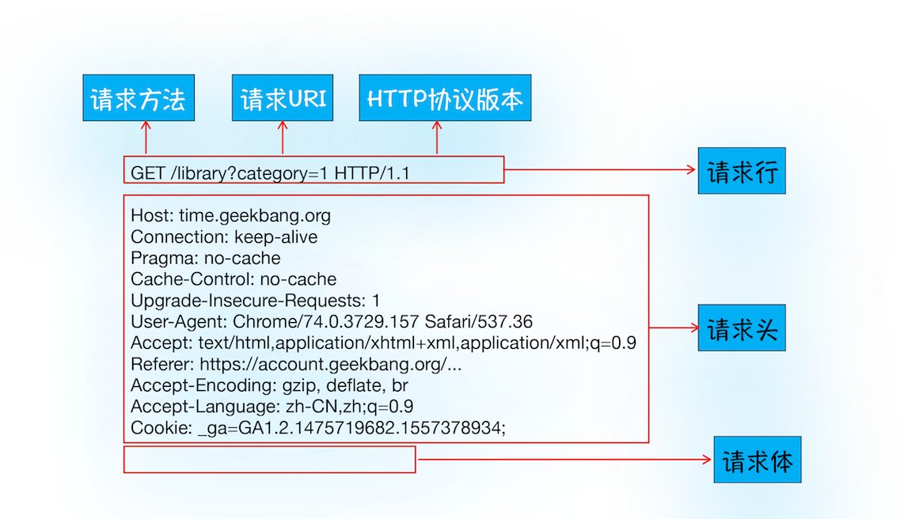

HTTP 协议，是建立在 TCP 连接基础之上的一种允许浏览器向服务器获取资源的协议，是 Web 的基础，通常由浏览器发起请求，用来获取不同类型的文件，例如 HTML 文件、CSS 文件、JavaScript 文件、图片、视频等。此外，HTTP 也是浏览器使用最广的协议。

## 浏览器端发起 HTTP 请求流程

在浏览器地址栏里键入极客时间网站的地址：`http://time.geekbang.org/index.html`， 之后浏览器会完成的动作：

1. 构建请求

首先，浏览器构建请求行信息，构建好后，浏览器准备发起网络请求。

```
GET /index.html HTTP1.1
```

2. 查找缓存

在真正发起网络请求之前，浏览器会先在浏览器缓存中查询是否有要请求的文件。其中，**浏览器缓存是一种在本地保存资源副本，以供下次请求时直接使用的技术。**

当浏览器发现请求的资源已经在浏览器缓存中存有副本，它会拦截请求，返回该资源的副本，并直接结束请求，而不会再去源服务器重新下载。这样做的好处有：

- 缓解服务器端压力，提升性能（获取资源的耗时更短了）；

- 对于网站来说，缓存是实现快速资源加载的重要组成部分。

如果缓存查找失败，就会进入网络请求过程了。

3. 准备 IP 地址和端口

因为浏览器使用 HTTP 协议作为应用层协议，用来封装请求的文本信息；并使用 TCP/IP 作传输层协议将它发到网络上，所以在 HTTP 工作开始之前，浏览器需要通过 TCP 与服务器建立连接。也就是说 HTTP 的内容是通过 TCP 的传输数据阶段来实现的，可以结合下图更好地理解这二者的关系。


第一步浏览器会请求 DNS 返回域名对应的 IP。当然浏览器还提供了 DNS 数据缓存服务，如果某个域名已经解析过了，那么浏览器会缓存解析的结果，以供下次查询时直接使用，这样也会减少一次网络请求。

拿到 IP 之后，接下来就需要获取端口号了。通常情况下，如果 URL 没有特别指明端口号，那么 HTTP 协议默认是 80 端口。

4. 等待 TCP 队列

Chrome 机制，同一个域名同时最多只能建立 6 个 TCP 连接，如果在同一个域名下同时有 10 个请求发生，那么其中 4 个请求会进入排队等待状态，直至进行中的请求完成。如果当前请求数量少于 6，会直接进入下一步，建立 TCP 连接。

5. 建立 TCP 连接

排队等待结束之后，终于可以快乐地和服务器握手了，在 HTTP 工作开始之前，浏览器通过 TCP 与服务器建立连接。

6. 发送 HTTP 请求

一旦建立了 TCP 连接，浏览器就可以和服务器进行通信了。而 HTTP 中的数据正是在这个通信过程中传输的。



首先浏览器会向服务器发送请求行，它包括了请求方法、请求 URI（Uniform Resource Identifier）和 HTTP 版本协议。

发送请求行，就是告诉服务器浏览器需要什么资源，最常用的请求方法是 Get。比如，直接在浏览器地址栏键入极客时间的域名（time.geekbang.org），这就是告诉服务器要 Get 它的首页资源。

另外一个常用的请求方法是 POST，它用于发送一些数据给服务器，比如登录一个网站，就需要通过 POST 方法把用户信息发送给服务器。如果使用 POST 方法，那么浏览器还要准备数据给服务器，这里准备的数据是通过请求体来发送。

在浏览器发送请求行命令之后，还要以请求头形式发送其他一些信息，把浏览器的一些基础信息告诉服务器。比如包含了浏览器所使用的操作系统、浏览器内核等信息，以及当前请求的域名信息、浏览器端的 Cookie 信息，等等。

## 服务器端处理 HTTP 请求流程

1. 返回请求

一旦服务器处理结束，便可以返回数据给浏览器了。可以通过工具软件 curl 来查看返回数据，具体使用方法是在命令行中输入以下命令：

```
curl -i https://time.geekbang.org/
```

这里加上了 `-i` 是为了返回响应行、响应头和响应体的数据，返回的结果如下图所示，可以结合这些数据来理解服务器是如何响应浏览器的。


首先服务器会返回响应行，包括协议版本和状态码。

并不是所有的请求都可以被服务器处理的，一些无法处理或者处理出错的信息，服务器会通过请求行的状态码来告诉浏览器它的处理结果，比如：

- 最常用的状态码是 200，表示处理成功；

- 如果没有找到页面，则会返回 404。

随后，正如浏览器会随同请求发送请求头一样，服务器也会随同响应向浏览器发送响应头。响应头包含了服务器自身的一些信息，比如服务器生成返回数据的时间、返回的数据类型（JSON、HTML、流媒体等类型），以及服务器要在客户端保存的 Cookie 等信息。

发送完响应头后，服务器就可以继续发送响应体的数据，通常，响应体就包含了 HTML 的实际内容。

以上这些就是服务器响应浏览器的具体过程。

2. 断开连接

通常情况下，一旦服务器向客户端返回了请求数据，它就要关闭 TCP 连接。不过如果浏览器或者服务器在其头信息中加入了：

```
Connection:Keep-Alive
```

那么 TCP 连接在发送后将仍然保持打开状态，这样浏览器就可以继续通过同一个 TCP 连接发送请求。保持 TCP 连接可以省去下次请求时需要建立连接的时间，提升资源加载速度。比如，一个 Web 页面中内嵌的图片就都来自同一个 Web 站点，如果初始化了一个持久连接，就可以复用该连接，以请求其他资源，而不需要重新再建立新的 TCP 连接。

3. 重定向

当在浏览器中打开 `geekbang.org` 后，会发现最终打开的页面地址是 `https://www.geekbang.org`。这两个 URL 之所以不一样，是因为涉及到了一个重定向操作。

可以使用 curl 来查看下请求 `geekbang.org` 会返回内容。

```
curl -I geekbang.org
```

注意这里输入的参数是 `-I`，和 `-i` 不一样，`-I` 表示只需要获取响应头和响应行数据，而不需要获取响应体的数据，最终返回的数据如下图所示：


从图中可以看到，响应行返回的状态码是 301，状态 301 就是告诉浏览器，需要重定向到另外一个网址，而需要重定向的网址正是包含在响应头的 `Location` 字段中，接下来，浏览器获取 `Location` 字段中的地址，并使用该地址重新导航，这就是一个完整重定向的执行流程。这也就解释了为什么输入的是 `geekbang.org`，最终打开的却是 `https://www.geekbang.org` 了。

不过也不要认为这种跳转是必然的。如果打开 `https://12306.cn`，会发现这个站点是打不开的。这是因为 `12306` 的服务器并没有处理跳转，所以必须要手动输入完整的 `https://www.12306.com` 才能打开页面。

## HTTP 缓存机制

如果第二次页面打开很快，主要原因是第一次加载页面过程中，缓存了一些耗时的数据。

其中，DNS 缓存和页面资源缓存这两块数据是会被浏览器缓存的。其中，DNS 缓存比较简单，它主要就是在浏览器本地把对应的 IP 和域名关联起来。

重点看下浏览器资源缓存处理的过程：


从上图的第一次请求可以看出，当服务器返回 HTTP 响应头给浏览器时，浏览器是通过响应头中的 `Cache-Control` 字段来设置是否缓存该资源。通常，还需要为这个资源设置一个缓存过期时长，而这个时长是通过 `Cache-Control` 中的 `Max-age` 参数来设置的，比如上图设置的缓存过期时间是 2000 秒。

```
Cache-Control:Max-age=2000
```

这也就意味着，在该缓存资源还未过期的情况下, 如果再次请求该资源，会直接返回缓存中的资源给浏览器。

但如果缓存过期了，浏览器则会继续发起网络请求，并且在 HTTP 请求头中带上：

```
If-None-Match:"4f80f-13c-3a1xb12a"
```

服务器收到请求头后，会根据 If-None-Match 的值来判断请求的资源是否有更新。

- 如果没有更新，就返回 304 状态码，相当于服务器告诉浏览器：“这个缓存可以继续使用，这次就不重复发送数据给你了。

- 如果资源有更新，服务器就直接返回最新资源给浏览器。

简要来说，很多网站第二次访问能够秒开，是因为这些网站把很多资源都缓存在了本地，浏览器缓存直接使用本地副本来回应请求，而不会产生真实的网络请求，从而节省了时间。同时，DNS 数据也被浏览器缓存了，这又省去了 DNS 查询环节。

## 登录状态是如何保持的？

- 用户打开登录页面，在登录框里填入用户名和密码，点击确定按钮。点击按钮会触发页面脚本生成用户登录信息，然后调用 POST 方法提交用户登录信息给服务器。

- 服务器接收到浏览器提交的信息之后，查询后台，验证用户登录信息是否正确，如果正确的话，会生成一段表示用户身份的字符串，并把该字符串写到响应头的 Set-Cookie 字段里，如下所示，然后把响应头发送给浏览器。

```
Set-Cookie: UID=3431uad;
```

- 浏览器在接收到服务器的响应头后，开始解析响应头，如果遇到响应头里含有 `Set-Cookie` 字段的情况，浏览器就会把这个字段信息保存到本地。比如把 `UID=3431uad` 保持到本地。

- 当用户再次访问时，浏览器会发起 HTTP 请求，但在发起请求之前，浏览器会读取之前保存的 Cookie 数据，并把数据写进请求头里的 Cookie 字段里，然后浏览器再将请求头发送给服务器。

- 服务器在收到 HTTP 请求头数据之后，就会查找请求头里面的 `Cookie` 字段信息，当查找到包含 `UID=3431uad` 的信息时，服务器查询后台，并判断该用户是已登录状态，然后生成含有该用户信息的页面数据，并把生成的数据发送给浏览器。

- 浏览器在接收到该含有当前用户的页面数据后，就可以正确展示用户登录的状态信息了。

简单地说，如果服务器端发送的响应头内有 `Set-Cookie` 的字段，那么浏览器就会将该字段的内容保持到本地。当下次客户端再往该服务器发送请求时，客户端会自动在请求头中加入 `Cookie` 值后再发送出去。服务器端发现客户端发送过来的 `Cookie` 后，会去检查究竟是从哪一个客户端发来的连接请求，然后对比服务器上的记录，最后得到该用户的状态信息。


浏览器中的 HTTP 请求从发起到结束一共经历了如下八个阶段：构建请求、查找缓存、准备 IP 和端口、等待 TCP 队列、建立 TCP 连接、发起 HTTP 请求、服务器处理请求、服务器返回请求和断开连接。

## 浏览器刷新操作，`ctrl+F5` 和 `F5` 有什么区别

`ctrl+F5` 是强制刷新，也就是资源都走网络。

`F5` 是正常处理流程。

比如通过网络面板，打开一个站点，再使用强制刷新，可以看到如下信息

```
176 requests
3.1 MB transferred
3.5 MB resources
Finish: 26.30 s
DOMContentLoaded: 5.04 s
Load: 14.88 s
```

如果使用正常的刷新，看到的信息如下：

```
171 requests
419 KB transferred
3.2 MB resources
Finish: 25.09 s
DOMContentLoaded: 1.41 s
Load: 6.24 s
```

其中的 `transferred` 是真正的网络传输的数据，使用强制刷新，传输的数据体积就大多了，而且请求时间也变得更长了。


