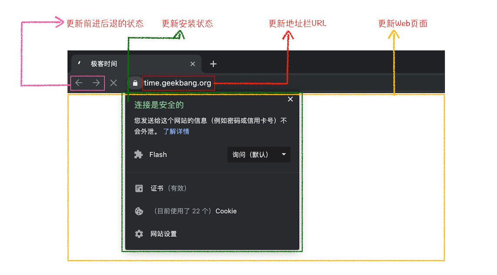

从输入 URL 到页面展示的整个过程需要各个进程之间的配合。

- 首先，用户**从浏览器进程里输入请求信息**；

- 然后，**网络进程发起 URL 请求**；

- 服务器响应 URL 请求之后，**浏览器进程开始准备渲染进程**；

- 渲染进程准备好之后，需要先向渲染进程提交页面数据，称之为**提交文档阶段**；

- 渲染进程接收完文档信息之后，便开始**解析页面和加载子资源**，完成页面的渲染。

这其中，用户发出 URL 请求到页面开始解析的这个过程，就叫做导航。

## 导航流程：从输入 URL 到页面展示

### 1. 用户输入

当用户在地址栏中输入一个查询关键字时，UI 线程的地址栏会判断输入的关键字是搜索内容，还是请求的 URL。因为 Chrome 的地址栏同时还是个搜索框，所以 UI 线程需要解析用户的输入，才能决定该直接访问网址还是把用户的输入丢给搜索引擎处理。

- 如果是搜索内容，地址栏会使用浏览器默认的搜索引擎，来合成新的带搜索关键字的 URL。

- 如果判断输入内容符合 URL 规则，比如输入的是 `time.geekbang.org`，那么地址栏会根据规则，把这段内容加上协议，合成为完整的 URL，如 `https://time.geekbang.org`。

当用户按下回车键后，浏览器开始加载一个地址之后，UI 线程要求网络线程去获取网站的内容，标签页上的图标便进入了加载状态。

但此时页面显示的依然是之前打开的页面内容，并没立即替换为对应地址的页面。因为需要等待提交文档阶段，页面内容才会被替换。

### 2. 开始导航：URL 请求过程

接下来，便进入了页面资源请求过程。这时，浏览器进程会通过进程间通信（IPC）把 URL 请求发送至网络进程，网络进程接收到 URL 请求后，会发起真正的 URL 请求流程。

首先，网络进程会查找本地缓存是否缓存了该资源。如果有缓存资源，那么直接返回资源给浏览器进程；如果在缓存中没有查找到资源，那么直接进入网络请求流程。这请求前的第一步是要进行 DNS 解析，以获取请求域名的服务器 IP 地址。如果请求协议是 HTTPS，那么还需要建立 TLS 连接。

接下来就是利用 IP 地址和服务器建立 TCP 连接。连接建立之后，浏览器端会构建请求行、请求头等信息，并把和该域名相关的 Cookie 等数据附加到请求头中，然后向服务器发送构建的请求信息。

服务器接收到请求信息后，会根据请求信息生成响应数据（包括响应行、响应头和响应体等信息），并发给网络进程。等网络进程接收了响应行和响应头之后，就开始解析响应头的内容了。（为了方便讲述，下面我将服务器返回的响应头和响应行统称为响应头。）

### 3. 读取响应

#### （1）重定向

在接收到服务器返回的响应头后，网络进程开始解析响应头，如果发现返回的状态码是 301 或者 302，那么说明服务器需要浏览器重定向到其他 URL。这时网络进程会从响应头的 Location 字段里面读取重定向的地址，然后再发起新的 HTTP 或者 HTTPS 请求，一切又重头开始了，所以重定向尽量少用。

在导航过程中，如果服务器响应行的状态码包含了 301、302 一类的跳转信息，浏览器会跳转到新的地址继续导航；如果响应行是 200，那么表示浏览器可以继续处理该请求。

#### （2）响应数据类型处理

URL 请求的数据类型，有时候是一个下载类型，有时候是正常的 HTML 页面，浏览器通过 `Content-Type` 区分它们。

`Content-Type` 是 HTTP 头中一个非常重要的字段， 它告诉浏览器服务器返回的响应体数据是什么类型，然后浏览器会根据 `Content-Type` 的值来决定如何显示响应体的内容。

响应头中的 `Content-type` 字段的值是 `text/html`，就是告诉浏览器，服务器返回的数据是 HTML 格式。

`Content-Type` 的值是 `application/octet-stream`，显示数据是字节流类型的，通常情况下，浏览器会按照下载类型来处理该请求。

需要注意的是，如果服务器配置 `Content-Type` 不正确，比如将 `text/html` 类型配置成 `application/octet-stream` 类型，那么浏览器可能会曲解文件内容，比如会将一个本来是用来展示的页面，变成了一个下载文件。

所以，不同 `Content-Type` 的后续处理流程也截然不同。如果 `Content-Type` 字段的值被浏览器判断为下载类型，那么该请求会被提交给浏览器的下载管理器，同时该 URL 请求的导航流程就此结束。但如果是 HTML，那么浏览器则会继续进行导航流程。

通常这一步也是安全检测发生的时候：如果域名或响应数据和已知的恶意网站匹配时，网络进程会抛出一个警告，并展现一个告警的页面。另外，CORB 检测也会开始工作，确保那些来自敏感站点的跨站响应数据不会进入到浏览器的渲染进程中。

由于 Chrome 的页面渲染是运行在渲染进程中的，所以接下来就需要准备渲染进程了。

### 4. 准备渲染进程

默认情况下，Chrome 会为每个页面分配一个渲染进程，也就是说，每打开一个新页面就会配套创建一个新的渲染进程。但是，也有一些例外，在某些情况下，浏览器会让多个页面直接运行在同一个渲染进程中。

Chrome 的默认策略是，每个标签对应一个渲染进程。但如果从一个页面打开了另一个新页面，而新页面和当前页面属于同一站点的话，那么新页面会复用父页面的渲染进程。官方把这个默认策略叫 process-per-site-instance。

总结来说，打开一个新页面采用的渲染进程策略就是：

- 通常情况下，打开新的页面都会使用单独的渲染进程；

- 如果从 A 页面打开 B 页面（要左键直接点击才开的才算），且 A 和 B 都属于同一站点的话，那么 B 页面复用 A 页面的渲染进程；如果是其他情况，浏览器进程则会为 B 创建一个新的渲染进程。

由于网络情况的不可控，一个请求可能会花上好几百毫秒才能把响应数据拿回来，所以这里浏览器默认开启了用来加速这一过程的优化。

在 `开始导航：URL 请求过程` 中，当 UI 线程将需要请求的 url 告诉网络线程时，其实它本身已经知道要导航到哪个网站了，于是 UI 线程在把 url 传递给网络线程的同时，会尝试启动一个渲染进程。

如果一切都按照预期正常进行的话，当网络线程拿到数据时，渲染进程就已经处于待命状态了。也会有例外的情况：比如导航重定向到一个另外的站点，那么预先启动好的渲染进程将不会被使用，这导致 UI 线程需要重新启动一个渲染进程。

渲染进程准备好之后，还不能立即进入文档解析状态，因为此时的文档数据还在网络进程中，并没有提交给渲染进程，所以下一步就进入了提交文档阶段。

### 5. 触发导航：提交文档

首先要明确一点，这里的“文档”是指 URL 请求的响应体数据。

- “提交文档”的消息是由浏览器进程发出的，渲染进程接收到“提交文档”的消息后，会和网络进程建立传输数据的“管道”。边下载边解析。

- 等文档数据传输完成之后，渲染进程会返回“确认提交”的消息给浏览器进程。

- 浏览器进程在收到“确认提交”的消息后，会更新浏览器界面状态，包括了安全状态、地址栏的 URL、前进后退的历史状态记录到窗口的页面历史中，为了便于在关闭窗口时恢复页面，历史的会话记录会保存在本地的磁盘上。当前窗口的 session 将会更新，并更新 Web 页面将新页面的信息呈现出来。

这也就解释了为什么在浏览器的地址栏里面输入了一个地址后，之前的页面没有立马消失，而是要加载一会儿才会更新页面。

到这里，一个完整的导航流程就“走”完了，这之后就要进入渲染阶段了。

### 5. 渲染阶段

一旦文档被提交，渲染进程便会持续接收资源并开始页面解析和子资源加载了，即渲染过程。

当渲染进程“完成”渲染后，渲染进程会通过 IPC 发送一个消息给浏览器进程（页面的 onload 事件均已执行完毕后），浏览器接收到消息后，UI 线程也就会停止标签图标上的加载动画。

上面的“完成”两个字，之所以打了双引号，因为在实际场景中，它通常并不真正意味着完成，因为客户端的 JavaScript 可能在此时持续地加载资源并渲染新的视图。

“从输入 URL 到页面展示，这中间发生了什么？”这个过程极其“串联”的问题也就解决了。

### 6. 导航到另一个网站

至此，一个完整的页面就生成了。假如这时用户输入了一个不同的 url 浏览器进程会按照上面的步骤导航到这个网站。但在这一切开始之前，浏览器会检查当前已经渲染好了的网站是否需要在网页卸载之前搞一点事情，这就是 `beforeunload` 事件。

在 `beforeunload` 事件中，可以在用户即将跳转至其他页面或者关闭 Tab 的时候发起一个“确认离开当前页面？”的二次确认。Tab 中的所有东西都由渲染进程控制着，当然也包括开发者编写的 JavaScript，所以当一个新的导航请求即将到来时，浏览器进程会对当前的渲染进程做最后的检查。

应当尽量避免在 `beforeunload` 中添加总会执行的事件代码，这会造成更多的交互延时，毕竟它们总会在新的导航开始之前执行。**只在需要的时候添加这些代码**，比如提醒用户如果进入新的页面那么当前页面的数据会丢失。

如果导航是在渲染进程中被创建的（比如用户点击了页面上的某一链接或者在 JavaScript 运行了 `window.location.href = 'https://kyrieliu.cn'` ），则当前的渲染进程会首先检查是 `beforeunload` 中是否有东西需要执行。之后，它会经历与浏览器进程直接发起导航后一样的导航过程。

当新的导航将发往与当前页面不同的站点时，浏览器将会创建一个新的渲染进程去处理这些新工作，旧的渲染进程则则用来在剩余的时间里处理诸如 `unload` 的页面事件。

## 答疑

### 链接里面使用了 `rel="noopener noreferrer"` 属性的页面打开都是新开一个渲染进程。

使用 `noopener noreferrer` 就是告诉浏览器，新打开的子窗口不需要访问父窗口的任何内容，这是为了防止一些钓鱼网站窃取父窗口的信息。

浏览器在打开新页面时，解析到含有 `noopener noreferrer` 时，就知道他们不需要共享页面内容，所以这时候浏览器就会让新链接在一个新页面中打开了。

### 同一站点共用一个渲染进程，那假设有 2 个标签页是同一站点，在 A 标签页面写个死循环，导致页面卡死，B 页面是否也是卡死了呢？--- 事件循环机制

多个页面公用一个渲染进程，也就意味着多个页面公用同一个主线程，所有页面的任务都是在同一个主线程上执行，这些任务包括渲染流程，JavaScript 执行，用户交互的事件的响应等等，但是，如果一个标签页里面执行一个死循环，那么意味着该 JavaScript 代码会一直霸占主线程，这样就导致了其它的页面无法使用该主线程，从而让所有页面都失去响应！

### keep-alive

首先 `keep-alive` 是为了解决连接效率不高的问题，http1.0 时代，http 请求都是短连接的形式，也即是每次请求一个资源都需要和服务器建立连接+传输数据+断开连接，通常，建立连接和断开连接的时间就有可能超过传输数据的时间了，这种短连接的效率是异常的低效。

针对短连接低效的问题，后面就出现了长连接，也就是这里要讲的 `keep-alive`。

可以把长连接看成是一个管道，一个 http 请求结束之后，不会关闭连接，下个请求可以复用该连接，这样就省去建立连接和断开连接的时间了，但是他们请求是按照顺序，也就是**符合 `IP + 端口` 规则的资源都可以复用该连接**。

但是，使用 `keep-alive` 同样存在问题，比如一个页面可能有 100 张图片素材，假设这些图片素材都保存在同一个域名下面，如果只复用一个 http 管道的话，那么传输 100 张图片的素材也是非常耗时间的，这就出现了同一时刻并发连接服务器的需求，也就是文中提到同一时刻，对同一域名下面，只能可以发起 6 个请求，这样就可以大大提升请求效率了。

为什么是 6 个请求而不是更多了，这是为了服务器性能考虑，如果同一时刻无限制连接，那么可能会导致服务器忙不过来。

[页面生命周期概览](https://developers.google.cn/web/updates/2018/07/page-lifecycle-api#overview_of_page_lifecycle_states_and_events)

[页面生命周期 API](https://developers.google.cn/web/updates/2018/07/page-lifecycle-api)
