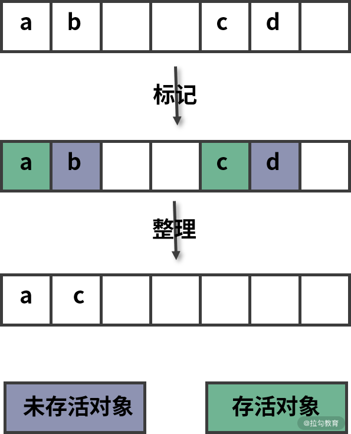

## 垃圾回收

javaScript 中的垃圾：对象不再被引用时，或者无法从根上访问到的对象，即为垃圾。

javaScript 中的可达对象：可以访问到的对象就是可达对象（引用、作用域链）。

可达的标准就是从根出发是否能够被找到。JS 中的根可以理解为全局对象。

垃圾回收：找到内存中的垃圾对象，并释放和回收空间，方便程序后续使用。

### 栈

栈是一个临时存储空间，主要存储局部变量和函数调用（对于全局表达式会创建匿名函数并调用）。

对于基本数据类型（`String`、`Undefined`、`Null`、`Boolean`、`Number`、`BigInt`、`Symbol`）的局部变量，会直接在栈中创建，而对象数据类型局部变量会存储在堆中，栈中只存储它的引用地址，也就是常说的浅拷贝。全局变量以及闭包变量也是只存储引用地址。总而言之栈中存储的数据都是轻量的。

对于函数，解释器创建了“调用栈”（Call Stack）来记录函数的调用流程。每调用一个函数，解释器就会把该函数添加进调用栈，解释器会为被添加进的函数创建一个栈帧 （Stack Frame，这个栈帧用来保存函数的局部变量以及执行语句）并立即执行。如果正在执行的函数还调用了其它函数，那么新函数也将会被添加进调用栈并执行。一旦这个函数执行结束，对应的栈帧也会被立即销毁。

查看调用栈的方式有 2 种：

- 调用函数 `console.trace()` 打印到控制台；

- 利用浏览器开发者工具进行断点调试。

虽然栈很轻量，只会在使用时创建，使用结束时销毁，但它并不是可以无限增长的。当分配的调用栈空间被占满时，就会引发“栈溢出”错误。

在编写递归函数的时候一定要注意函数执行边界，也就是退出递归的条件。否则会导致栈溢出报错。

**尾调用**

递归调用由于调用次数较多，同时每层函数调用都需要保存栈帧，所以通常是比较消耗内存的操作。对递归的优化一般有两个思路，减少递归次数和使用尾调用。

尾调用（Tail Call）是指函数的最后一步返回另一个函数的调用。

```javaScript
function a(x){
  return b(x);
}
```

尾调用由于是在 `return` 语句中，并且是函数的最后一步操作，所以局部变量等信息不需要再用到，从而可以立即释放节省内存空间。

下面的示例代码通过递归实现了求斐波那契额数列第 n 个数的功能。函数 `fibTail()` 相对于函数 `fib()` 就同时使用了尾调用以及减少调用次数两种优化方式。

```javaScript
function fib(n) {
  if (n < 3) return 1
  return fib(n-1) + fib(n-2)
}

function fibTail(n, a = 0, b = 1) {
  if (n === 0) return a
  return fibTail(n - 1, b, a + b)
}
```

但是由于尾调用也存在一些隐患，比如错误信息丢失、不方便调试，所以浏览器以及 Node.js 环境默认并没有支持这种优化方式。

## Chrome 内存回收机制

在 Chrome 浏览器中，JavaScript 的 V8 引擎被限制了内存的使用，根据不同的操作系统（操作系统有 64 位和 32 位的）内存大小会不同，大的可以到 1.4G 的空间，小的只能到 0.7G 的空间。

限制内存使用的两个原因：

- V8 最开始是为浏览器而设计的引擎，早些年由于 Web 应用都比较简单，其实并未考虑占据过多的内存空间；

- 另外又由于被 V8 的垃圾回收机制所限制，比如清理大量的内存时会耗费很多时间，这样会引起 JavaScript 执行的线程被挂起，会影响当前执行的页面应用的性能。

Chrome 的 JavaScript 引擎 V8 将堆内存分为两类：新生代的回收机制和老生代的回收机制

堆空间存储的数据比较复杂，大致可以划分为下面 5 个区域：代码区（Code Space）、Map 区(Map Space)、大对象区（Large Object Space）、新生代（New Space）、老生代（Old Space）。

**新生代内存回收**

大多数的对象最开始都会被分配在新生代，该存储空间相对较小，在 64 位操作系统下分配为 32 MB，在 32 位操作系统下分配为 16 MB，正是因为新生代中的变量存活时间短，不太容易产生太大的内存压力，因此不够大也是可以理解的。首先系统会将分配给新生代的内存空间分为两个空间：**from 正在使用的内存空间**和**to 目前闲置的内存空间**两部分。

新生代内存回收过程采用复制算法和标记整理的方式来回收未存活的对象空间。

程序中声明的对象首先会被分配到 from 空间，当进行垃圾回收时，会先将 from 空间中存活的的对象（存活对象可以理解为被引用的对象）标记整理后复制到 to 空间进行保存，对未存活的对象空间进行回收。当复制完成后，from 空间和 to 空间进行调换，to 空间会变为新的 from 空间，原来的 from 空间则变为 to 空间，这种算法称之为 “Scavenge”。

新生代的内存回收频率很高、速度也很快，但空间利用率较低，因为让一半的内存空间处于“闲置”状态。


**老生代内存回收**

新生代中多次回收仍然存活的对象会被转移到空间较大的老生代。时间长了之后通过几个原因的判断，就会把这些变量进行 "晋升"，只要是已经经历过一次 `Scavenge` 算法回收的，就可以晋升为老生代内存的对象。因为老生代空间较大，如果回收方式仍然采用 `Scanvage` 算法来频繁复制对象，那性能开销就太大了。还有就是 to 空间的使用率超过 25% 也会触发晋升。

所以老生代采用的是 Mark-Sweep（标记清除） 和 Mark-Compact（标记整理）和增量标记的方式来回收未存活的对象空间。

1. 标记清除（Mark-Sweep）

标记清除分为标记和清除两个阶段。标记阶段会遍历堆中所有对象。

首先标记阶段会遍历堆中所有对象，并分别对存活的活动对象进行标记；然后在代码执行过程结束之后，对使用过的变量取消标记。那么没取消标记的就是没有使用过的变量，因此在清除阶段，就会把还有标记的进行整体清除，从而释放内存空间。


由于标记清除不会对内存一分为二，所以不会浪费空间。但是进行过标记清除之后的内存空间会产生很多不连续的碎片空间，这种不连续的碎片空间中，如果要新来一个较大的内存对象需要存储时可能会由于空间不足而导致无法存储的情况。对于通过标记清除产生的内存碎片，还是需要通过另外一种方式进行解决，因此这里就不得不提到标记整理策略（Mark-Compact）了。

2. 标记整理（Mark-Compact）

为了解决内存碎片的问题，提高对内存的利用，还需要使用到标记整理（Mark-Compact） 算法。标记整理算法相对于标记清除算法在回收阶段进行了改进，标记整理对待未标记的对象并不是立即进行回收，而是将存活的对象移动到一边，然后再清理。当然这种移动对象的操作相对而言是比较耗时的，所以执行速度上，比标记清除要慢。



3. 标记增量

当垃圾回收进行工作的时候会阻塞 JS 代码的执行，所谓标记增量，即为将整个垃圾回收工作，拆分成多个小步，在代码执行的空档期，组合着完成整个回收工作。

可以看出，老生代内存的管理方式和新生代的内存管理方式区别还是比较大的。`Scavenge` 算法比较适合内存较小的情况处理；而对于老生代内存较大、变量较多的时候，还是需要采用“标记-清除”结合“标记-整理”这样的方式处理内存问题，并尽量避免内存碎片的产生。

**思考题**

```javaScript
var a = {n: 1};
var b = a;
a.x = a = {n: 2};

a.x 	// --> undefined
b.x 	// --> {n: 2}
```

解答：

- 1. **优先级**: `.` 的优先级高于 `=` ，所以先执行 `a.x`，堆内存中的 `{n: 1}` 就会变成 `{n: 1, x: undefined}`，改变之后相应的 `b.x` 也变化了，因为指向的是同一个对象。

- 2. **赋值操作是从右到左**，所以先执行 `a = {n: 2}`，`a` 的引用就被改变了，然后这个返回值又赋值给了 `a.x`，需要注意的是这时候 `a.x`是第一步中的 `{n: 1, x: undefined}` 那个对象，其实就是 `b.x`，相当于 `b.x = {n: 2}`

