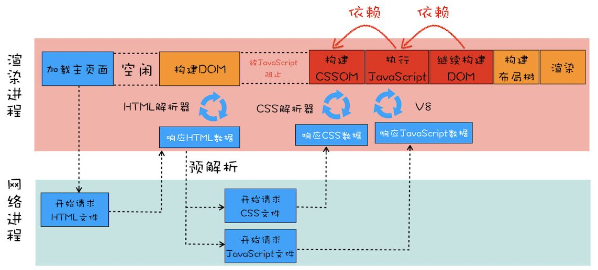
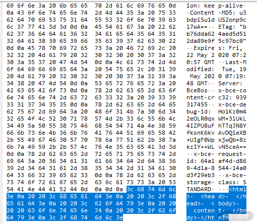
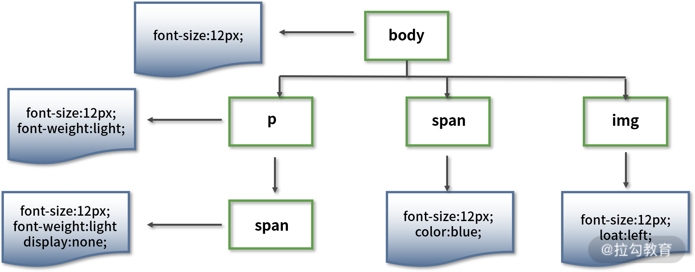
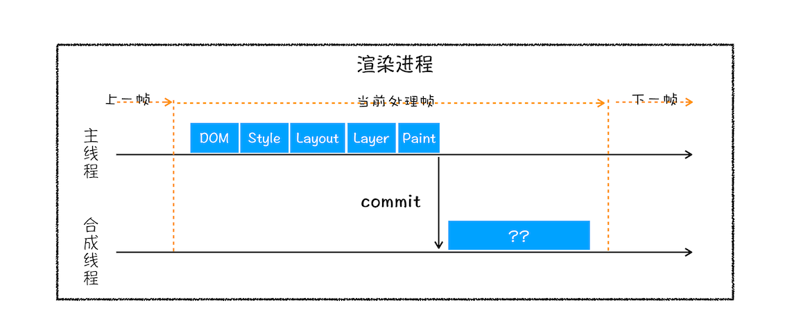

浏览器的渲染过程 —— 关键渲染路径:

1. **字节流解码**: 把字节数据解码成字符数据。

2. **输入流预处理**: 把字符数据进行统一格式化，生成规范化的字符流数据。

3. **令牌化**: 通过分词器将字符数据转化成令牌（Token）。

4. 渲染进程将 HTML 内容转换为 **DOM 树结构**。

5. 渲染引擎将 CSS 样式表转化为 **styleSheets**，计算出 DOM 节点的样式。

6. 创建**布局树**，并计算元素的布局信息，计算每个元素的大小及位置。

7. 对布局树进行分层，并生成**分层树**。

8. 为每个图层生成**绘制列表**，并将其提交到合成线程。

9. 合成线程将图层分成图块，并调用 GPU **光栅化线程池**中将图块转换成位图。

10. 合成线程发送绘制图块命令 DrawQuad 给浏览器进程。

11. 浏览器进程根据 DrawQuad 消息**生成页面**，并显示到显示器上。




# 浏览器渲染机制（关键渲染路径）详解

先来看一个例子，假如我们在浏览器中输入了一个网址，得到了下面的 `html` 文件，渲染引擎是怎样通过解析代码生成页面的呢？

```html
<html>
  <head></head>
  <body>
    lagou
  </body>
</html>
```

**总结： 字节 → 字符 → 令牌 → 树 → 页面**

## 从 `HTML` 到 `DOM`

在渲染引擎内部，有个叫HTML解析器（HTMLParser）的模块，负责将HTML字节流转换成DOM结构。

HTML 解析器并不是等整个文档加载完成之后再解析的，而是网络进程加载了多少数据，HTML 解析器便解析多少数据。

### 1. 字节流解码

对于上面的代码，我们看到的是它的字符形式。而浏览器通过 HTTP 协议接收到的文档内容是字节数据，下图是抓包工具截获的报文截图，报文内容为左侧高亮显示的区域（为了查看方便，该工具将字节数据以十六进制方式显示）。当浏览器得到字节数据后，通过“[编码嗅探算法](https://html.spec.whatwg.org/multipage/parsing.html#encoding-sniffing-algorithm)”来确定字符编码，然后根据字符编码将字节流数据进行解码，生成截图右侧的字符数据，也就是我们编写的代码。

这个把字节数据解码成字符数据的过程称之为“**字节流解码**”。



我们通过浏览器调试工具查看网络请求时，也是经过了上述操作过程，才能直观地看到字符串。

### 2. 输入流预处理

通过上一步解码得到的字符流数据在进入解析环节之前还需要进行一些预处理操作。比如将换行符转换成统一的格式，最终生成规范化的字符流数据，这个把字符数据进行统一格式化的过程称之为“**输入流预处理**”。

### 3. 令牌化 (token)

经过前两步的数据解码和预处理，下面就要进入重要的解析步骤了。

解析包含两步，第一步是**通过分词器（Tokens）将字符数据转化成令牌（Token）**，第二步是**解析 `HTML` 生成 `DOM` 树**。

先来说说令牌化，其过程是使用了一种类似状态机的算法，即每次接收一个或多个输入流中的字符；然后根据当前状态和这些字符来更新下一个状态，也就是说在不同的状态下接收同样的字符数据可能会产生不同的结果，比如当接收到“body”字符串时，在标签打开状态会解析成标签（Tag Token），在标签关闭状态则会解析成文本节点（文本 Token）。

Tag Token 又可分为 StartTag 和 EndTag，对应着标签的开和闭。

可以通过下面这个简单的例子来理解其原理。

上述 html 代码的标记过程如下：

- 1. 初始化为“数据状态”（Data State）；

- 2. 匹配到字符 `<`，状态切换到 “标签打开状态”（Tag Open State）；

- 3. 匹配到字符 `!`，状态切换至 “标签声明打开状态”（Markup Declaration Open State），后续 7 个字符可以组成字符串 `DOCTYPE`，跳转到 “DOCTYPE 状态”（DOCTYPE State）；

- 4. 匹配到字符为空格，当前状态切换至 “DOCTYPE 名称之前状态”（Before DOCTYPE Name State）；

- 5. 匹配到字符串 html，创建一个新的 `DOCTYPE` 标记，标记的名字为 “html” ，然后当前状态切换至 “DOCTYPE 名字状态”（DOCTYPE Name State）；

- 6. 匹配到字符 `>`，跳转到 “数据状态” 并且释放当前的 `DOCTYPE` 标记；

- 7. 匹配到字符 `<`，切换到 “标签打开状态”；

- 8. 匹配到字符 `h`，创建一个新的起始标签标记，设置标记的标签名为空，当前状态切换至 “标签名称状态”（Tag Name State）；

- 9. 从字符 `h` 开始解析，将解析的字符一个一个添加到创建的起始标签标记的标签名中，直到匹配到字符 `>`，此时当前状态切换至 “数据状态” 并释放当前标记，当前标记的标签名为 “html” 。

- 10. 解析后续的 `<body>` 标签的方式与 `<html>` 标签一致，创建并释放对应的起始标签标记，解析完毕后，当前状态处于 “数据状态” ；

- 11. 匹配到字符串 “标记” ，针对每一个字符，创建并释放一个对应的字符标记，解析完毕后，当前状态仍然处于 “数据状态” ；

- 12. 匹配到字符 `<`，进入 “标签打开状态” ；

- 13. 匹配到字符 `/`，进入 “结束标签打开状态”（End Tag Open State）；

- 14. 匹配到字符 `b`，创建一个新的结束标签标记，设置标记的标签名为空，当前状态切换至“标签名称状态”（Tag Name State）；

- 15. 重新从字符 `b` 开始解析，将解析的字符一个一个添加到创建的结束标签标记的标签名中，直到匹配到字符 `>`，此时当前状态切换至 “数据状态” 并释放当前标记，当前标记的标签名为 “body”；

- 16. 解析 `</html>` 的方式与 `</body>` 一样；

- 17. 所有的 html 标签和文本解析完成后，状态切换至 “数据状态” ，一旦匹配到文件结束标志符（EOF），则释放 EOF 标记。

最终生成类似下面的令牌结构：

```
开始标签:html
  开始标签:head
  结束标签:head
  开始标签:body
    字符串:lagou
  结束标签:body
结束标签:html
```

### 4. 构建 `DOM` 树 (DOM Tree)

解析 `HTML` 的第二步是 `DOM` 树构建。这是因为浏览器无法直接理解和使用 HTML，所以需要将 HTML 转换为浏览器能够理解的结构 —— DOM 树。

浏览器在创建解析器的同时会创建一个 `Document` 对象。在树构建阶段，`Document` 会作为根节点被不断地修改和扩充。标记步骤产生的令牌会被送到树构建器进行处理。HTML 5 标准中定义了每类令牌对应的 `DOM` 元素，当树构建器接收到某个令牌时就会创建该令牌对应的 `DOM` 元素并将该元素插入到 `DOM` 树中。

为了纠正元素标签嵌套错位的问题和处理未关闭的元素标签，树构建器创建的新 `DOM` 元素还会被插入到一个开放元素栈中。

树构建算法也可以采用状态机的方式来描述，具体以令牌化的 HTML 代码为例进行举例说明。

- 1. 进入初始状态 “initial” 模式；

- 2. 树构建器接收到 DOCTYPE 令牌后，树构建器会创建一个 DocumentType 节点附加到 Document 节点上，DocumentType 节点的 name 属性为 DOCTYPE 令牌的名称，切换到 “before html” 模式；

- 3. 接收到令牌 html 后，树构建器创建一个 html 元素并将该元素作为 Document 的子节点插入到 DOM 树中和开放元素栈中，切换为 “before head” 模式；

- 4. 虽然没有接收到 head 令牌，但仍然会隐式地创建 head 元素并加到 DOM 树和开放元素栈中，切换到“in head”模式；

- 5. 将开放元素栈中的 head 元素弹出，进入 “after head”模式；

- 6. 接收到 body 令牌后，会创建一个 body 元素插入到 DOM 树中同时压入开放元素栈中，当前状态切换为 “in body” 模式；

- 7. 接收到字符令牌，创建 Text 节点，节点值为字符内容“标记”，将 Text 节点作为 body 元素节点插入到 DOM 树中；

- 8. 接收到结束令牌 body，将开放元素栈中的 body 元素弹出，切换至 “after body” 模式；

- 9. 接收到结束令牌 html，将开放元素栈中的 html 元素弹出，切换至 “after after body” 模式；

- 10. 接收到 EOF 令牌，树构建器停止构建，html 文档解析过程完成。

最终生成下面的 DOM 树结构：

```
              Document
             /        \
DocumentType           HTMLHtmlElement
                      /               \
       HTMLHeadElement                 HTMLBodyElement
                                              |
                                          TextNode
```


> Bytes → characters → tokens → nodes → DOM


打开 Chrome 的“开发者工具”，选择“Console”标签来打开控制台，在控制台里面输入“document”后回车，就能看到一个完整的 DOM 树结构。DOM 和 HTML 内容几乎是一样的，但是和 HTML 不同的是，DOM 是保存在内存中树状结构，可以通过 JavaScript 来查询或修改其内容。

**资源外链的下载**

实际上，在解析 `html` 时，会遇到一些资源连接，此时就需要进行单独处理了。简单起见，这里将遇到的静态资源分为一下几大类（未列举所有）：

1. 遇到外链时的处理

当遇到外链时，会单独开启一个下载线程去下载资源（http1.1 中是每一个资源的下载都要开启一个 http 请求，对应一个 tcp/ip 链接）

2. 遇到 `CSS` 样式资源

- `CSS` 下载时异步，不会阻塞浏览器构建 `DOMTree`

- 但是会阻塞渲染，也就是在构建 `TrnderTree` 时，会等到 `CSS` 下载解析完毕后才进行（这点与浏览器优化有关，防止 `CSS` 规则不断改变，避免了重复的构建）

- 例外，`media query` 声明的 `CSS` 是不会阻塞渲染的

3. 遇到 `JS` 脚本资源

- 阻塞浏览器的解析，也就是说发现一个外链脚本时，需等待脚本下载完成并执行后才会继续解析 `HTML`

- 浏览器的优化，一般现代浏览器有优化，在脚本阻塞时，也会继续下载其它资源（当然有并发上限），但是虽然脚本可以并行下载，解析过程仍然是阻塞的，也就是说必须这个脚本执行完毕后才会接下来的解析，并行下载只是一种优化而已

- `defer` 与 `async`，普通的脚本是会阻塞浏览器解析的，但是可以加上 `defer` 或 `async` 属性，这样脚本就变成异步了，可以等到解析完毕后再执行。注意，`defer` 是延迟执行，而 as`ync 是异步执行。

- 在执行 `JavaScript` 脚本之前，如果页面中有引用外部 `CSS` 或有内联的 `CSS`，那么渲染引擎需要先把这些内容转换为 `CSSOM`，因为 `JavaScript` 有修改 `CSSOM` 的能力，所以在执行 `JavaScript` 之前还依赖 `CSSOM`。也就是说 `CSS` 会间接阻塞 `DOM` 的解析。

4. 遇到 `img` 图片类资源

遇到图片等资源时，直接就是异步下载，不会阻塞解析，下载完毕后直接用图片替换原有 `src` 的地方。

### 5. 构建 `CSSOM` 树 (CSS Rule Tree) —— 样式计算（Recalculate Style）

> 和 `DOM` 不一样，在源码里面并没有 `CSSOM` 这个词，`CSSOM` 应该是是 `styleSheets`，是能在控制台直观感受的到的。

渲染引擎除了解析 `HTML` 之外，也需要解析 `CSS`。样式计算的目的是为了计算出 `DOM` 节点中每个元素的具体样式。

1. 把 CSS 转换为浏览器能够理解的结构

CSS 样式来源主要有三种：

- 通过 `link` 引用的外部 CSS 文件

- `<style>` 标记内的 CSS

- 元素的 `style` 属性内嵌的 CSS

和 `HTML` 文件一样，浏览器也是无法直接理解这些纯文本的 `CSS` 样式，所以当渲染引擎接收到 `CSS` 文本时，会执行一个转换操作，将 `CSS` 文本转换为浏览器可以理解的结构 —— `styleSheets`。并且该结构同时具备了查询和修改功能，这会为样式操作提供基础。

在控制台中输入 `document.styleSheets`，就可以看到样式表的结构。样式表包含了很多种样式，已经把那三种来源的样式都包含进去了。

2. 转换样式表中的属性值，使其标准化

把现有的 `CSS` 文本转化为浏览器可以理解的结构之后对其进行**属性值的标准化操作**转换为渲染引擎容易理解的、标准化的计算值。

3. 计算出 `DOM` 树中每个节点的具体样式

**计算 DOM 树中每个节点的样式属性涉及到 `CSS` 的继承规则和层叠规则。**

首先是 `CSS` 继承。`CSS` 继承就是每个 `DOM` 节点都包含有父节点的样式。所有子节点都继承了父节点样式。

可以从**样式来源**中查看样式的具体来源信息，看看是来源于样式文件，还是来源于 `UserAgent` 样式表。

`UserAgent` 样式，它是浏览器提供的一组默认样式，如果不提供任何样式，默认使用的就是 `UserAgent` 样式。

样式计算过程中，会根据 `DOM` 节点的继承关系来合理计算节点样式。

样式计算过程中的第二个规则是样式层叠。层叠是 `CSS` 的一个基本特征，它是一个定义了如何合并来自多个源的属性值的算法。它在 `CSS` 处于核心地位，`CSS` 的全称“层叠样式表”正是强调了这一点。

总之，样式计算阶段的目的是为了计算出 `DOM` 节点中每个元素的具体样式，在计算过程中需要遵守 `CSS` 的继承和层叠两个规则。这个阶段最终输出的内容是每个 `DOM` 节点的样式，并被保存在 `ComputedStyle` 的结构内。

`CSSOM`（CSS Object Model）是一组允许用 JavaScript 操纵 CSS 的 API。`CSSOM` 有两个作用，一个是提供给 JavaScript 操作样式表的能力；二是为布局树的合成提供基础的样式信息。

下面举例说明。

```css
body {
  font-size: 12px;
}
p {
  font-weight: light;
}
span {
  color: blue;
}
p span {
  display: none;
}
img {
  float: left;
}
```

对于上面的代码，会解析生成类似下面结构的 `CSSOM` 树：



需要注意的是，上图中的 `CSSOM` 树并不完整，完整的 `CSSOM` 树还应当包括浏览器提供的默认样式（也称为“User Agent 样式”）。

`CSS` 解析的过程与 `HTML` 解析过程步骤一致，最终也会生成树状结构。`CSSOM` 包含了节点的 `CSS` 样式（大小、颜色等）。

**`CSS` 加载是否会阻塞 `DOMTree` 渲染？**

这里说的是头部引入 `CSS` 的情况

首先，我们都知道：`CSS` 是由单独的下载线程异步下载的。

然后再说下几个现象：

- `CSS` 加载不会阻塞 `DOMTree` 解析（异步加载时 `DOM` 照常构建）

- 但会阻塞 `RenderTree` 渲染（渲染时需等 `CSS` 加载完毕，因为 `RenderTree` 需要 `CSS` 信息）

这可能也是浏览器的一种优化机制。

因为加载 `CSS` 的时候，可能会修改下面 `DOM` 节点的样式，如果 `CSS` 加载不阻塞 `RenderTree` 渲染的话，那么当 `CSS` 加载完之后，`RenderTree` 树可能又得重新重绘或者回流了，这就造成了一些没有必要的损耗。

所以干脆就先把 `DOMTree` 的结构先解析完，把可以做的工作做完，然后等 `CSS` 加载完之后，
在根据最终的样式来渲染 `RenderTree`，这种做法性能方面确实会比较好一点。

## 从 `DOM` 到渲染

有了 `DOM` 树和 `CSSOM` 树之后，渲染引擎就可以开始生成页面了。

### 6. 构建渲染树 (Rendering Tree)

`DOM` 树包含的结构内容与 `CSSOM` 树包含的样式规则都是独立的，为了更方便渲染，先需要将它们合并成一棵渲染树。

这个过程会从 `DOM` 树的根节点开始遍历，并从 `CSSOM` 树上找到每个节点匹配的样式规则。在匹配过程中是通过自下而上的方式进行匹配。因为浏览器进行 `CSS` 选择器匹配时，是从右向左进行的，所以可以推知是自下而上。如果自上而下，会引起重复渲染。

遍历过程中会自动忽略那些不需要渲染的节点（比如脚本标记、元标记等）以及不可见的节点（比如设置了“display:none”样式）。同时也会将一些需要显示的伪类元素加到渲染树中。所以渲染树只会包括需要显示的节点和这些节点的样式信息。

渲染树包含了网页中有哪些节点、节点的从属关系、以及节点的 `CSS` 样式。

对于上面的 `HTML` 和 `CSS` 代码，最终生成的渲染树就只有一个 `body` 节点，样式为 `font-size:12px`。


### 7. 布局 (layout)

生成了渲染树之后，就可以进入布局阶段了，布局就是计算元素的大小及位置。

计算元素布局是一个比较复杂的操作，因为需要考虑重新布局（Layout）或渲染（Repaint）的因素，包括字体大小、换行位置等，这些因素会影响段落的大小和形状，进而影响下一个段落的位置。

布局完成后会输出对应的“盒模型”，它会精确地捕获每个元素的确切位置和大小，将所有相对值都转换为屏幕上的绝对像素。

这里 Layout 和 Repaint 的概念是有区别的：

- Layout，也称为 Reflow，即回流。一般意味着元素的内容、结构、位置或尺寸发生了变化，需要重新计算样式和渲染树。

- Repaint，即重绘。意味着元素发生的改变只是影响了元素的一些外观之类的时候（例如，背景色，边框颜色，文字颜色等），此时只需要应用新样式绘制这个元素就可以了。

回流的成本开销要高于重绘，而且一个节点的回流往往回导致子节点以及同级节点的回流， 所以优化方案中一般都包括，尽量避免回流。

在执行布局操作的时候，会把布局运算的结果重新写回布局树中，所以布局树既是输入内容也是输出内容，这是布局阶段一个不合理的地方，因为在布局阶段并没有清晰地将输入内容和输出内容区分开来。

分开来，结构会更加清晰，目前布局操作都是在主线程执行执行的，如果将布局的输入结构和输出结构分开，那么可以在另外一个线程上执行布局操作，解析完把结果提交给主线程，这样会减轻主线程的压力。

针对这个问题，Chrome 团队正在重构布局代码，下一代布局系统叫 LayoutNG，试图更清晰地分离输入和输出，从而让新设计的布局算法更加简单，可以更好地重构渲染模块的代码。

### 8. 分层(Layer)

因为页面中有很多复杂的效果，如一些复杂的 3D 变换、页面滚动，或者使用 z-indexing 做 z 轴排序等，为了更加方便地实现这些效果，**渲染引擎还需要为特定的节点生成专用的图层，并生成一棵对应的图层树（LayerTree）**。正是这些图层叠加在一起构成了最终的页面图像。

要想直观地理解什么是图层，可以打开 Chrome 的“开发者工具”，选择“Layers”标签，就可以可视化页面的分层情况。

**通常情况下，并不是布局树的每个节点都包含一个图层，如果一个节点没有对应的层，那么这个节点就从属于父节点的图层。最终每一个节点都会直接或者间接地从属于一个层。**

通常满足下面两点中任意一点的元素就可以被提升为单独的一个图层。

1. 第一点，拥有层叠上下文属性的元素会被提升为单独的一层。

页面是个二维平面，但是层叠上下文能够让 `HTML` 元素具有三维概念，这些 `HTML` 元素按照自身属性的优先级分布在垂直于这个二维平面的 z 轴上。

明确定位属性的元素、定义透明属性的元素、使用 CSS 滤镜的元素等，都拥有[层叠上下文](https://developer.mozilla.org/zh-CN/docs/Web/CSS/CSS_Positioning/Understanding_z_index/The_stacking_context)属性。

2. 第二点，需要剪裁（clip）的地方也会被创建为图层。

content 高度大于容器高度出现滚动条，渲染引擎会为 content 部分单独创建一个层，滚动条也会被提升为单独的层。

### 9. 图层绘制 (Painting) 

在完成图层树的构建之后，渲染引擎会对图层树中的每个图层进行绘制。绘制就是将渲染树中的每个节点通过显卡转换成屏幕上的实际像素的过程。

渲染引擎实现图层的绘制会把一个图层的绘制拆分成很多小的绘制指令，然后再把这些指令按照顺序组成一个待绘制列表。如果没有弄清楚绘制顺序，那么很可能会导致页面被错误地渲染。

例如，对于使用 `z-index` 属性的元素（如遮罩层）如果未按照正确的顺序绘制，则将导致渲染结果和预期不符（失去遮罩作用）。

所以绘制过程中的第一步就是遍历布局树，生成绘制记录，然后渲染引擎会根据绘制记录去绘制相应的内容。

绘制列表中的指令就是让其执行一个简单的绘制操作。而绘制一个元素通常需要好几条绘制指令，因为每个元素的背景、前景、边框都需要单独的指令去绘制。所以在图层绘制阶段，输出的内容就是这些待绘制列表。

可以打开“开发者工具”的“Layers”标签，选择“document”层，来实际体验下绘制列表。


在该图中，区域 1 就是 document 的绘制列表，拖动区域 2 中的进度条可以重现列表的绘制过程。

### 10. 栅格化（Raster）操作

绘制列表只是用来记录绘制顺序和绘制指令的列表，而实际上绘制操作是由渲染引擎中的合成线程来完成的。可以结合下图来看下渲染主线程和合成线程之间的关系：



如上图所示，当图层的绘制列表准备好之后，主线程会把该绘制列表提交（commit）给合成线程，那么接下来合成线程是怎么工作的呢？

通常一个页面可能很大，但是用户只能看到其中的一部分，把用户可以看到的这个部分叫做视口（viewport）。

在有些情况下，有的图层可以很大，比如有的页面使用滚动条要滚动好久才能滚动到底部，但是通过视口，用户只能看到页面的很小一部分，所以在这种情况下，要绘制出所有图层内容的话，就会产生太大的开销，而且也没有必要。

基于这个原因，**合成线程会将图层划分为图块（tile）**，这些图块的大小通常是 256x256 或者 512x512。

然后**合成线程会按照视口附近的图块来优先生成位图，实际生成位图的操作是由栅格化来执行的。所谓栅格化，是指将图块转换为位图。**而图块是栅格化执行的最小单位。渲染进程维护了一个栅格化的线程池，所有的图块栅格化都是在线程池内执行的，运行方式如下图所示：


通常，栅格化过程都会使用 GPU 来加速生成，使用 GPU 生成位图的过程叫快速栅格化，或者 GPU 栅格化，生成的位图被保存在 GPU 内存中。

GPU 操作是运行在 GPU 进程中，如果栅格化操作使用了 GPU，那么最终生成位图的操作是在 GPU 中完成的，这就涉及到了跨进程操作。具体形式可以参考下图：


从图中可以看出，渲染进程把生成图块的指令发送给 GPU，然后在 GPU 中执行生成图块的位图，并保存在 GPU 的内存中。

### 11. 合成 (Composite)和显示

一旦所有图块都被光栅化，合成线程就会生成一个绘制图块的命令——“DrawQuad”，然后将该命令提交给浏览器进程。

浏览器进程里面有一个叫 viz 的组件，用来接收合成线程发过来的 DrawQuad 命令，然后根据 DrawQuad 命令，将其页面内容绘制到内存中，最后再将内存显示在屏幕上。

需要重点关注的是，合成操作是在合成线程上完成的，这也就意味着在执行合成操作时，是不会影响到主线程执行的。这就是为什么经常主线程卡住了，但是 CSS 动画依然能执行的原因。

到这里，经过这一系列的阶段，编写好的 HTML、CSS、JavaScript 等文件，经过浏览器就会显示出页面了。

渲染完毕后就是 `load` 事件了，之后就是自己的 JS 逻辑处理了。

#### 显示器显示图像

每个显示器都有固定的刷新频率，通常是 60HZ，也就是每秒更新 60 张图片，更新的图片都来自于显卡中一个叫前缓冲区的地方，显示器所做的任务很简单，就是每秒固定读取 60 次前缓冲区中的图像，并将读取的图像显示到显示器上。

#### 显卡

显卡的职责就是合成新的图像，并将图像保存到后缓冲区中，一旦显卡把合成的图像写到后缓冲区，系统就会让后缓冲区和前缓冲区互换，这样就能保证显示器能读取到最新显卡合成的图像。通常情况下，显卡的更新频率和显示器的刷新频率是一致的，正常显示器是60帧/s（或者60FPS）。但有时候，在一些复杂的场景中，显卡处理一张图片的速度会变慢，这样就会造成视觉上的卡顿。

### Load 和 DOMContentLoaded 区别

- `DOMContentLoaded` 事件触发代表初始的 `HTML` 被完全加载和解析成 `DOM`，不需要等待 `CSS`，图片加载。(譬如如果有 async 加载的脚本就不一定完成)

- `onload` 事件触发代表页面中的 `DOM`，`CSS`，`JS`，图片已经全部加载完毕。（渲染完毕了）

- 执行顺序是：`DOMContentLoaded` -> `Load`
