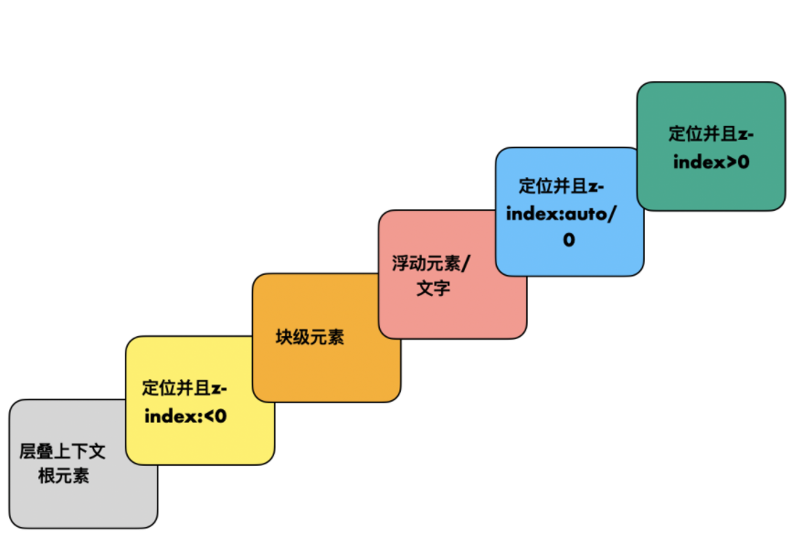

上两道面试真题：

1. `z-index` 值大的元素一定在值小的上面吗？

答：`z-index` 不一定会生效，生效了也不一定是值大的在上面，主要取决于层叠上下文；

2. 如何实现父元素覆盖子元素？

答：给父元素设置一个很大的 `z-index` 不能实现覆盖子元素，但是把子元素的 `z-index` 设置成负数却可以满足要求。

这两个题的考点都是层叠上下文，本文会讲清为什么。

顾名不难思义，层叠上下文是把元素以三维的视角，放在不同层级来判断最后的堆叠关系，它由 `z-index` 这个属性来决定“等级“。

## 如何让 `z-index` 生效

`z-index` 是用于规定元素在 z 轴的高度，其值越大，离用户越近，越在“上面”。没有设置 `z-index`，其层叠等级都可以看作是 0，同级的元素会根据其在 HTML 中的出现顺序出现顺序决定堆叠结果。

使用时可能会感觉这个属性不太听话：给元素设置的 `z-index` 好像没有生效，它没有按照预期跑到其他元素上面。因为它单独使用时不生效，一定要配合定位属性一起，即只对指定了 `position` 属性的元素生效 —— 只要不是默认值 `static`，其他的 `absolute`、`relative`、`fixed` 都可以使 `z-index` 生效。

## 什么是层叠上下文

层叠上下文听起来比较抽象，你可以把它想象成一个三维空间，这个空间内有很多个平面。

最大的层叠上下文就是由文档根元素 —— html 形成的：它自身连同它的子元素就形成了一个最大的层叠上下文，也就是说，我们写的所有代码都是在根层叠上下文里的。

层叠上下文包含多个平面，具体来说：每个 `z-index` 的值形成一个平面，普通的无定位的块级元素也是一个平面，浮动元素也是一个平面，正是这些平面形成了层叠上下文。

除此之外，每个有 `z-index` 数值的元素也会连同它的子元素一起，生成一个小的层叠上下文，这个小层叠上下文和父级一样，拥有多个平面。

去处理这些上下文时，我们可以按照从小到大的顺序递归：先把最小的堆叠上下文中元素的顺序理好，拍成一片——当做一个整体，再与父级的堆叠上下文中其他元素比较。

## 层叠上下文规律

只有明确指定了 `z-index` 的值（不是 `auto`）的定位元素才会生产一个层叠上下文，在这个层叠上下文中，内部元素层级都在它之上，哪怕是负数。

如果是一个没有指定 `z-index`（即为 `auto`）的定位元素，那么虽然它不能形成一个层叠上下文，但是比较层级时，和 `z-index:0` 的等级是一样的。

如果把浮动元素也放进来，我们可以得到一个完整的层叠等级：

1. 首先看块级元素，我们写的大部分代码都是它，比如 div，我们能看到它们，就是因为块级元素是在层叠上下文根元素之上的。

2. 接着是浮动元素和文字，而浮动本身是为了实现环绕效果的，所以是浮动元素和文字是同一级，这样才不会遮挡。

3. 然后是定位元素，我们知道，不指定 `z-index`，即为 `auto` 时，是会在浮动元素之上的，在层级关系中其实相当于 0；可以继续推出，`z-index>0` 的会在 `z-index=0` 之上。

4. 唯一要特意记忆的是 `z-index<0`，他的层级关系是在块元素之下，形成层叠上下文的根元素之上的。

其中，当多个层叠等级相同的元素重叠时，按照 html 中出现的顺序决定堆叠上下关系，后出现的在上面。

## CSS3 的新特性

除了被定位的 `z-index` 元素，CSS3 还提供另外的方法能生成一个层叠上下文。

特别偏门的不列举了，意义不大，开发中可能会用到的有：

1. 弹性布局的子项（父元素 `display:flex|inline-flex`)，并且 `z-index` 不是 `auto` 时

2. `opacity` 非 1 的元素

3. `transform` 非 `none` 的元素

4. `filter` 非 `none` 的元素

这些都能生成层叠上下文，`flex` 子元素还可以使用 `z-index`，近一步精确设置层级，其余三个设置 `z-index` 不生效，但在比较层级关系是被当作 `z-index:0` 对待。

## 结语

层叠上下文和 `z-index` 两个概念是分不开的。一个层叠上下文是由许多拥有 `z-index` 属性元素形成的平面构成的；有 `z-index` 属性的元素又会形成一个子层叠上下文。当然，这里的 `z-index` 必须是被有效设置的，在以前是指被定位的元素 —— `position` 为 `absolute/relative` 等，现在它还可以是 flex 的子元素。

在比较复杂元素的层叠顺序时，主要是要整理出一棵层叠上下文树，一个元素的层叠等级只在当前这个层叠上下文中有意义。

回到开头的两个问题，答案也不难理解了。

1. `z-index` 大的元素不一定在小的元素之上。因为它不一定生效，通常需要是一个定位元素才生效，在 CSS3 之后，弹性元素的子元素也可以生效；在 `z-index` 生效之后，也不是单纯的大小比较，因为这个数值只在当前的层叠上下文中才有意义。

2. 要实现父元素覆盖子元素，去给父元素设置一个很大的 `z-index` 是没有用的。因为这样他就成为一个层叠上下文的根元素了，无论子元素被如何设置都会在这个层叠上下文根元素之上。正确的解法是把子元素的 `z-index` 设置为负数，这样父元素是一个块级元素，`z-index<0` 的子元素会在块级元素之下，就可以实现我们想要的效果。
