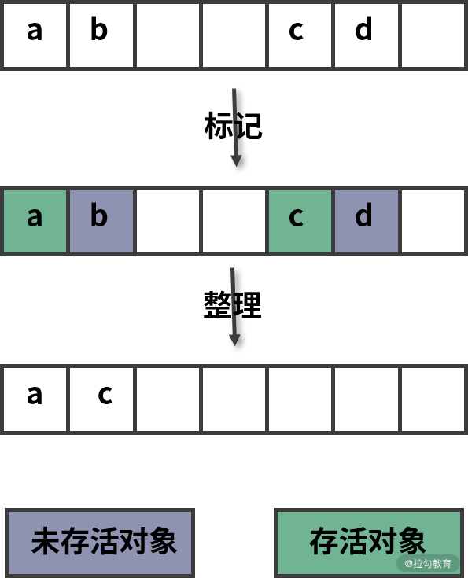

## 垃圾回收

javaScript 中的垃圾：对象不再被引用时，或者无法从根上访问到的对象，即为垃圾。

javaScript 中的可达对象：可以访问到的对象就是可达对象（引用、作用域链）。

可达的标准就是从根出发是否能够被找到。JS 中的根可以理解为全局对象。

垃圾回收：找到内存中的垃圾对象，并释放和回收空间，方便程序后续使用。

### 栈

栈是一个临时存储空间，主要存储局部变量和函数调用（对于全局表达式会创建匿名函数并调用）。

对于基本数据类型（`String`、`Undefined`、`Null`、`Boolean`、`Number`、`BigInt`、`Symbol`）的局部变量，会直接在栈中创建，而对象数据类型局部变量会存储在堆中，栈中只存储它的引用地址，也就是常说的浅拷贝。全局变量以及闭包变量也是只存储引用地址。总而言之栈中存储的数据都是轻量的。

对于函数，解释器创建了“调用栈”（Call Stack）来记录函数的调用流程。每调用一个函数，解释器就会把该函数添加进调用栈，解释器会为被添加进的函数创建一个栈帧 （Stack Frame，这个栈帧用来保存函数的局部变量以及执行语句）并立即执行。如果正在执行的函数还调用了其它函数，那么新函数也将会被添加进调用栈并执行。

与此同时，还有一个记录当前执行状态的指针（称为 ESP），指向调用栈中函数的执行上下文，表示当前正在执行的函数。一旦这个函数执行结束，对应的栈帧也会被立即销毁。JavaScript 会将 ESP 下移到下一层函数的执行上下文，这个下移操作就是销毁函数执行上下文的过程。

查看调用栈的方式有 2 种：

- 调用函数 `console.trace()` 打印到控制台；

- 利用浏览器开发者工具进行断点调试。

虽然栈很轻量，只会在使用时创建，使用结束时销毁，但它并不是可以无限增长的。当分配的调用栈空间被占满时，就会引发“栈溢出”错误。

在编写递归函数的时候一定要注意函数执行边界，也就是退出递归的条件。否则会导致栈溢出报错。

**尾调用**

递归调用由于调用次数较多，同时每层函数调用都需要保存栈帧，所以通常是比较消耗内存的操作。对递归的优化一般有两个思路，减少递归次数和使用尾调用。

尾调用（Tail Call）是指函数的最后一步返回另一个函数的调用。

```javaScript
function a(x){
  return b(x);
}
```

尾调用由于是在 `return` 语句中，并且是函数的最后一步操作，所以局部变量等信息不需要再用到，从而可以立即释放节省内存空间。

下面的示例代码通过递归实现了求斐波那契额数列第 n 个数的功能。函数 `fibTail()` 相对于函数 `fib()` 就同时使用了尾调用以及减少调用次数两种优化方式。

```javaScript
function fib(n) {
  if (n < 3) return 1
  return fib(n-1) + fib(n-2)
}

function fibTail(n, a = 0, b = 1) {
  if (n === 0) return a
  return fibTail(n - 1, b, a + b)
}
```

但是由于尾调用也存在一些隐患，比如错误信息丢失、不方便调试，所以浏览器以及 Node.js 环境默认并没有支持这种优化方式。

## Chrome 内存回收机制

### 代际假说和分代收集

不过在正式介绍 V8 是如何实现回收之前，需要先学习下代际假说（The Generational Hypothesis）的内容，这是垃圾回收领域中一个重要的术语，后续垃圾回收的策略都是建立在该假说的基础之上的，所以很是重要。

代际假说有以下两个特点：

- 第一个是大部分对象在内存中存在的时间很短，简单来说，就是很多对象一经分配内存，很快就变得不可访问；

- 第二个是不死的对象，会活得更久。


其实这两个特点不仅仅适用于 JavaScript，同样适用于大多数的动态语言，如 Java、Python 等。

有了代际假说的基础，就可以来探讨 V8 是如何实现垃圾回收的了。

### 垃圾回收器的工作流程

不论什么类型的垃圾回收器，它们都有一套共同的执行流程。

第一步是标记空间中活动对象和非活动对象。所谓活动对象就是还在使用的对象，非活动对象就是可以进行垃圾回收的对象。

第二步是回收非活动对象所占据的内存。其实就是在所有的标记完成之后，统一清理内存中所有被标记为可回收的对象。

第三步是做内存整理。一般来说，频繁回收对象后，内存中就会存在大量不连续空间，我们把这些不连续的内存空间称为内存碎片。当内存中出现了大量的内存碎片之后，如果需要分配较大连续内存的时候，就有可能出现内存不足的情况。所以最后一步需要整理这些内存碎片，但这步其实是可选的，因为有的垃圾回收器不会产生内存碎片，比如接下来要介绍的副垃圾回收器。

### V8 引擎的堆内存回收

在 Chrome 浏览器中，JavaScript 的 V8 引擎被限制了内存的使用，根据不同的操作系统（操作系统有 64 位和 32 位的）内存大小会不同，大的可以到 1.4G 的空间，小的只能到 0.7G 的空间。

限制内存使用的两个原因：

- V8 最开始是为浏览器而设计的引擎，早些年由于 Web 应用都比较简单，其实并未考虑占据过多的内存空间；

- 另外又由于被 V8 的垃圾回收机制所限制，比如清理大量的内存时会耗费很多时间，这样会引起 JavaScript 执行的线程被挂起，会影响当前执行的页面应用的性能。

Chrome 的 JavaScript 引擎 V8 将堆内存分为两类：**新生代的回收机制**和**老生代的回收机制**。

- 副垃圾回收器，主要负责新生代的垃圾回收。

- 主垃圾回收器，主要负责老生代的垃圾回收。

堆空间存储的数据比较复杂，大致可以划分为下面 5 个区域：代码区（Code Space）、Map 区(Map Space)、大对象区（Large Object Space）、新生代（New Space）、老生代（Old Space）。

**新生代内存回收**

大多数的对象最开始都会被分配在新生代，该存储空间相对较小，在 64 位操作系统下分配为 32 MB，在 32 位操作系统下分配为 16 MB，正是因为新生代中的变量存活时间短，不太容易产生太大的内存压力，因此不够大也是可以理解的。首先系统会将分配给新生代的内存空间分为两个空间：**from 正在使用的内存空间**和**to 目前闲置的内存空间**两部分。

新生代内存回收过程采用复制算法和标记整理的方式来回收未存活的对象空间。

程序中声明的对象首先会被分配到 from 空间（对象区域），当进行垃圾回收时，会先将 from 空间中存活的的对象（存活对象可以理解为被引用的对象）标记整理后复制到 to 空间（空闲区域）进行保存，对未存活的对象空间进行回收。当复制完成后，from 空间和 to 空间进行调换，to 空间会变为新的 from 空间，原来的 from 空间则变为 to 空间，这种算法称之为 “Scavenge”。

新生代的内存回收频率很高、速度也很快，但空间利用率较低，因为让一半的内存空间处于“闲置”状态。


**老生代内存回收**

新生代中多次回收仍然存活的对象会被转移到空间较大的老生代。时间长了之后通过几个原因的判断，就会把这些变量进行 "晋升"，只要是已经经历过一次 `Scavenge` 算法回收的，就可以晋升为老生代内存的对象。（对象晋升策略）

因为老生代空间较大，如果回收方式仍然采用 `Scanvage` 算法来频繁复制对象，那性能开销就太大了。还有就是 to 空间的使用率超过 25% 也会触发晋升。因此老生区中的对象有两个特点，一个是对象占用空间大，另一个是对象存活时间长。

所以老生代采用的是 Mark-Sweep（标记清除） 和 Mark-Compact（标记整理）和增量标记的方式来回收未存活的对象空间。

1. 标记清除（Mark-Sweep）

标记清除分为标记和清除两个阶段。标记阶段会遍历堆中所有对象。

首先标记阶段会遍历堆中所有对象，并分别对存活的活动对象进行标记；然后在代码执行过程结束之后，对使用过的变量取消标记。那么没取消标记的就是没有使用过的变量，因此在清除阶段，就会把还有标记的进行整体清除，从而释放内存空间。


由于标记清除不会对内存一分为二，所以不会浪费空间。但是进行过标记清除之后的内存空间会产生很多不连续的碎片空间，这种不连续的碎片空间中，如果要新来一个较大的内存对象需要存储时可能会由于空间不足而导致无法存储的情况。对于通过标记清除产生的内存碎片，还是需要通过另外一种方式进行解决，因此这里就不得不提到标记整理策略（Mark-Compact）了。

2. 标记整理（Mark-Compact）

为了解决内存碎片的问题，提高对内存的利用，还需要使用到标记整理（Mark-Compact） 算法。标记整理算法相对于标记清除算法在回收阶段进行了改进，标记整理对待未标记的对象并不是立即进行回收，而是将存活的对象移动到一边，然后再清理。当然这种移动对象的操作相对而言是比较耗时的，所以执行速度上，比标记清除要慢。



3. 标记增量

由于 JavaScript 是运行在主线程之上的，一旦执行垃圾回收算法，都需要将正在执行的 JavaScript 脚本暂停下来，待垃圾回收完毕后再恢复脚本执行。把这种行为叫做**全停顿**（Stop-The-World）。

在 V8 新生代的垃圾回收中，因其空间较小，且存活对象较少，所以全停顿的影响不大，但老生代就不一样了。如果在执行垃圾回收的过程中，占用主线程时间过久，主线程是不能做其他事情的。比如页面正在执行一个 JavaScript 动画，因为垃圾回收器在工作，就会导致这个动画在这 200 毫秒内无法执行的，这将会造成页面的卡顿现象。

为了降低老生代的垃圾回收而造成的卡顿，V8 将标记过程分为一个个的子标记过程，同时让垃圾回收标记和 JavaScript 应用逻辑交替进行，直到标记阶段完成，把这个算法称为增量标记（Incremental Marking）算法。

当垃圾回收进行工作的时候会阻塞 JS 代码的执行，所谓标记增量，即为将整个垃圾回收工作，拆分成多个小步，在代码执行的空档期，组合着完成整个回收工作。


使用增量标记算法，可以把一个完整的垃圾回收任务拆分为很多小的任务，这些小的任务执行时间比较短，可以穿插在其他的 JavaScript 任务中间执行，这样当执行上述动画效果时，就不会让用户因为垃圾回收任务而感受到页面的卡顿了。

可以看出，老生代内存的管理方式和新生代的内存管理方式区别还是比较大的。`Scavenge` 算法比较适合内存较小的情况处理；而对于老生代内存较大、变量较多的时候，还是需要采用“标记-清除”结合“标记-整理”这样的方式处理内存问题，并尽量避免内存碎片的产生。

**思考题**

```javaScript
var a = {n: 1};
var b = a;
a.x = a = {n: 2};

a.x 	// --> undefined
b.x 	// --> {n: 2}
```

解答：

- 1. **优先级**: `.` 的优先级高于 `=` ，所以先执行 `a.x`，堆内存中的 `{n: 1}` 就会变成 `{n: 1, x: undefined}`，改变之后相应的 `b.x` 也变化了，因为指向的是同一个对象。

- 2. **赋值操作是从右到左**，所以先执行 `a = {n: 2}`，`a` 的引用就被改变了，然后这个返回值又赋值给了 `a.x`，需要注意的是这时候 `a.x`是第一步中的 `{n: 1, x: undefined}` 那个对象，其实就是 `b.x`，相当于 `b.x = {n: 2}`
