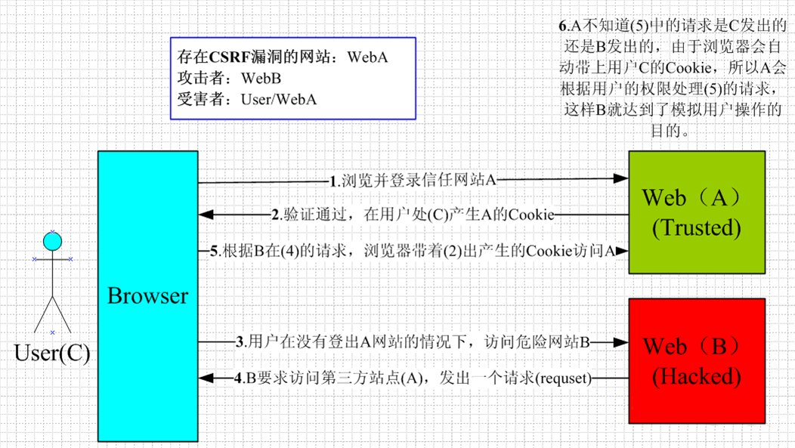

## 跨站脚本（Cross Site Scripting，XSS）

1. XSS 的攻击原理

XSS 攻击的核心原理是：不需要你做任何的登录认证，它会通过合法的操作（比如在 url 中输入、在评论框中输入），向你的页面注入脚本（可能是 js、hmtl 代码块等）。

最后导致的结果可能是：

- 盗用 Cookie

- 破坏页面的正常结构，插入广告等恶意内容

- D-doss 攻击

2. XSS 的攻击方式

- 1. 反射型

反射型 XSS 也叫非持久型 XSS，是指攻击者将恶意代码拼写在 URL 中提交给服务端，服务器端解析后响应，XSS 代码随响应内容一起传回给浏览器，最后浏览器解析执行 XSS 代码。这个过程像一次反射，所以叫反射型 XSS。

- 2. 存储型

存储型 XSS 和反射型 XSS 的差别在于，提交的代码会存储在服务器端（数据库、内存、文件系统等），下次请求时目标页面时不用再提交 XSS 代码。

- 3. DOM 型

DOM 型 XSS 可以看作一种特殊的反射型 XSS，它也是一种非持久型 XSS，不过相对于反射型 XSS 而言它不需要经过服务端。

3. XSS 的防范措施（encode + 过滤）

1、编码：

对用户输入的数据进行 HTML Entity 编码。

如上图所示，把字符转换成 转义字符。

Encode 的作用是将$var 等一些字符进行转化，使得浏览器在最终输出结果上是一样的。

比如说这段代码：

```html
<script>
  alert(1);
</script>
```

若不进行任何处理，则浏览器会执行 alert 的 js 操作，实现 XSS 注入。

进行编码处理之后，L 在浏览器中的显示结果就是<script>alert(1)</script>，实现了将$var 作为纯文本进行输出，且不引起 JavaScript 的执行。

参考链接：[4 类防御 XSS 的有效方法](https://www.jianshu.com/p/599fcd03fd3b)

2、过滤：

- 移除用户输入的和事件相关的属性。如 onerror 可以自动触发攻击，还有 onclick 等。（总而言之，过滤掉一些不安全的内容）

- 移除用户输入的 Style 节点、Script 节点、Iframe 节点。（尤其是 Script 节点，它可是支持跨域的呀，一定要移除）。

3、校正

- 避免直接对 HTML Entity 进行解码。

- 使用 DOM Parse 转换，校正不配对的 DOM 标签。

备注：我们应该去了解一下 DOM Parse 这个概念，它的作用是把文本解析成 DOM 结构。

比较常用的做法是，通过第一步的编码转成文本，然后第三步转成 DOM 对象，然后经过第二步的过滤。

还有一种简洁的答案：

首先是 encode，如果是富文本，就白名单。

4. 参数校验

对于 HTTP 请求的 URL 参数和请求体 payload 的数据进行校验，比如我们接收的数据是用户年龄，那么在后端，需要判断一下数据是否是 Number，对于不符合校验规则的数据及时抛出错误。

5. 字符转义

对于一些特殊符号，比如“<”“>”“&”“"”“'”“/”，我们需要对其进行转义，后端接收这些代码时候的转义存储，前端在显示的时候，再把它们转成原来的字符串进行显示。

对于用户输入的字符串内容，不要使用 eval、new Function 等动态执行字符串的方法，也不要将这些字符串通过 innerHTML、outerHTML、document.write() 方式直接写到 HTML 中。对于非客户端 cookie，比如保存用户凭证的 session，将其设置为 http only，避免前端访问 cookie。

6. CSP 内容安全策略

## 跨站请求伪造（Cross-site Request Forgery，CSRF/XSRF）

1. CSRF 的攻击原理

CSRF 攻击就是在受害者毫不知情的情况下以受害者名义伪造请求发送给受攻击站点，从而在并未授权的情况下执行在权限保护之下的操作。和 XSS 攻击方式相比，CSRF 并不需要直接获取用户信息，只需要“借用”用户的登录信息相关操作即可，隐蔽性更强。



用户是网站 A 的注册用户，且登录进去，于是网站 A 就给用户下发 cookie。

从上图可以看出，要完成一次 CSRF 攻击，受害者必须满足两个必要的条件：

- 登录受信任网站 A，并在本地生成 Cookie。（如果用户没有登录网站 A，那么网站 B 在诱导的时候，请求网站 A 的 api 接口时，会提示你登录）

- 在不登出 A 的情况下，访问危险网站 B（其实是利用了网站 A 的漏洞）。

我们在讲 CSRF 时，一定要把上面的两点说清楚。

温馨提示一下，cookie 保证了用户可以处于登录状态，但网站 B 其实拿不到 cookie。

2. CSRF 如何防御

- 1. 方法一、Token 验证：（用的最多）

（1）服务器发送给客户端一个 token；

（2）客户端提交的表单中带着这个 token。

（3）如果这个 token 不合法，那么服务器拒绝这个请求。

- 2. 方法二：隐藏令牌：

把 token 隐藏在 http 的 head 头中。

方法二和方法一有点像，本质上没有太大区别，只是使用方式上有区别。

- 3. 方法三、Referer 验证：

Referer 指的是页面请求来源。意思是，只接受本站的请求，服务器才做响应；如果不是，就拦截。

## CSRF 和 XSS 的区别

1. 区别一：

- CSRF：需要用户先登录网站 A，获取 cookie。

- XSS：不需要登录。

2. 区别二：（原理的区别）

- CSRF：是利用网站 A 本身的漏洞，去请求网站 A 的 api。

- XSS：是向网站 A 注入 JS 代码，然后执行 JS 里的代码，篡改网站 A 的内容。

## 点击劫持（C lickJacking ）

攻击者创建一个网页利用 `iframe` 包含目标网站，然后通过设置透明度等方式隐藏目标网站，使用户无法察觉目标网站的存在，并且把它遮罩在网页上。在网页中诱导用户点击特定的按钮，而这个按钮的位置和目标网站的某个按钮重合，当用户点击网页上的按钮时，实际上是点击目标网站的按钮。

ClickJacking 防御:

ClickJacking 的攻击原理主要是利用了 `iframe`，所以可以通过设置响应头部字段 X-Frame-Options HTTP 来告诉浏览器允许哪些域名引用当前页面。`X-Frame-Options` 的值有 3 个，具体如下。

- **DENY**：表示页面不允许在 `iframe` 中引用，即便是在相同域名的页面中嵌套也不允许，GitHub 首页响应头部使用的就是这个值。

- **SAMEORIGIN**：表示该页面可以在相同域名页面的 `iframe` 中引用，知乎网站首页响应头部使用的就是这个值。

- **ALLOW-FROM [URL]**：表示该页面可以在指定来源的 `iframe` 中引用。

## DDOS 攻击

## 密码加密存储

[常见 Web 攻击和防御](https://juejin.cn/post/6844903970171781134)

[前端面试查漏补缺--(七) XSS 攻击与 CSRF 攻击](https://juejin.cn/post/6844903781704925191)

[一文读懂 Web 安全](https://segmentfault.com/a/1190000023396707)

[【面试篇】寒冬求职之你必须要懂的Web安全](https://juejin.cn/post/6844903842635579405)

[前端开发人员的十个安全建议，做了以后老板给你点赞](https://mp.weixin.qq.com/s?__biz=MzUyNDYxNDAyMg==&mid=2247485408&idx=1&sn=24289701510c65daf9a1cc2bdafa79c6&chksm=fa2be709cd5c6e1f65d20469204057fcbab031a9a79b260c8680faf39d79f70ee9ec77171ac3&scene=126&&sessionid=1664420280#rd)

[你在项目中做过哪些安全防范措施？](https://mp.weixin.qq.com/s?__biz=MzUyNDYxNDAyMg==&mid=2247488732&idx=2&sn=be1fab0d19c6886af79142fc5c972b95&chksm=fa2bf435cd5c7d23cf96ebd65b81e22c4b516b34317dffa919d0c25395451aac24280bffcb31&scene=126&&sessionid=1664519630#rd)


