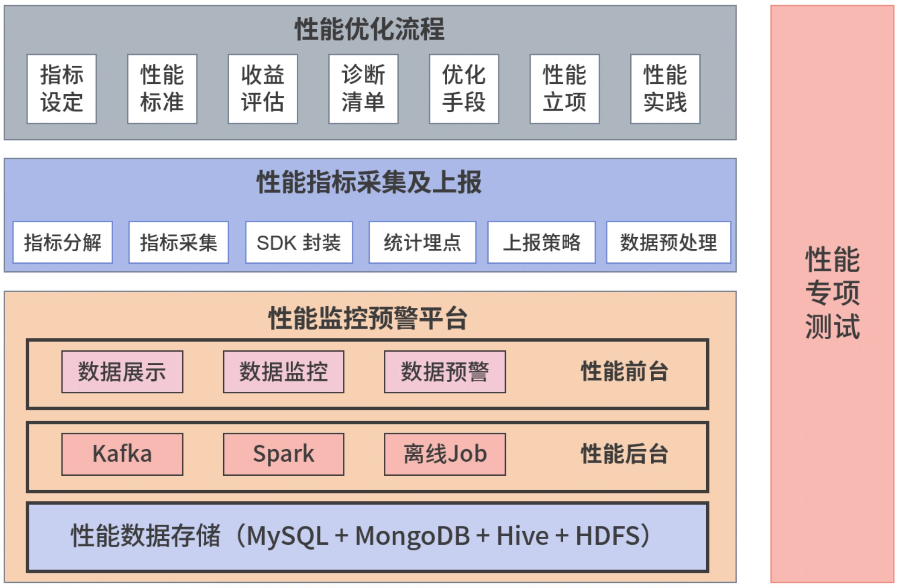
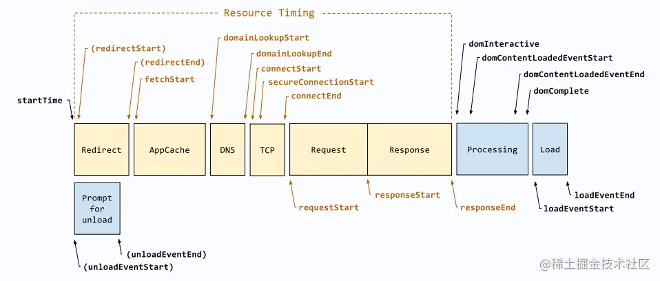
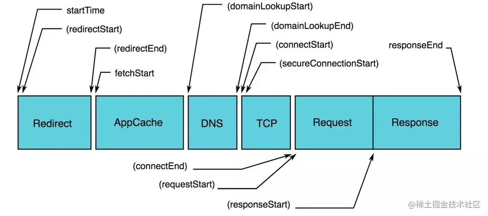

> 一年一度的双十一活动开始了，大家都在祈祷交易系统千万别出问题，有个同事突然发现自家的下单页面变得很慢。哪里出了问题？
>
> 是网络抽风，卡顿了？还是后端接口出问题了？或者是用户的手机环境问题？

遇到这类场景判断问题，要是有个**前端性能标准和预警监控平台**。一旦出现异常，直接拿平台上的数据和标准对比，就知道问题出在哪里，以及该怎么解决了。

## 性能优化体系概览

作为前端工程师，针对琐碎繁杂性能优化工作，整理出了一个系统化前端性能体系图。可以对前端性能优化有一个更清晰而全面的把握，不像以前那样总感觉乱糟糟的。

一般来说，前端搭建监控体系，可以概括为为了做两件事：**如何及时发现问题**、**如何快速定位问题**，而为了解决这两个问题，前端监控体系需要关注的点可以拆分为如下：

- 页面的性能情况：包括各阶段加载耗时，一些关键性的用户体验指标等。

- 用户的行为情况：包括 PV、UV、访问来路，路由跳转等。

- 接口的调用情况：通过 http 访问的外部接口的成功率、耗时情况等。

- 页面的稳定情况：各种前端异常等。

- 数据上报及优化：如何将监控捕获到的数据优雅的上报。

性能优化体系具体主要包括三部分：性能优化流程、性能指标采集及上报、性能监控预警平台。



### 第一部分，性能优化流程

对应图中灰色部分，主要包括**性能指标设定、性能标准确定、收益评估、诊断清单、优化手段、性能立项、性能实践**。

**性能指标设定**，是要选择什么样的指标。比如页面打开慢，想要优化它，该从哪些地方入手，优化完后怎么知道问题解决了？这些就需要明确的指标来衡量。

**确定性能标准**，也就是性能优化目标是怎样的，优化到什么程度合适。例如，要优化 App 里面的 H5 页面打开速度，确定的指标是秒开率，那一秒内可以打开的请求比例就是它的性能标准。

如果仅仅判断性能指标是否优化到位还好，但很多时候，为了让产品同学感觉我们是为产品服务，而不是又在造轮子，我们还需要关联产品目标进行**收益评估**。比如，列表页到详情页的转化率能不能提升？用户跳出率可不可降低？

接下来，我们就可以把业务代码接入性能监控预警平台，根据性能标准给出**诊断清单**。假如诊断出性能问题，我们就可以结合性能标准和诊断清单，确定相应的**优化手段**。

最后是**性能实践**，即经过优化之后发起项目上线，并跟踪进行效果评估，结合场景把这些项目成果以文档或代码的形式沉淀下来，给后来者使用参考。

不要小看这个沉淀文档的重要性，攻城不易，守城更难，制订优化实践，确保新人也可以执行，是优化成果得以长期保持的必要保障。比如之前有个同事通过懒加载解决了滚动列表下拉慢的问题，后来的新同事再遇到同样问题，就可以通过查看这个文档快速解决。

### 第二部分，性能指标采集与上报

对应着图中紫色部分，主要内容是把前面提到的性能指标以代码的形式分解落地，确保可以采集，然后在 SDK 封装后集合统计埋点，最后根据实际情况，制定上报策略。

在上报之前，还需要注意将一些“脏数据”（也就是明显异常的数据）丢弃掉，避免占用用户网络带宽。

### 第三部分，性能监控预警平台

对应图中橙色部分，主要是通过分析上一步采集到的性能数据，再对比性能标准进行监控。当指标超过某一监控阈值时，性能监控预警平台会通过邮件或者短信，给我们发送预警信息。

在构造上，性能监控预警平台包括：**性能数据处理后台**和**性能可视化展现前台**两部分。

其中，性能数据处理后台，主要是在性能采集数据上报到性能平台后，对数据进行预处理、数据清洗和数据计算，然后生成前台可视化所需数据。

性能可视化展现前台包括性能展示、性能监控预警，主要是对核心数据指标进行可视化展现，对性能数据波动进行监控，对超出阈值的数据给出短信或邮件报警。

最后我注意一点，为了确保没问题，在上线前一定要做性能专项测试，检查一下你采取的措施和性能优化预期是否一致。比如，能否正确发出请求，请求处理流程是否正确，性能平台数据能否展现。如果不一致，那就得继续优化。

以上就是整个性能体系的优化流程和核心内容了。这里只是让你有一个整体印象。

说了这么多，你觉得整个性能优化体系当中，最开始要做的是哪个？比如说，现在出现了一个 6.18 活动页加载数据卡顿的性能问题，我们想要优化它，那么该怎么做？

要先确定它的性能指标及其标准是什么。因为只有设定好了性能指标，知道了它的标准，接下来我们才知道该围绕着什么来开展性能优化。但实际当中指标有那么多，比如 FPS、白屏、首屏、可操作等，最关键的是哪个？

## 如何设定性能关键指标？

### 什么样的指标值得我们关注？

根据经验和业界情况，要确定关键的性能指标，必须满足两点：

- 可衡量，就是可以通过代码来度量；
- 关注以用户为中心的关键结果和真实体验。

第一点好理解，无法衡量就无法优化，而第二点说的“关键结果和真实体验”是什么意思呢？

**所谓关键结果，就是用户真正关心什么。**举例来说，当用户进入商品详情页面，他关心的是这个商品怎么样，什么价格，具体到页面上就是商品描述、商品头图、商品价格和购买按钮这些关键信息。我们要保证无论什么情况下都能让用户看到这些信息。

**而真实体验，就是用户使用产品的感受。**比如当用户进入列表页，在滑动过程中，页面加载突然跳出一个弹窗，他会不会觉得烦？这就是一种真实体验。

**所以，基于这两点，在性能指标方面，选定加载、交互性和视觉稳定性这三个方向，来一起了解性能指标及其标准设定。**

### 性能优化关键指标设定及标准

#### 以用户为中心的性能指标

以用户为中心的性能指标就是可以直接的体现出用户的使用体验的指标；目前 Google 定义了 `FCP`、`LCP`、`CLS` 等体验指标，已经成为了目前业界的标准；对于用户体验来说，指标可以简单归纳为**加载速度**、**视觉稳定**、**交互延迟**等几个方面；

**所谓加载，就是进入页面时，页面内容的载入过程。加载速度，决定了用户是否可以尽早感受到页面已经加载完成。**比如，当你打开一些网站时，你会发现，有的网站首页上的文字、图片出现很缓慢，而有的则很快，这个内容出现的过程就是加载。加载缓慢严重消耗用户的耐心，会让用户离开页面。

**所谓交互，就是用户点击网站或 App 的某个功能，页面给出的回应。交互延迟，决定了用户是否可以尽早感受到页面已经可以操作**比如我们点击了一个“点赞”按钮，立刻给出了点赞数加一的展示，这就是交互体验好，反之如果很长时间都没回应，这就是交互体验不好。

**视觉稳定性指标（Cumulative Layout Shift CLS），也就是布局偏移量，它是指页面从一帧切换到另外一帧时，视线中不稳定元素的偏移情况。衡量了页面上的视觉变化对用户造成的负面影响大小**

比如，你想要购买的商品正在参加抢购活动，而且时间快要到了。在你正要点击页面链接购买的时候，原来的位置插入了一条 9.9 元包邮的商品广告。结果会怎样？你点成了那个广告商品。如果等你再返回购买的时候，你心仪商品的抢购活动结束了，你是不是很气？所以，`CLS` 也非常重要。

在性能优化关键指标方面，目前业界主要集中在加载方面，特别是白屏时间和首屏时间。它们直接和用户体验相关，且相关的衡量标准已经达成共识。在采集方式上，除了手动采集之外，还可以自动化采集。而交互性和视觉稳定性关键指标，业界还在探索，没有统一的衡量标准，且必须手动采集。

比如交互方面，有的公司用 `FID` 指标 （First Input Delay，首次输入延迟）， 指标必须尽量小于 100ms，如果过长会给人页面卡顿的感觉。还有的公司使用 `PSI`（Perceptual Speed Index，视觉变化率），衡量标准是小于 20%。

而视觉稳定性指标 CLS 比较前沿，2020 年 5 月 Google 公司才发布了一篇文章关于 CLS 指标定义及相关介绍的文章。它的采集方法，除了依赖 Google 的 Lighthouse 做本地采集，目前还没有好的方案。在应用上，其他公司或者沿用 Google 的或者很少使用。

因为这两个方向还没统一的标准，就不赘述了，接下来我就重点介绍这目前已经确定的加载关键指标，具体就是白屏时间和首屏时间的设定及其标准。

##### 白屏（FP）、灰屏（FCP）

**白屏时间指的是从输入内容回车（包括刷新、跳转等方式）后，到页面开始出现第一个字符的时间。**这个过程包括 DNS 查询，建立 TCP 连接，发送首个 HTTP 请求（如果使用 HTTPS 还要介入 TLS 的验证时间），返回 HTML 文档，HTML 文档 Head 解析完毕。**白屏时间的标准时间是 300ms。**

如果白屏时间过长，用户会认为我们的页面不可用，或者可用性差。如果超过一定时间（如 1s），用户注意力就会转移到其他页面。

哪些因素会导致白屏时间过长？原因有很多，有可能是 DNS 查询时间长，建立 TCP 请求链接太慢，或者是服务器处理请求速度太慢，客户端下载、解析、渲染时长过长，没有做 Gzip 压缩，缺乏本地离线化处理，等等。

W3C 标准化在 [w3c/paint-timing](https://link.juejin.cn/?target=https%3A%2F%2Fgithub.com%2Fw3c%2Fpaint-timing) 定义了**首次非网页背景像素渲染（fp）(白屏时间)**，可以直接去取。

```JavaScript
new PerformanceObserver((entryList) => {
  for (const entry of entryList.getEntriesByName('first-paint')) {
    console.log('fp', entry);
  }
}).observe({ type: 'paint', buffered: true });
```

`paint` 还定义了一个 **首次内容渲染（fcp)(灰屏时间)**，简单说一下获取方式:

- 手写一个 FCP 获取：

```JavaScript
new PerformanceObserver((entryList) => {
  for (const entry of entryList.getEntriesByName('first-contentful-paint')) {
    console.log('fcp', entry);
  }
}).observe({ type: 'paint', buffered: true });
```

- 使用 google 的 `web-vitals` ：

```JavaScript
import { getFCP } from 'web-vitals';
// 当 FCP 可用时立即进行测量和记录。
getFCP(console.log);
```

- 简单封装一下以适合上文的整体封装

```JavaScript
// 获取 FP
export const getFP = (): PerformanceEntry | undefined => {
  const [entry] = performance.getEntriesByName('first-paint');
  return entry;
};

// 初始化 FP 的获取以及返回
initFP = (): void => {
  const entry = getFP();
  const metrics = {
    startTime: entry?.startTime.toFixed(2),
    entry,
  } as IMetrics;
  this.metrics.set(metricsName.FP, metrics);
};

// 获取 FCP
export const getFCP = (): PerformanceEntry | undefined => {
  const [entry] = performance.getEntriesByName('first-contentful-paint');
  return entry;
};

// 初始化 FCP 的获取以及返回
initFCP = (): void => {
  const entry = getFCP();
  const metrics = {
    startTime: entry?.startTime.toFixed(2),
    entry,
  } as IMetrics;
  this.metrics.set(metricsName.FCP, metrics);
};
```

- **FP 首次绘制**：页面视觉首次发生变化的时间点。`FP` 不包含默认背景绘制，但包含非默认的背景绘制。

- **FCP 首次内容绘制**：首次绘制任何文本、图像、非空白 `canvas` 或者 `SVG` 的时间点。

- **FP 和 FCP 的区别**：`FCP` 是首次绘制来自 `DOM` 的有效内容的时间点；所以 `FP` 可能等于 `FCP`，也可能先于 `FCP`。大部分情况下得到的值两者相等；

- 但假如，给单页面应用的 `body` 元素加了一个背景色，那么 `FP` 记录的时间就是开始绘制带背景色的 `body` 的时间点，而 `FCP` 记录的则是 `body` 生成之后，首次绘制来自 `DOM` 的有效内容的时间点，这个时候 `FP` 的时间点就先于 `FCP`。

##### 首次有效绘制（FMP）(首屏）

**首屏时间 = 白屏时间 + 渲染时间。它是指从浏览器输入地址并回车后，到首屏内容渲染完毕的时间。**这期间不需要滚动鼠标或者下拉页面，否则无效。

`FMP` 首次有效绘制，可以定义为 **页面渲染过中** 元素增量最大的点，因为元素增量最大的时候，页面主要内容也就一般都渲染完成了。

如果想系统化首屏的计算，可以参考 [阿里 ARMS 的 FMP 文章](https://link.juejin.cn/?target=https%3A%2F%2Fzhuanlan.zhihu.com%2Fp%2F44933789%3Fspm%3Da2c4g.11186623.0.0.3e4c6c29FBlaPe) ，或者 **可以使用手动在代码中埋点的方式进行计算**。

如果想用 `MutationObserver` 进行自己写一个算法，可以按照下面的思路进行自己实现：

```JavaScript
export const initFMP = (): void => {
  new MutationObserver((records: Array<MutationRecord>) => {
    // 对当前的 document 进行计算评分
    // 或者对 records.addedNodes的每个 node 元素，计算评分累加;每次遍历元素还需要判断此元素是否在可视区域
  }).observe(document, { childList: true, subtree: true });
};
```

在加载性能指标方面，相比于白屏时间，首屏时间更重要。原因在于：

- 从重要性角度看，打开页面后，第一眼看到的内容一般都非常关键，比如电商的头图、商品价格、购买按钮等。这些内容即便在最恶劣的网络环境下，我们也要确保用户能看得到。

- 从体验完整性角度看，进入页面后先是白屏，随着第一个字符加载，到首屏内容显示结束，我们才会认为加载完毕，用户可以使用了。

白屏加载完成后，仅仅意味着页面内容开始加载，但我们还是没法完成诸如下单购买等实际操作，首屏时间结束后则可以。

首屏时间的标准，最初只是根据这个页面对时间是否敏感来判定，主要以用户平均首屏加载时间来计算，并没有详细区分 2G/3G/4G/WiFi 这些网络环境。

如果一个站点对时间敏感，首屏时间在 1s 内，用户感觉会很快；如果首屏时间超过 2.5s，用户就会感觉很慢。但是在 1s 内打开页面，人们对这么短的时间并不敏感，体验不出 10ms 和 50ms 有什么差别。

但当到了 2G/3G 弱网环境，或者网络不稳定的环境（如坐火车或乘飞机时），用户联网加载的时间会特别长，严重影响整体指标。就好像 100 个穷人和马云一起，看平均资产差不多每人 5 个亿，但实际上多数人并没有那么多钱。性能也如此，前端工程师在使用过程中，越来越觉得用平均值来表示加载时间并不准确可靠。

于是，人们又开始采用中位数，做正态分布，看分位值统计。在对首屏时间进行数据分析和可视化展现时，经常用到的是 P50（50 分位值）、P90（90 分位值）、P99（99 分位值）。它们是怎么得出的呢？以 P99 为例，我们是把所有首屏时间排序，得出排在第 99 位的首屏时间就是 P99。

不过这样处理起来还是比较麻烦，后来为了计算简单，也便于理解，我们引入了**秒开率**的指标，即 1s 内打开用户的占比。这个概念最早来自阿里巴巴，后来被业界普遍采用。

可以说，性能指标和标准建立到这里，已经 OK 了，业界能做到这一点的公司屈指可数。

但还有一个问题，首屏时间毕竟粒度太粗了，如果首屏时间长，白屏时间短，到底是哪里的问题？是数据接口的问题，还是页面渲染问题？所以还必须把这个指标进一步拆解细化。

**首屏时间可以拆分为白屏时间、数据接口响应时间、图片加载资源等。** 白屏时间前面已经提到了，数据接口响应时间可以直接从后端服务中获取，不需要前端再重复计算，我们只需取完放在性能平台即可。最后的图片资源需要我们单独采集。

##### 最大内容绘制（LCP）

**`LCP` 是页面内首次开始加载的时间点，到可视区域内最大的图像或者文本块完成渲染的相对时间**，是一个以用户为中心的性能指标，可以测试用户主观感知到的页面加载速度，**因为最大内容绘制完成时，往往可以认为页面将要加载完成**。

通常来说，为了提供良好的用户体验，应该努力将 最大内容绘制控（LCP） 制在 2.5 秒或以内。

- 手写一个 `LCP` 获取：

```JavaScript
new PerformanceObserver((entryList) => {
  const entries = entryList.getEntries();
  const entry = entries[entries.length - 1];
  console.log('lcp', entry);
}).observe({ type: 'largest-contentful-paint', buffered: true });
```

- 使用 google 的 `web-vitals` ：

```JavaScript
import { getLCP } from 'web-vitals';
// 当 LCP 可用时立即进行测量和记录。
getLCP(console.log);
```

- 简单封装一下以适合上文的整体封装

```JavaScript
// 获取 LCP
export const getLCP = (entryHandler: PerformanceEntryHandler): PerformanceObserver | undefined => {
  return observe('largest-contentful-paint', entryHandler);
};

// 初始化 LCP 的获取以及返回
initLCP = (): void => {
  const entryHandler = (entry: PerformanceEntry) => {
    const metrics = {
      startTime: entry?.startTime.toFixed(2),
      entry,
    } as IMetrics;
    this.metrics.set(metricsName.LCP, metrics);
  };
  getLCP(entryHandler);
};
```

##### 首次输入延迟（FID）

FID 是从用户第一次与页面交互（例如当他们单击链接、点按按钮或使用由 JavaScript 驱动的自定义控件）直到浏览器对交互作出响应，并实际能够开始处理事件处理程序所经过的时间。

通常来说，可以认为，FID 时间在 100ms 内的能让用户得到良好的使用体验。

- 手写一个 `LCP` 获取：

```JavaScript
new PerformanceObserver((entryList) => {
  const entries = entryList.getEntries();
  const entry = entries[entries.length - 1];
  const delay = entry.processingStart - entry.startTime;
  console.log('FID:', delay, entry);
}).observe({ type: 'first-input', buffered: true });
```

- 使用 google 的 `web-vitals` ：

```JavaScript
import { getFID } from 'web-vitals';
// 当 FID 可用时立即进行测量和记录。
getFID(console.log);
```

- 简单封装一下以适合上文的整体封装

```JavaScript
// 获取 FID
export const getFID = (entryHandler: PerformanceEntryHandler): PerformanceObserver | undefined => {
  return observe('first-input', entryHandler);
};

// 初始化 FID 的获取 及返回
initFID = (): void => {
  const entryHandler = (entry: PerformanceEventTiming) => {
    const metrics = {
      delay: entry.processingStart - entry.startTime,
      entry,
    } as IMetrics;
    this.metrics.set(metricsName.FID, metrics);
  };
  getFID(entryHandler);
};
```

##### 累计布局偏移（CLS）

CLS 是测量整个页面生命周期（页面可见性变成隐藏）内发生的所有意外布局偏移中最大一的布局偏移分数。每当一个已渲染的可见元素的位置从一个可见位置变更到下一个可见位置时，就发生了布局偏移 。

CLS 会衡量在网页的整个生命周期内发生的所有意外布局偏移的得分总和。

简单点说，就是正在阅读文章时，突然页面上某些内容发生了改变；或者你正要点击一个链接或一个按钮，但在手指落下的瞬间，哟？按钮来了一拨灵性走位，导致你点到了别的东西。

通常来说，我们应该将 CLS 分数控制在 0.1 或以下。

- 这里就直接呈上适合上文的整体封装的代码了，`entryHandler` 函数内的就是关键计算代码：

```JavaScript
export interface LayoutShift extends PerformanceEntry {
  value: number;
  hadRecentInput: boolean;
}

// 获取 CLS
export const getCLS = (entryHandler: PerformanceEntryHandler): PerformanceObserver | undefined => {
  return observe('layout-shift', entryHandler);
};

// 初始化 CLS 的获取以及返回
initCLS = (): void => {
  let clsValue = 0;
  let clsEntries = [];

  let sessionValue = 0;
  let sessionEntries: Array<LayoutShift> = [];

  const entryHandler = (entry: LayoutShift) => {
    if (!entry.hadRecentInput) {
      const firstSessionEntry = sessionEntries[0];
      const lastSessionEntry = sessionEntries[sessionEntries.length - 1];

      // 如果条目与上一条目的相隔时间小于 1 秒且
      // 与会话中第一个条目的相隔时间小于 5 秒，那么将条目
      // 包含在当前会话中。否则，开始一个新会话。
      if (
        sessionValue &&
        entry.startTime - lastSessionEntry.startTime < 1000 &&
        entry.startTime - firstSessionEntry.startTime < 5000
      ) {
        sessionValue += entry.value;
        sessionEntries.push(entry);
      } else {
        sessionValue = entry.value;
        sessionEntries = [entry];
      }

      // 如果当前会话值大于当前 CLS 值，
      // 那么更新 CLS 及其相关条目。
      if (sessionValue > clsValue) {
        clsValue = sessionValue;
        clsEntries = sessionEntries;

        // 记录 CLS 到 Map 里
        const metrics = {
          entry,
          clsValue,
          clsEntries,
        } as IMetrics;
        this.metrics.set(metricsName.CLS, metrics);
      }
    }
  };
  getCLS(entryHandler);
};
```

- google 的 web-vitals ：

```JavaScript
import {getCLS} from 'web-vitals';
// 在所有需要汇报 CLS 的情况下
// 对其进行测量和记录。
getCLS(console.log);
```

#### 以技术为中心的性能指标



##### 关键时间点

| 字段         | 描述                                | 计算公式                            | 备注                                                                                                       |
| :----------- | :---------------------------------- | :---------------------------------- | :--------------------------------------------------------------------------------------------------------- |
| FP           | 白屏时间                            | responseEnd - fetchStart            | 从请求开始到浏览器开始解析第一批 HTML 文档字节的时间。                                                     |
| TTI          | 首次可交互时间                      | domInteractive - fetchStart         | 浏览器完成所有 HTML 解析并且完成 DOM 构建，此时浏览器开始加载资源。                                        |
| DomReadyHTML | 加载完成时间也就是 DOM Ready 时间。 | domContentLoadEventEnd - fetchStart | 单页面客户端渲染下，为生成模板 dom 树所花费时间；非单页面或单页面服务端渲染下，为生成实际 dom 树所花费时间 |
| Load         | 页面完全加载时间                    | loadEventStart - fetchStart         | Load=首次渲染时间+DOM 解析耗时+同步 JS 执行+资源加载耗时。                                                 |
| FirstByte    | 首包时间                            | responseStart - domainLookupStart   | 从 DNS 解析到响应返回给浏览器第一个字节的时间                                                              |

##### 关键时间段

| 字段  | 描述             | 计算公式                                  | 备注                                                                                     |
| :---- | :--------------- | :---------------------------------------- | :--------------------------------------------------------------------------------------- |
| DNS   | DNS 查询耗时     | domainLookupEnd - domainLookupStart       | 如果使用长连接或本地缓存，则数值为 0                                                     |
| TCP   | TCP 连接耗时     | connectEnd - connectStart                 | 如果使用长连接或本地缓存，则数值为 0                                                     |
| SSL   | SSL 安全连接耗时 | connectEnd - secureConnectionStart        | 只在 HTTPS 下有效，判断 secureConnectionStart 的值是否大于 0,如果为 0，转为减 connectEnd |
| TTFB  | 请求响应耗时     | responseStart - requestStart              | TTFB 有多种计算方式，相减的参数可以是 requestStart 或者 startTime                        |
| Trans | 内容传输耗时     | responseEnd - responseStart               | 无                                                                                       |
| DOM   | DOM 解析耗时     | domInteractive - responseEnd              | 无                                                                                       |
| Res   | 资源加载耗时     | loadEventStart - domContentLoadedEventEnd | 表示页面中的同步加载资源。                                                               |

###### 简单封装

```JavaScript
export interface MPerformanceNavigationTiming {
  FP?: number;
  TTI?: number;
  DomReady?: number;
  Load?: number;
  FirstByte?: number;
  DNS?: number;
  TCP?: number;
  SSL?: number;
  TTFB?: number;
  Trans?: number;
  DomParse?: number;
  Res?: number;
}

// 获取 NT
const getNavigationTiming = (): MPerformanceNavigationTiming | undefined => {
  const resolveNavigationTiming = (entry: PerformanceNavigationTiming): MPerformanceNavigationTiming => {
    const {
      domainLookupStart,
      domainLookupEnd,
      connectStart,
      connectEnd,
      secureConnectionStart,
      requestStart,
      responseStart,
      responseEnd,
      domInteractive,
      domContentLoadedEventEnd,
      loadEventStart,
      fetchStart,
    } = entry;

    return {
      // 关键时间点
      FP: responseEnd - fetchStart,
      TTI: domInteractive - fetchStart,
      DomReady: domContentLoadedEventEnd - fetchStart,
      Load: loadEventStart - fetchStart,
      FirstByte: responseStart - domainLookupStart,
      // 关键时间段
      DNS: domainLookupEnd - domainLookupStart,
      TCP: connectEnd - connectStart,
      SSL: secureConnectionStart ? connectEnd - secureConnectionStart : 0,
      TTFB: responseStart - requestStart,
      Trans: responseEnd - responseStart,
      DomParse: domInteractive - responseEnd,
      Res: loadEventStart - domContentLoadedEventEnd,
    };
  };

  const navigation =
    // W3C Level2  PerformanceNavigationTiming
    // 使用了High-Resolution Time，时间精度可以达毫秒的小数点好几位。
    performance.getEntriesByType('navigation').length > 0
      ? performance.getEntriesByType('navigation')[0]
      : performance.timing; // W3C Level1  (目前兼容性高，仍然可使用，未来可能被废弃)。
  return resolveNavigationTiming(navigation as PerformanceNavigationTiming);
};

// 初始化 NT 的获取以及返回
initNavigationTiming = (): void => {
  const navigationTiming = getNavigationTiming();
  const metrics = navigationTiming as IMetrics;
  this.metrics.set(metricsName.NT, metrics);
};
```

##### 其它指标

###### 静态资源加载



可以获取每次加载时所访问的静态资源，将收集到的静态资源做成瀑图等分析图形，来找出导致静态资源加载时间过长的问题所在。

- 简单写一个 静态资源的获取：

```JavaScript
const resource = performance.getEntriesByType('resource')
const formatResourceArray = resource.map(item => {
  return {
    name: item.name,                    //资源地址
    startTime: item.startTime,          //开始时间
    responseEnd: item.responseEnd,      //结束时间
    time: item.duration,                //消耗时间
    initiatorType: item.initiatorType, //资源类型
    transferSize: item.transferSize,    //传输大小
    //请求响应耗时 ttfb = item.responseStart - item.startTime
    //内容下载耗时 tran = item.responseEnd - item.responseStart
    //但是受到跨域资源影响。除非资源设置允许获取timing
  };
});
```

- 还可以封装一下以适合上文的整体封装

```JavaScript
export interface ResourceFlowTiming {
  name: string;
  transferSize: number;
  initiatorType: string;
  startTime: number;
  responseEnd: number;
  dnsLookup: number;
  initialConnect: number;
  ssl: number;
  request: number;
  ttfb: number;
  contentDownload: number;
}

// 获取 RF
export const getResourceFlow = (resourceFlow: Array<ResourceFlowTiming>): PerformanceObserver | undefined => {
  const entryHandler = (entry: PerformanceResourceTiming) => {
    const {
      name,
      transferSize,
      initiatorType,
      startTime,
      responseEnd,
      domainLookupEnd,
      domainLookupStart,
      connectStart,
      connectEnd,
      secureConnectionStart,
      responseStart,
      requestStart,
    } = entry;
    resourceFlow.push({
      // name 资源地址
      name,
      // transferSize 传输大小
      transferSize,
      // initiatorType 资源类型
      initiatorType,
      // startTime 开始时间
      startTime,
      // responseEnd 结束时间
      responseEnd,
      // 贴近 Chrome 的近似分析方案，受到跨域资源影响
      dnsLookup: domainLookupEnd - domainLookupStart,
      initialConnect: connectEnd - connectStart,
      ssl: connectEnd - secureConnectionStart,
      request: responseStart - requestStart,
      ttfb: responseStart - requestStart,
      contentDownload: responseStart - requestStart,
    });
  };

  return observe('resource', entryHandler);
};

// 初始化 RF 的获取以及返回
initResourceFlow = (): void => {
  const resourceFlow: Array<ResourceFlowTiming> = [];
  const resObserve = getResourceFlow(resourceFlow);

  const stopListening = () => {
    if (resObserve) {
      resObserve.disconnect();
    }
    const metrics = resourceFlow as IMetrics;
    this.metrics.set(metricsName.RF, metrics);
  };
  // 当页面 pageshow 触发时，中止
  window.addEventListener('pageshow', stopListening, { once: true, capture: true });
};
```

###### 静态资源加载的缓存命中率

很多的一些资源，比如 img 图片等，在用户加载后这些资源就会被缓存起来，再下一次进入时判断缓存类型、是否过期来决定是否使用缓存；那么我们就可以统计每一次用户进入时的一个缓存命中率。

判断用户的静态资源被缓存了，它具有以下两个特征：

- 静态资源的 duration 为 0；

- 静态资源的 transferSize 不为 0；

根据上面这两个特征，就可以计算每次加载的缓存命中率：

```JavaScript
const resource = performance.getEntriesByType('resource');
let cacheQuantity = 0;
const formatResourceArray = resource.map((item) => {
  if (item.duration == 0 && item.transferSize !== 0) cacheQuantity++;
  return {
    name: item.name, //资源地址
    startTime: item.startTime, //开始时间
    responseEnd: item.responseEnd, //结束时间
    time: item.duration, //消耗时间
    initiatorType: item.initiatorType, //资源类型
    transferSize: item.transferSize, //传输大小
    //请求响应耗时 ttfb = item.responseStart - item.startTime
    //内容下载耗时 tran = item.responseEnd - item.responseStart
    //但是受到跨域资源影响。除非资源设置允许获取timing
  };
});
console.log('缓存命中率', (cacheQuantity / resource.length).toFixed(2));
```

###### PS：跨域资源(CDN)

获取页面资源时间详情时，有跨域的限制。默认情况下，跨域资源以下属性会被设置为 0

- redirectStart

- redirectEnd

- domainLookupStart

- domainLookupEnd

- connectStart

- connectEnd

- secureConnectionStart

- requestStart

- responseStart

- transferSize

如果想获取资源的具体时间，跨域资源需要设置响应头 `Timing-Allow-Origin`

- 对于可控跨域资源例如自家 `CDN`，`Timing-Allow-Origin` 的响应头 `origins` 至少得设置了主页面的域名，允许获取资源时间

- 一般对外公共资源设置为 `Timing-Allow-Origin: *`。

###### 分析得出的指标

分析得出的指标，意味着不是一次采集就能得到的指标数据，而指的是对于整个应用来说，对采集上来的众多数据进行分析而得出的指标情况；

- 首次加载跳出率：第一个页面完全加载前用户跳出率；

- 慢开比：完全加载耗时超过 5s 的 PV 占比；

- 多维度分析：对地域、网络、页面等多个维度下的性能情况；

以上就是前端性能体系中的关键指标，还有一些不太重要的指标，如卡顿、完全加载时间、资源加载时间等。

[前端监控 - 首屏统计的前世今生](https://link.juejin.cn/?target=https%3A%2F%2Fzhuanlan.zhihu.com%2Fp%2F44933789%3Fspm%3Da2c4g.11186623.0.0.3e4c6c29FBlaPe)

[web-vitals](https://link.juejin.cn/?target=https%3A%2F%2Fgithub.com%2FGoogleChrome%2Fweb-vitals%2Ftree%2Fmain%2Fsrc)

[W3C paint-timing](https://link.juejin.cn/?target=https%3A%2F%2Fgithub.com%2Fw3c%2Fpaint-timing)

[Google 文档-指标](https://link.juejin.cn/?target=https%3A%2F%2Fweb.dev%2Fmetrics%2F)

[Lighthouse 计算源码](https://link.juejin.cn/?target=https%3A%2F%2Fgithub.com%2FGoogleChrome%2Flighthouse%2Ftree%2Fmaster%2Flighthouse-core%2Faudits%2Fmetrics)

[还在看那些老掉牙的性能优化文章么？这些最新性能指标了解下](https://mp.weixin.qq.com/s?__biz=MzUyNDYxNDAyMg==&mid=2247486142&idx=1&sn=b75b87a109c28cc6c32046d0fb234aab&chksm=fa2bea57cd5c6341da695d42d7e1b02de3c86250c3039bdf7f0011f360fab0702045502c6556&scene=126&&sessionid=1664420277#rd)
