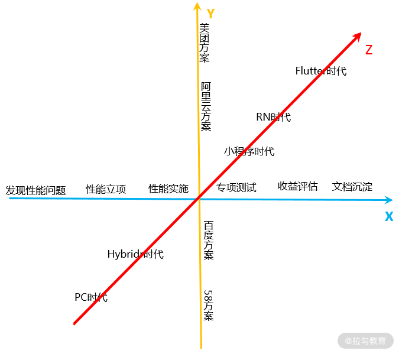

## 为什么是前端性能优化体系

- 方便团队做自定义的UV用户识别，比如通过登录账号ID或者通过设备信息；甚至从设备信息转入登录态后的继承

- 方便接入自己团队的各种告警业务等

- 方便做各维度数据的联合分析，比如发生错误可以联动查询用户行为追溯数据等

- 方便做业务需求上的拓展，比如自定义埋点、特殊的数据分析维度

- 方便前后端全链路的一个API请求链路分析

### 性能是前端面试的必考问题

在问做过哪些性能优化的时候，面试官期待的是你在什么场景下，遇到了什么性能问题，围绕什么样的性能指标，采取了哪些性能优化手段，最后取得了什么样的结果，而不仅仅是直接说采取了哪些优化手段。

### 首页加载缓慢，原因有很多

老板期待的是，前端能和后端一样，通过查日志就能定位平台问题，而不是停留在猜测层面。但在实际当中，能做到这点的前端同学并不多。

因此，在谈论性能时，重要的是做到精确，并且根据能够进行定量测量的客观标准来论及性能。这些标准就是 指标。

而前端性能监控，就是要监测页面的性能情况，将各种的性能数据指标量化并收集。

那么，前端有没有这样的工具呢？有，那就是性能监控平台。平台上面有各个业务的性能指标及其对应场景下的性能标准，一旦遇到性能问题，就能直接判断当前性能数据有没有问题，然后提示问题是出在前端、后端，还是网络层。

### 职业发展问题

工作几年后，你成了高级工程师，再往上发展需要确定你的擅长领域。如果是提效，这个领域一般是前端工程化，具体包括编译打包发布流程、物料中心、组件化这些。如果是体验领域，更多人会选择性能优化方向。

## 前端性能优化学习中的难点

在实际工作当中，前端性能优化往往比较繁杂，防布局抖动、HTML 优化、CSS 优化、图片加载优化等等，许多细节都需要顾及。而想要学习和掌握前端性能优化，人们会有许多难点。

### 第一个难点：成体系的性能优化资料严重缺失。

市面上的“武器库”有很多，你 Google 搜索性能优化体系会出来很多站点，里面提到各种各样的优化思路，如缓存请求、服务端响应优化、页面解析与处理、静态资源优化等。但这些优化手段充其量只是性能优化中的一个点或几个点，很难形成一个完整的体系，让人一目了然。

举个例子来说，你通过接入离线包来对页面进行优化，使用这种优化方式的目的是什么，围绕什么指标做的优化，优化完有什么收益，你看完那些资料之后还是回答不了这几个问题。

### 第二个难点：性能监控预警平台没有开源，需要自己去开发。

有一定优化经验的前端工程师都知道，性能优化的一个重中之重在于性能监控预警平台。通过它，我们可以第一时间发现问题。但这么一个重要工具，需要你自己去开发。

有人说了，市面上不是有类似 7 天开发一个监控平台这样的教程文章，它不行吗？不行！虽然里面提到一些方法步骤，但如何与公司现有前端性能基建对接，性能平台上包含哪些东西，需要对哪些内容做预警，应该设定什么样的预警策略，等等，这些关键问题并没有任何资料提及。

### 第三个难点：实践中有许多坑，别人并不会公开分享。

前端指标的制定、采集和上报，你在网上会看到一些资料，比如行业会议上阿里巴巴分享的采集方案，但是实践过程中，会有各种各样的坑，这个坑别人是不会分享的。

比如说，有一个搜索页面，用户在页面还没加载完成的时候，发起了搜索。这时候，你会发现采集到的首屏时间比实际的要长很多。又比如，采集到的异常数据该怎么处理，上报策略怎么设定，这些需要多次趟坑才能了解到。

### 第四个难点：性能优化立项沟通

性能优化中的立项是个难题，如何从业务的角度来思考性能优化的价值，并说服业务去发起这个项目，这中间有很多的方法。但这些方法你很难通过自己短期思考去获得，而在市面上也很难找到这样的知识。

比如立项正推和反推。所谓正推，就是性能线索 -> 性能问题 -> 性能优化方案 -> 性能收益 ，根据这个思路来开展立项沟通；反推是预估需要的性能收益 -> 性能优化方案 -> 性能问题 -> 性能线索，以此来确定立项。

## 收获

通过五个模块的的系统化性能体系学习，你会有以下几个收获。

1. **强大的性能优化思考框架**，让你心中有一个整体的 Roadmap，掌握一个整体的优化方法论，在前端优化的时候，不至于想到哪做到哪儿。

2. **丰富的实践方案**， 如果只是理论知识，很难落实到业务中，比如如何采集性能指标，采集过程中会有哪些坑，业界整体实现方案如何，各种优化手段有什么逻辑前提，在讲解的过程中，我会为你提供一些实现 Demo，让你事半功倍。

3. **业界实现方案及演进**， 通过了解业界实现方案，扩宽思维，让你少走弯路。

4. **晋升和面试的法宝**， 课程中的一些问题点，都是面试中的高频问题演化，期望让你在掌握整体体系的同时，也能给出具体解决方案。

## 总结

通过发现问题、立项、项目实施、专项测试、收益评估等过程，形成了一条横轴（ X轴），又通过一线大厂性能方案对比，形成了一条纵轴（Y轴），加入时间因素后，前端未来在 RN、Flutter上 的演进形成了一条时间轴（Z轴）。

通过实践来夯实自己之前梳理的前端性能体系会遇到哪些问题呢？又该怎么解决呢？这里提供一些经验。

**性能优化实践过程中最难的点，还是发现问题**，我们之所以觉得问题难以解决，就是因为没有发现问题的真正所在。所以性能监控预警平台至关重要，你要知道怎么搭建该平台，怎么设定、采集和上报性能指标，性能监控预警平台上的数据指标对应的标准是什么，学会从性能指标异常推导出性能问题。

这很像医生看病，当一个发烧病人来到诊室，医生通过验血等手段了解你白细胞、中性离细胞等指标，然后和标准进行对比，诊断是病毒性感冒还是细菌性感冒，并开对应对药方治疗。当然，如果你目前还没有能力去开发平台，可以使用第三方，比如阿里云的性能平台或者听云 APM。

**无论是否需要自研平台，性能诊断都是一个难点**，值得你一遍一遍反复学习。我们会在性能平台上看到各种各样的问题，那怎么去诊断、发现代码修改点就非常重要。这时如果你比较了解团队过往出现的性能问题，那你定位性能问题的速度也就越快；如果你能多了解工程化链路和浏览器渲染原理等瓶颈点，就越有助你定位到问题。

通过一遍一遍练习对性能问题的定位与诊断，你要努力达到：利用性能体系建立强大的心理表征（心理表征是一种与我们大脑正在思考的某个事物、某个观点、某些信息或者其他任何事物相对应的心理结构，棋手的心理表征是过往的一盘盘棋局），吸收和考虑更多性能相关的信息，把 webview、浏览器、App，前端代码当作一个整体来思考，快速定位到性能问题。

**当你发现问题，并成功定位问题之后，接下来的重点就是掌握优化手段。** 很多同学会因为缺乏对节奏的把握，影响优化结果，比如明明时间很紧，要快点拿到结果，你却选择了一个长期的方案，导致迟迟看不到结果，项目被 cancel 掉。所以我重点讲一下这块儿。

一般来说，业务报出性能问题时，比如手机首页访问慢的问题，需要一个短平快的解决方案（比如一周内需要完成上线），快速上线。

因为时间的原因，这个性能优化方案过程中肯定是要有取舍的，比如在最终效果方面，性能指标定到首屏平均 1s 就可以了，更多是短期方案，也就是前端工程师可以独立完成的优化手段，如懒加载、离线化、异步化、骨架屏和缓存等手段，做完上述优化后，一般可以做到性能大幅提升，极限秒开。那为了进一步提升性能水平，让秒开率也达标，你可以同时准备一些中期需要的基础建设，比如离线包方案和 SSR 相关的 Node 生态内容等。

接下来就要定一个中期目标（比如 半个月周期的项目），效果方面，秒开率提升到 80%。此时就可以用一些中期优化方案，比如首屏内容做到稳定秒开，优化手段就是性能的稳定治理，需要利用一些横向资源，比如客户端资源，接入前期准备的离线包、SSR 等方案。与此同时，也要开始做一些长期的准备，比如webview 层的优化，又比如预请求、预加载、预渲染的方案。

如果你可以再提高对自己的要求，比如二次做到闪开、首次秒开、且白屏时间缩短，需要使用一些长期方案，比如引入 QA 团队做好专项测试，保证性能长期稳定，建立起性能预警问题的解决机制。一般来说，要实现上述的要求，需要跨团队的深度合作，长期方案实施时，就需要我们设定好预期收益目标，说服业务投入资源到项目中去。

以上就是优化整体体系以及实战过程中的注意事项，希望能让你明确性能优化的重难点，以及今后努力的方向。

或许你觉得在互联网时代知识很容易学习，实际上性能知识比较海量，如果你单纯依赖碎片化的学习，就会越来越无法将知识体系化，更别提提升性能优化的技能了。

[一文摸清前端监控自研实践](https://juejin.cn/post/7097157902862909471)

[Crooked Style Sheets](https://github.com/jbtronics/CrookedStyleSheets/blob/master/docs/README.zh.md)

[前端进阶：你不知道的浏览器性能优化](https://mp.weixin.qq.com/s?__biz=MzUyNDYxNDAyMg==&mid=2247484756&idx=1&sn=c2923258762d505520d943841634b3c1&chksm=fa2be5bdcd5c6cab0f30c74990a14afef97a8baa4fad6300dd644f4212aff76d16870f4996b7&scene=126&&sessionid=1664420290#rd)

[深度系统梳理前端性能优化](https://mp.weixin.qq.com/s?__biz=MzUyNDYxNDAyMg==&mid=2247484834&idx=1&sn=14c0bd94570ff2e28a9592b66300242b&chksm=fa2be54bcd5c6c5df07602b91fd4c9abb55ef250e0ff1c3f1c293655e9d33f876574effc8fa1&scene=126&&sessionid=1664420287#rd)

[你需要知道的最新前端性能相关的内容都在这里](https://mp.weixin.qq.com/s?__biz=MzUyNDYxNDAyMg==&mid=2247484879&idx=1&sn=38bd78ff00d988b7b842beafc76b24a9&chksm=fa2be526cd5c6c30d152edef83c884357aad69cab74526b6e7458d11dc5ef0198e31be7969eb&scene=126&&sessionid=1664420287#rd)

[前端进阶：还能这样高性能渲染十万级数据？](https://mp.weixin.qq.com/s?__biz=MzUyNDYxNDAyMg==&mid=2247484822&idx=1&sn=627ba5480eecd14141e8147ac7fa7f54&chksm=fa2be57fcd5c6c696a7e5e5bac7cfc5451154b9af1e5a6de84a50b80346206dc2162b9999365&scene=126&&sessionid=1664420287#rd)

[高阶性能优化方案：虚拟列表的实现原理](https://mp.weixin.qq.com/s?__biz=MzUyNDYxNDAyMg==&mid=2247488713&idx=1&sn=2fc04f5c8865c12e4a7af0b4e90632f6&chksm=fa2bf420cd5c7d364f7bdabe37db08c10f19c3ee625f927617bcaa6374e85aee2d42500f548e&scene=126&&sessionid=1664519630#rd)

[2020前端性能优化清单（一）](https://mp.weixin.qq.com/s?__biz=MzUyNDYxNDAyMg==&mid=2247485450&idx=2&sn=a98f53f754020bd2c211325791162eac&chksm=fa2be8e3cd5c61f5a9e453cc4da5c6fdb7af5dcfd9b5238d977f12dd2726a4e94aaf8a5f08f1&scene=126&&sessionid=1664420280#rd)

[2020前端性能优化清单（二）](https://mp.weixin.qq.com/s?__biz=MzUyNDYxNDAyMg==&mid=2247485457&idx=2&sn=78f9eca6d3e94f3cb83b8fa13aa00b4a&chksm=fa2be8f8cd5c61eea43e6480bfa90d903097abd5b8a5f6c4ee50a2b62e60688f9e18c204e190&scene=126&&sessionid=1664420280#rd)

[中小型公司如何低成本搭建性能检测系统](https://mp.weixin.qq.com/s?__biz=MzUyNDYxNDAyMg==&mid=2247486907&idx=1&sn=a137f1130ccca4cd8f279b1cb2356fe9&chksm=fa2bed52cd5c6444cdccb50e0c47901d6164993fa56475893b475ce8dd9a87a609ee2ef06edd&scene=126&&sessionid=1664420268#rd)

[2020 年最新 24 条前端性能优化军规](https://mp.weixin.qq.com/s?__biz=MzUyNDYxNDAyMg==&mid=2247487051&idx=1&sn=da8711f197fe9c5e7c82fe7a72fc5aab&chksm=fa2beea2cd5c67b4172b05c5429d7ddafff88991f41f33fca377e3e6cf445c51533224ab1d08&scene=126&&sessionid=1664420268#rd)

[后端服了！这通操作让接口提速了 60%](https://mp.weixin.qq.com/s?__biz=MzUyNDYxNDAyMg==&mid=2247487058&idx=1&sn=004efdf7b67dc7624d8cdcfebebd62dc&chksm=fa2beebbcd5c67ad610747045b31bd59f8d7d46a1b083cb9dffce11dd93120873e5d48d5009e&scene=126&&sessionid=1664420264#rd)

[谷歌工程师分享前端性能优化，渐进式的极致艺术。](https://mp.weixin.qq.com/s?__biz=MzUyNDYxNDAyMg==&mid=2247487263&idx=1&sn=e127a06ef38ac0874dcf7878362d4947&chksm=fa2beff6cd5c66e04b03ea277c02da0d93a286bbaa26f40b7fe6686a2a67bb9c5791e59d3165&scene=126&&sessionid=1664420263#rd)

[前端搞工程化：从零打造性能检测库「源码 + 视频」](https://mp.weixin.qq.com/s?__biz=MzUyNDYxNDAyMg==&mid=2247487811&idx=2&sn=40d02e839fb5400c5b82858d422fb738&chksm=fa2bf1aacd5c78bcab34392a90e64fc8b53232a1da1eabce87a83a75500daffd8be8334814af&scene=126&&sessionid=1664420259#rd)

[他们渲染了一百万个网页，来了解网络如何崩溃](https://mp.weixin.qq.com/s?__biz=MzUyNDYxNDAyMg==&mid=2247487594&idx=2&sn=004b14f7b201a032a905272d11aedf53&chksm=fa2bf083cd5c7995191bed6b784bf2140919f8f6ad8dd8a76ae842874e73f3f453b90d529b52&scene=126&&sessionid=1664420260#rd)

[前端工程化之H5性能优化篇](https://mp.weixin.qq.com/s?__biz=MzUyNDYxNDAyMg==&mid=2247488168&idx=2&sn=e6295adc3cd3bc66b5f31481fc5a65ec&chksm=fa2bf241cd5c7b57a7d23ff3547c8d17a80796668129c3c696bd3917ea4f7b79f88700ff53b3&scene=126&&sessionid=1664519637#rd)

[牛逼了啊！国科大硕士教你手撸一个前端埋点回放系统](https://mp.weixin.qq.com/s?__biz=MzUyNDYxNDAyMg==&mid=2247488676&idx=1&sn=63785a51acead5f3e68fdf83ac8429d2&chksm=fa2bf44dcd5c7d5bacd7921f7a073e306e997a0ff766805075b26f432b3c728db81d62c44b63&scene=126&&sessionid=1664519633#rd)

[还在手动埋点么？out 了。不到百行代码实现自动埋点](https://mp.weixin.qq.com/s?__biz=MzUyNDYxNDAyMg==&mid=2247488915&idx=2&sn=81188706e77c010c35341f97244982a5&chksm=fa2bf57acd5c7c6c242c7e1e8a65c2cce9e51545d444ef29e26c3fd4878680548f04b040156b&scene=126&&sessionid=1664519627#rd)

[当聊到前端性能优化时，我们会关注什么？](https://mp.weixin.qq.com/s?__biz=MzUyNDYxNDAyMg==&mid=2247489227&idx=2&sn=46eebaf8fd7d73649b9cbdfb7f7ec276&chksm=fa2bf622cd5c7f346d52c5c7cb868ca53dd84b38747856080026140a03bba844f179c54e5b08&scene=126&&sessionid=1664519625#rd)

[这才是你需要了解的性能优化呀！](https://mp.weixin.qq.com/s?__biz=MzUyNDYxNDAyMg==&mid=2247489161&idx=1&sn=f029ea01370364f49fe61451b2d247ff&chksm=fa2bf660cd5c7f7666736bbdd9b6f1866761ffb937b1dea9294583bd20a386ed028fd26fbed4&scene=126&&sessionid=1664519625#rd)

[揭秘字节跳动前端异常监控背后的秘密](https://mp.weixin.qq.com/s?__biz=MzUyNDYxNDAyMg==&mid=2247489258&idx=1&sn=dc4a3ef63dc8ed88f0e1834eb7612c9f&chksm=fa2bf603cd5c7f15cee83e0bf958915a0a15f7a66d6e25944183988328c05342f7058b646597&scene=126&&sessionid=1664519625#rd)

[Web 图片组件设计的最佳实践](https://mp.weixin.qq.com/s?__biz=MzUyNDYxNDAyMg==&mid=2247490349&idx=1&sn=49320e9e20e7a836931c75ed529da39e&chksm=fa2bfbc4cd5c72d281b95ef45c01291b2d750d2340bb815e7dc22e4a7c98d2cf1cbb41a4b51a&scene=126&&sessionid=1664519602#rd)