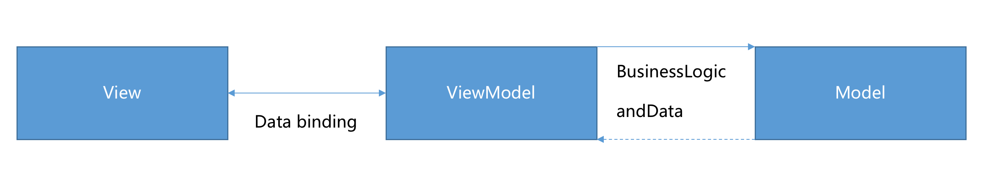

## 基本概念

`MVVM` ———— `Model View ViewModel` 双向数据流，最核心的就是 `ViewModel` 。`ViewModel` 包含 `DOM Listeners` 和 `Data Bindings`。

`Data Bindings`：从 `Model` 到 `View` 的映射。用于将数据绑定到 `View` 上显示。可以大量省略手动 `update View` 的代码和时间。

`DOM Listeners` : 用于从 `View` 到 `Model` 的事件监听。`Model` 会随着 `View` 触发事件而改变。数据的请求和视图的请求完全解耦(相互影响)。

## MVVM 思想的两个方向

1. 将模型转换成视图，即将后端传递的数据转换成看到的页面。实现方式是：数据绑定。

2. 将视图转换成模型，即将看到的页面转换成后端的数据。实现的方式是：`DOM` 事件监听。

这两个方向都实现的，就称为数据的双向绑定。

## MVC 和 MVVM 的区别(关系)

`MVC` - `Model View Controller`( `controller`: 控制器 )，`M` 和 `V` 和 `MVVM` 中的 `M` 和 `V` 意思一样，`C` 指页面业务逻辑。使用 `MVC` 的目的就是将 `M` 和 `V` 的代码分离，但 `MVC` 是单向通信，去除了 `View` -> `Model` 这一步，需要由用户手动绑定。也就是将 `Model` 渲染到 `View` 上，必须通过 `Controller` 来承上启下。

`MVC` 和 `MVVM` 的区别(关系)并不是 `ViewModel` 完全取代了 `Controller` 。

- `ViewModel` 目的在于抽离 `Controller` 中的数据渲染功能，而不是替代。

- 其他操作业务等还是应该放在 `Controller` 中实现，这样就实现了业务逻辑组件的复用。

[Mvvm 前端数据流框架精讲](https://github.com/ascoders/blog/issues/27)

[前端框架MVC和MVVM的理解](https://blog.csdn.net/qq_29722281/article/details/99717680?spm=1001.2014.3001.5501)
