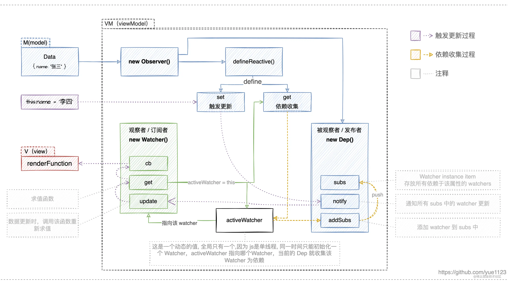
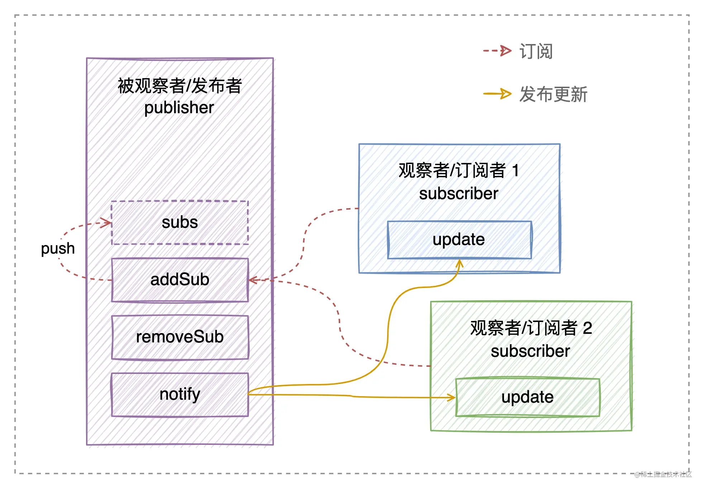

## 响应式

简单来说，就是当修改 `data` 中的数据时，视图会重新渲染，更新为最新的值。这使得状态管理变的非常的简单，只需要关注数据本身，而不用关心数据的渲染，大大的提高了开发效率。

## Vue2.x —— Object.defineProperty()

当把一个普通的 JavaScript 对象传入 Vue 实例作为 `data` 选项，Vue 将遍历此对象所有的 `property`，并使用 `Object.defineProperty` 把这些 `property` 全部转为 `getter` / `setter`，然后围绕 `getter` / `setter `来运行。

一句话概括 Vue 的响应式系统就是: **观察者模式 + [Object.defineProperty](https://developer.mozilla.org/zh-CN/docs/Web/JavaScript/Reference/Global_Objects/Object/defineProperty) 拦截 getter/setter**。



### Object.defineProperty

`Object.defineProperty(obj, prop, descriptor)` 方法会直接在一个对象上定义一个新属性，或者修改一个对象的现有属性，并返回此对象。

简单的说，就是通过此方式定义的 `property`，执行 `obj.xxx` 时会触发 `get`，执行 `obj.xxx = xxx` 会触发 `set`，这便是响应式的关键。

> Object.defineProperty 是 ES5 中一个无法 shim（无法通过 polyfill 实现） 的特性，这也就是 Vue 不支持 IE8 以及更低版本浏览器的原因。

### 观察者模式

观察者模式是一种行为设计模式，允许你定义一种订阅机制，可在对象事件发生时通知多个 “观察” 该对象的其他对象。

拥有一些值得关注状态的对象通常被称为**目标，由于它自身状态发生改变时需要通知其他对象，我们也将其成为发布者（pub­lish­er）**。所有希望关注发布者状态变化的其他对象被称为**订阅者（sub­scribers）**。此外，发布者与所有订阅者直接仅通过接口交互，都**必须具有同样的接口**。



### 设计响应式系统

1. 抽象观察者（订阅者）类 `Watcher`

抽像一个观察者（订阅者）类 `Watcher` 来保存并执行更新函数，同时向外提供一个 `update` 更新接口。

```JavaScript
// Watcher 观察者可能有 n 个，为了区分它们，保证唯一性，增加一个 uid
let watcherId = 0;
// 当前活跃的 Watcher
let activeWatcher = null;

class Watcher {
  constructor(cb) {
    this.uid = watcherId++;
    // 更新函数
    this.cb = cb;
    // 保存 watcher 订阅的所有数据
    this.deps = [];
    // 初始化时执行更新函数
    this.get();
  }
  // 求值函数
  get() {
    // 调用更新函数时，将 activeWatcher 指向当前 watcher
    activeWatcher = this;
    this.cb();
    // 调用完重置
    activeWatcher = null;
  }
  // 数据更新时，调用该函数重新求值
  update() {
    this.get();
  }
}
```

2. 抽象被观察者（发布者）类 `Dep`

抽象一个被观察者（发布者）`Dep` 类来保存数据对应的观察者（Watcher），以及数据变化时通知观察者更新。

```JavaScript
class Dep {
  constructor() {
    // 保存所有该依赖项的订阅者
    this.subs = [];
  }
  addSubs() {
    // 将 activeWatcher 作为订阅者，放到 subs 中
    // 防止重复订阅
    if(this.subs.indexOf(activeWatcher) === -1){
      this.subs.push(activeWatcher);
    }
  }
  notify() {
    // 先保存旧的依赖,便于下面遍历通知更新
    const deps = this.subs.slice()
    // 每次更新前，清除上一次收集的依赖，下次执行时，重新收集
    this.subs.length = 0;
    deps.forEach((watcher) => {
      watcher.update();
    });
  }
}
```

3. 抽象 `Observer`

把 `Watcher` 和 `Dep` 两个独立的模块用 `Object.defineProperty` 关联起来，在数据被读取，触发 `get` 方法，`Dep` 将当前触发 `get` 的 `Watcher` 当做订阅者放到 `subs` 中，`Watcher` 就与 `Dep` 建立关系；在数据被修改，触发 `set` 方法，`Dep` 就遍历 `subs` 中的订阅者，通知 `Watcher` 更新。

抽象一个 `Observer` 类来完成对 `data` 数据的遍历，并调用 `defineReactive` 转换为 `getter`/`setter`，最终完成响应式绑定。

为了简化，只处理 `data` 中单层数据。

```JavaScript
class Observer {
  constructor(value) {
    this.value = value;
    this.walk(value);
  }
  // 遍历 keys，转换为 getter/setter
  walk(obj) {
    const keys = Object.keys(obj);
    for (let i = 0; i < keys.length; i++) {
      const key = keys[i]
      defineReactive(obj, key, obj[key]);
    }
  }
}

// 通过参数 value 的闭包，来保存最新的数据，避免新增其他变量

function defineReactive(target, key, value) {
  // 每一个数据都是一个被观察者
  const dep = new Dep();
  Object.defineProperty(target, key, {
    enumerable: true,
    configurable: true,
    // 执行 data.xxx 时 get 触发，进行依赖收集，watcher 订阅 dep
    get() {
      if (activeWatcher) {
        // 订阅
        dep.addSubs(activeWatcher);
      }
      return value;
    },
    // 执行 data.xxx = xxx 时 set 触发，遍历订阅了该 dep 的 watchers，
    // 调用 watcher.updata 更新
    set(newValue) {
      // 如果前后值相等，没必要跟新
      if (value === newVal) {
        return;
      }
      value = newValue;
      // 派发更新
      dep.notify();
    },
  });
}
```

Vue 响应式原理的核心就是 `Observer`、`Dep`、`Watcher`，三者共同构成 MVVM 中的 VM。

`Observer` 中进行数据响应式处理以及最终的 `Watcher` 和 `Dep` 关系绑定，在数据被读的时候，触发 `get` 方法，将 `Watcher` 收集到 `Dep` 中作为依赖；在数据被修改的时候，触发 `set` 方法，`Dep` 就遍历 `subs` 中的订阅者，通知 `Watcher` 更新。

[Vue2响应式原理浅析](https://juejin.cn/post/7084200479005081608)
[Vue 响应式原理](https://juejin.cn/post/7087544873003253797)
[Vue 深入浅出 - 响应式原理](https://juejin.cn/post/7117094704218374174)
[纯干货！图解Vue响应式原理](https://juejin.cn/post/7074422512318152718)
[Vue2.0响应式原理剖析](https://juejin.cn/post/7123575720973959182)
[深度解析Vue2响应式数据原理](https://juejin.cn/post/7134183965824385032)
[学透Vue源码~nextTick原理](https://juejin.cn/post/6930413268376748045)
[为什么说 Vue 的响应式更新精确到组件级别？（原理深度解析）](https://juejin.cn/post/6844904113432444942)
[手写Vue2.0源码（一）-响应式数据原理｜技术点评](https://juejin.cn/post/6935344605424517128)
[Vue源码系列之响应式原理](https://juejin.cn/post/7116768217980207111)
[深入响应式原理](https://juejin.cn/post/7008799005480058911)
[Vue 响应式实现原理深入浅出](https://juejin.cn/post/7139078234905247774)
[面试官: 能不能手写 Vue 响应式？（Vue2 响应式原理【完整版】）](https://juejin.cn/post/7079807948830015502)


## Vue3.x —— Proxy


[vue3 响应式的实现原理](https://juejin.cn/post/7108263262881480734)
[响应式数据原理](https://juejin.cn/post/7139809574827720718)
[手写一个简易vue响应式带你了解响应式原理](https://juejin.cn/post/6989106100582744072)
[林三心画了8张图，最通俗易懂的Vue3响应式核心原理解析](https://juejin.cn/post/7001999813344493581)
[Vue3 原理解析之响应系统的实现](https://juejin.cn/post/7084915514434306078)
[Vue 源码解读（3）—— 响应式原理](https://juejin.cn/post/6950826293923414047)
[浅析 Vue3 响应式原理](https://juejin.cn/post/7130156153417236494)
[手写简单vue3响应式原理](https://juejin.cn/post/7134281691295645732)
