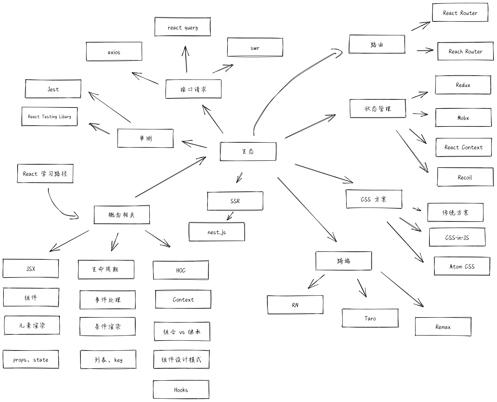

## React

React 已经进入了 Hook 为主的阶段，社区的各个库也都在积极拥抱 Hook，虽然它还有很多陷阱和不足，但是这基本上是未来的方向没跑了。这篇文章里我会减少 class 组件的开发技巧的提及，毕竟好多不错的公司也已经全面拥抱 Hook 了。

### 熟练应用

1. 你必须掌握官网中提到的所有技巧，就算没有使用过，你也要大概知道该在什么场景使用。

2. 推荐 React 小书，虽然书中的很多 api 已经更新了，但是核心的设计思想还是没有变。[React.js 小书](http://huziketang.mangojuice.top/books/react)。

3. 关于熟练应用，其实掘金的小册里有几个宝藏

- 诚身大佬（悄悄告诉你，他的职级非常高）的企业级管理系统小册，这个项目里的代码非常深入，而且在抽象和优化方面也做的无可挑剔，自己抽象了 acl 权限管理系统和 router 路由管理，并且引入了 reselect 做性能优化，一年前我初次读的时候，很多地方懵懵懂懂，这一年下来我也从无到有经手了一套带 acl 和权限路由的管理系统后，才知道他的抽象能力有多强。真的是

> 初闻不知曲中意，再闻已是曲中人。

[React 组合式开发实践：打造企业管理系统五大核心模块](https://juejin.im/book/5b1e15f76fb9a01e516d14a0)

- 三元大佬的[React Hooks 与 Immutable 数据流实战](https://juejin.im/book/5da96626e51d4524ba0fd237)，深入浅出的带你实现一个音乐播放器。三元大家都认识吧？那是神，神带你们写应用项目，不学能说得过去吗？

4. 深入理解 React 中的 `key`

- [understanding-reacts-key-prop](https://kentcdodds.com/blog/understanding-reacts-key-prop)。

- [react 中为何推荐设置 key](https://zhuanlan.zhihu.com/p/112917118)。

5. React 官方团队成员对于派生状态的思考：[you-probably-dont-need-derived-state](https://zh-hans.reactjs.org/blog/2018/06/07/you-probably-dont-need-derived-state.html)。

### React Hook

你必须熟练掌握 Hook 的技巧，除了官网文档熟读以外：

1. 推荐 Dan 的博客，他就是 Hook 的代码实际编写者之一，看他怎么说够权威了吧？这里贴心的送上汉化版。[useEffect 完整指南](https://overreacted.io/zh-hans/a-complete-guide-to-useeffect/)

看完这篇以后，进入 dan 的[博客主页](https://overreacted.io/zh-hans)，找出所有和 Hook 有关的，全部精读！

2. 推荐黄子毅大佬的精读周刊系列[096.精读《useEffect 完全指南》.md](https://github.com/dt-fe/weekly/blob/v2/096.%E7%B2%BE%E8%AF%BB%E3%80%8AuseEffect%20%E5%AE%8C%E5%85%A8%E6%8C%87%E5%8D%97%E3%80%8B.md)。

注意！不是只看这一篇，而是这个仓库里所有有关于 React Hook 的文章都去看一遍，结合自己的思想分析。

3. Hook 陷阱系列 还是 Dan 老哥的文章，详细的讲清楚了所谓**闭包陷阱**产生的原因和设计中的权衡。[函数式组件与类组件有何不同？](https://overreacted.io/zh-hans/how-are-function-components-different-from-classes/)

4. 去找一些社区的精品自定义 hook，看看他们的开发和设计思路，有没有能融入自己的日常开发中去的。

- [精读《Hooks 取数 - swr 源码》](https://segmentfault.com/a/1190000020964640)。

- [Umi Hooks - 助力拥抱 React Hooks](https://zhuanlan.zhihu.com/p/103150605?utm_source=wechat_session)。

- [React Hooks 的体系设计之一 - 分层](https://zhuanlan.zhihu.com/p/106665408)。

### React 性能优化

React 中优化组件重渲染，这里有几个隐含的知识点。[optimize-react-re-renders](https://kentcdodds.com/blog/optimize-react-re-renders)

如何对 React 函数式组件进行性能优化？[如何对 React 函数式组件进行优化](https://juejin.im/post/5dd337985188252a1873730f)这篇文章讲的很详细，值得仔细阅读一遍。

### React 单元测试

1. 使用 `@testing-library/react` 测试组件，这个库相比起 `enzyme` 更好的原因在于，它更注重于站在**用户的角度**去测试一个组件，而不是测试这个组件的**实现细节**。

[Introducing The React Testing Library](https://kentcdodds.com/blog/introducing-the-react-testing-library)

[Testing Implementation Details](https://kentcdodds.com/blog/testing-implementation-details)

2. 使用 `@testing-library/react-hooks` 测试自定义 Hook。

[how-to-test-custom-react-hooks](https://kentcdodds.com/blog/how-to-test-custom-react-hooks)

### React 和 TypeScript 结合使用

1. [react-typescript-cheatsheet](https://github.com/typescript-cheatsheets/react-typescript-cheatsheet) 这个仓库非常详细的介绍了如何把 React 和 TypeScript 结合，并且给出了一些进阶用法的示例，非常值得过一遍！

2. [React + Typescript 工程化治理实践](https://juejin.im/post/5dccc9b8e51d4510840165e2)这篇文章是蚂蚁金服数据体验技术部的同学带来的，其实除了这里面的技术文章以外，蚂蚁金服的同学也由非常生动给我们讲解了一个高级前端同学是如何去社区寻找方案，如何思考和落地到项目中的，由衷的佩服。

3. 微软的大佬带你写一个类型安全的组件，非常深入，非常过瘾...

[Writing Type-Safe Polymorphic React Components (Without Crashing TypeScript)](https://blog.andrewbran.ch/polymorphic-react-components/)

4. React + TypeScript 10 个需要避免的错误模式。[10-typescript-pro-tips-patterns-with-or-without-react](https://medium.com/@martin_hotell/10-typescript-pro-tips-patterns-with-or-without-react-5799488d6680)

### React 代码抽象思考

1. 何时应该把代码拆分为组件？[when-to-break-up-a-component-into-multiple-components](https://kentcdodds.com/blog/when-to-break-up-a-component-into-multiple-components)

2. 仔细思考你的 React 应用中，状态应该放在什么位置，是组件自身，提升到父组件，亦或是局部 context 和 redux，这会有益于提升应用的性能和可维护性。[state-colocation-will-make-your-react-app-faster](https://kentcdodds.com/blog/state-colocation-will-make-your-react-app-faster/)

3. 仔细思考 React 组件中的状态应该如何管理，优先使用派生状态，并且在适当的时候利用 useMemo、reselect 等库去优化他们。[dont-sync-state-derive-it](https://kentcdodds.com/blog/dont-sync-state-derive-it)

4. React Hooks 的自定义 hook 中，如何利用 reducer 的模式提供更加灵活的数据管理，让用户拥有数据的控制权。[the-state-reducer-pattern-with-react-hooks](https://kentcdodds.com/blog/the-state-reducer-pattern-with-react-hooks)

## Vue 推荐学习资料

[React](https://github.com/KieSun/all-of-frontend?utm_source=gold_browser_extension#react)

[React 性能优化 | 包括原理、技巧、Demo、工具使用](https://juejin.cn/post/6935584878071119885)

[React 技术揭秘](https://react.iamkasong.com/)

[从零搭建完整的 React 项目模板 (Webpack + React hooks + Mobx + Antd) 【演戏演全套】](https://juejin.cn/post/6844904035099623437)

[KieSun/Chat-Buy-React](https://github.com/KieSun/Chat-Buy-React)

[useEffect 完整指南](https://overreacted.io/zh-hans/a-complete-guide-to-useeffect/)

[2019 年 17 道高频 React 面试题及详解](https://juejin.cn/post/6844903922453200904)

[【React 深入】从 Mixin 到 HOC 再到 Hook](https://juejin.cn/post/6844903815762673671)

[React 16 加载性能优化指南](https://mp.weixin.qq.com/s/XSvhOF_N0VbuOKStwi0IYw)

[这届面试官，不讲武德](https://mp.weixin.qq.com/s?__biz=MzUyNDYxNDAyMg==&mid=2247487236&idx=2&sn=63df5ed013ac03f586e17bd6a85bd0e8&chksm=fa2befedcd5c66fb7a6c9887e36e295702a5a60c48f5486d4f321cf47ca545510c68b93437a6&scene=126&&sessionid=1664420263#rd)

[React 组件到底什么时候 render 啊](https://mp.weixin.qq.com/s?__biz=MzUyNDYxNDAyMg==&mid=2247486914&idx=2&sn=b464b81a317f87c8619987cce54abc93&chksm=fa2bed2bcd5c643d511edf5d70812d13e420e1650879e173ac8e95477e562c56a3dc8ea049a4&scene=126&&sessionid=1664420268#rd)

[这可能是最通俗的 React Fiber(时间分片) 打开方式](https://juejin.cn/post/6844903975112671239)

[15 年经验老外，5 小时免费带你完成一个全栈项目（React / Node）](https://mp.weixin.qq.com/s?__biz=MzUyNDYxNDAyMg==&mid=2247485471&idx=1&sn=3509b05a0fdc5b021c9e46bcd32f390c&chksm=fa2be8f6cd5c61e01ec714a4bf50c55b573971d476e40d233c1aa6383ab658903a26140a3b5c&scene=126&&sessionid=1664420280#rd)

[如何学习 React 源码](https://mp.weixin.qq.com/s?__biz=MzUyNDYxNDAyMg==&mid=2247486362&idx=2&sn=5947011c78bde650e4b20bbd38b227d2&chksm=fa2beb73cd5c62659d742842f7b97bbdcc1f121d3987dac2581e9a67969aa0e8f37f2b98e5ce&scene=126&&sessionid=1664420274#rd)

[React17 虽无新特性，但是底层代码已经大变样！](https://mp.weixin.qq.com/s?__biz=MzUyNDYxNDAyMg==&mid=2247486367&idx=1&sn=395a2d4cc8f487a8bf8892e1b0ca6cc3&chksm=fa2beb76cd5c626019c82f3eee39268d2262f99576c8fe90bac9f63cdc4f7f52528a10fd71fe&scene=126&&sessionid=1664420274#rd)

[关于 useState 的一切](https://mp.weixin.qq.com/s?__biz=MzUyNDYxNDAyMg==&mid=2247486507&idx=2&sn=7a6e278b5be63c97866a3130e5cb4a2e&chksm=fa2becc2cd5c65d452e3b62270e0c481bfa13db72819ea0e949ffe2b1191caaaec123edbc915&scene=126&&sessionid=1664420274#rd)

[我在阿里写 React，学到了什么？](https://mp.weixin.qq.com/s?__biz=MzUyNDYxNDAyMg==&mid=2247486839&idx=1&sn=97d365df9005d89e4cdc0c18a96252d2&chksm=fa2bed9ecd5c6488c19b6a75a0a87242dc37d6930643cdc59538dc55c5eea6bbb1961da8d0c9&scene=126&&sessionid=1664420269#rd)

[我在 BAT 写 React 是如何进行性能优化的](https://mp.weixin.qq.com/s?__biz=MzUyNDYxNDAyMg==&mid=2247486903&idx=1&sn=b07ffe622b56253df176bb891b597b06&chksm=fa2bed5ecd5c6448e240fa8bb57562a1034e87eaecb6fed6f0174edc8867db41daa10c999d8a&scene=126&&sessionid=1664420268#rd)

[跟着官方文档能学懂 React 就怪了](https://mp.weixin.qq.com/s?__biz=MzUyNDYxNDAyMg==&mid=2247487413&idx=1&sn=c220ad27008d85a3e38d424de114f754&chksm=fa2bef5ccd5c664a82694365d431836da10272519dfbb4a086439641c45dfb818f58f2496ca2&scene=126&&sessionid=1664420260#rd)

[5 分钟学会 1 个 React 原理！](https://mp.weixin.qq.com/s?__biz=MzUyNDYxNDAyMg==&mid=2247487911&idx=1&sn=aee1f5df5a2d51c51dd320c2925c5448&chksm=fa2bf14ecd5c78588e02b2a85154120b36afbdc1dd785eb01a599d259921c46804307a1e714f&scene=126&&sessionid=1664420257#rd)

[React17 在我看来是这样的](https://mp.weixin.qq.com/s?__biz=MzUyNDYxNDAyMg==&mid=2247488141&idx=2&sn=656006fad708a9ca02f2c6b68d9dfab1&chksm=fa2bf264cd5c7b72ebe8885b89e479cbf26bbfea841d961257286b0a920ccc8b6911295eb8f3&scene=126&&sessionid=1664519638#rd)

[一篇必看的 React 文章](https://mp.weixin.qq.com/s?__biz=MzUyNDYxNDAyMg==&mid=2247488149&idx=2&sn=c107baf0c28d47c327d965d7d49861fb&chksm=fa2bf27ccd5c7b6a93b35e3de497d7bbcf464bdaa0b463fba8215f0ef7a11b5e83a6b61c5052&scene=126&&sessionid=1664519637#rd)

[写给进阶玩家的 React 事件系统原理](https://mp.weixin.qq.com/s?__biz=MzUyNDYxNDAyMg==&mid=2247489255&idx=2&sn=6d516b183d84a1a07957926bd132c347&chksm=fa2bf60ecd5c7f1879f0f67cb4efc7419dd328d54f39ebcb439e7af9e7ef97ec0649c737bd86&scene=126&&sessionid=1664519625#rd)

[手写简易版 React 来彻底搞懂 fiber 架构](https://mp.weixin.qq.com/s?__biz=MzUyNDYxNDAyMg==&mid=2247490489&idx=1&sn=e58f499973e9bf69645513e55f7ccaba&chksm=fa2bfb50cd5c7246ae5e2b3ca2fe1bf14a33aebbb4181182cffdf668986ec5e5516665a987b5&scene=126&&sessionid=1664519599#rd)

[图解 React 的 diff 算法：核心就两个字 —— 复用](https://mp.weixin.qq.com/s?__biz=MzUyNDYxNDAyMg==&mid=2247490831&idx=1&sn=27e5b7a524c2e7a0babba747447aef51&chksm=fa2bfde6cd5c74f0cc778660d7342b7864cb79535dcbae947b5941effe8a5de15f2b4e537b8d&scene=126&&sessionid=1664519593#rd)

[全网最优雅的 React 源码调试方式](https://mp.weixin.qq.com/s?__biz=MzUyNDYxNDAyMg==&mid=2247490797&idx=1&sn=05da8d6b763d7cb2fdaee370dc52b33f&chksm=fa2bfc04cd5c75126c39909547223298fcda0388a567771e7c4ae7404737429b98c04fb02cc4&scene=126&&sessionid=1664519593#rd)

