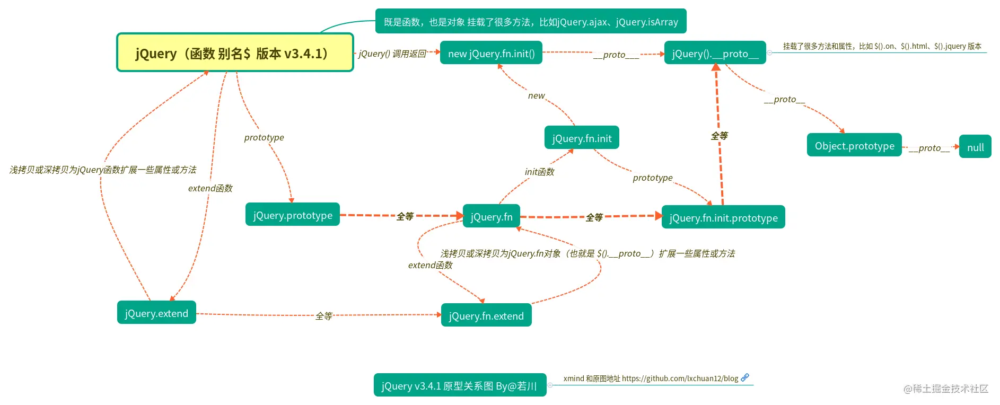

## 自执行匿名函数

```javaScript
(function(global, factory){

})(typeof window !== "underfined" ? window: this, function(window, noGlobal){
"use strict";
var
	version = "3.6.0",

	// 定义jQuery的本地副本
	jQuery = function( selector, context ) {};

  /**
   * 浏览器环境下，最后把$ 和 jQuery函数挂载到window上
   * 在外界就可以访问到 $ 和 jQuery 了
   *
   * 其中`noGlobal`参数只有在这里用到
  */
  if ( typeof noGlobal === "undefined" ) {
    window.jQuery = window.$ = jQuery;
  }
});
```

## 支持多种环境下使用 比如 commonjs、amd 规范

### commonjs 规范支持

```jaVaScript
// global是全局变量，factory 是函数
( function( global, factory ) {

 //  使用严格模式
 "use strict";
 // Commonjs 或者 CommonJS-like  环境
 if ( typeof module === "object" && typeof module.exports === "object" ) {
  // 如果存在global.document 则返回factory(global, true);
  module.exports = global.document ?
   factory( global, true ) :
   function( w ) {
    if ( !w.document ) {
     throw new Error( "jQuery requires a window with a document" );
    }
    return factory( w );
   };
 } else {
  factory( global );
 }

// 如果尚未定义窗口，则传递此消息
// 第一个参数判断 window，存在返回 window，不存在返回 this
} )( typeof window !== "undefined" ? window : this, function( window, noGlobal ) {});
```

### amd 规范 主要代表 requirejs

```javaScript
if ( typeof define === "function" && define.amd ) {
 define( "jquery", [], function() {
  return jQuery;
 } );
}
```

## 无 new 构造

```javaScript
	var
		version = "3.6.0",

		// 定义 jQuery 的本地副本
		jQuery = function( selector, context ) {
      // jQuery 对象实际上只是“增强 enhanced ”的初始化构造函数
      // 如果 jQuery 被调用，则需要 init（如果不包含则允许抛出错误）
      // 返回new之后的对象
      return new jQuery.fn.init(selector, context);
    };

	// fn === function 不是 函数 而是 功能
	jQuery.fn = jQuery.prototype = {
    // 当前使用的 jQuery 版本
    jquery: version,
    // 修正构造器为jQuery
    constructor: jQuery,

    // jQuery 对象的默认长度为 0
    length: 0,
  };

  init = jQuery.fn.init = function( selector, context, root ) {
    if ( !selector ) {
      return this;
    }
	};

  // 为init函数提供jQuery原型，以便以后实例化
	init.prototype = jQuery.fn;
```

```javaScript
jQuery.fn === jQuery.prototype;  // true
init = jQuery.fn.init;
init.prototype = jQuery.fn;
// 也就是
jQuery.fn.init.prototype === jQuery.fn;  // true
jQuery.fn.init.prototype === jQuery.prototype;  // true
```



`Vue` 源码中，也跟 `jQuery` 类似，执行的是 `Vue.prototype._init` 方法。

```javaScript
function Vue (options) {
 if (!(this instanceof Vue)
 ) {
  warn('Vue is a constructor and should be called with the `new` keyword');
 }
 this._init(options);
}
initMixin(Vue);
function initMixin (Vue) {
 Vue.prototype._init = function (options) {};
};
```

## 核心函数之一 extend

jQuery 中一个重要的函数便是 extend，既可以对本身 jQuery 的属性和方法进行扩张，又可以对原型的属性和方法进行扩展。

extend 函数的功能，大概有两种，如果参数只有一个 object，即表示将这个对象扩展到 jQuery 的命名空间中，也就是所谓的 jQuery 的扩展。如果函数接收了多个 object，则表示一种属性拷贝，将后面多个对象的属性全拷贝到第一个对象上，这其中，还包括深拷贝，即非引用拷贝，第一个参数如果是 true 则表示深拷贝。

```javaScript
	/**
   *  jQuery 3 之后的 extend 函数源码
   *
   * $.extend的用法。 第一个参数是决定是否需要深复制。 由 true, false。 默认是浅复制
   * @params options => 接收传递过来的arguments 的中间参数
   * @params name => 没对对象的key值
   * @params src => 当传递的对象key值相同到时候。要和并
   * @params copy => 复制的value 值
   * @params copyIsArray => 判断value对象是不是数组
   * @params clone => 当深度复制的时候。需要新建一个变量。不会改变原始的值
   * @params target =>  最开始是默认值是取传进来的第一个参数。
   *                    过后往后一直跳。$.extend(a,b,c); target 为 a, 为b,为c
   * @params i => 决定当前target 等于参数中的某个值
   * @params length =>
   * @params deep => 默认是false 是决定是否需要深复制的参数。true 是深复制。false 是浅复制
*/
jQuery.extend = jQuery.fn.extend = function() {
  var options, name, src, copy, copyIsArray, clone,
    target = arguments[ 0 ] || {},
    i = 1,
    length = arguments.length,
    deep = false;

  // 判断 target 来决定是否 深复制
  if ( typeof target === "boolean" ) {
    deep = target;

    // 当深复制的时候，需要跳过第一个参数。来循环传进来的参数。 刚开始 1,2,3
    target = arguments[ i ] || {};
    i++;
  }

  // 当 target 不是一个对象且不是一个函数对象这个时候就把target 变为空对象。
  if ( typeof target !== "object" && !isFunction( target ) ) {
    target = {};
  }

  // 判断是否 jQuery 的扩展
  // 如果传递过来的参数只有一个的情况下。target 就是该参数。
  if ( i === length ) {
    target = this; // this 做一个标记，可以指向 jQuery，也可以指向 jQuery.fn
    i--;
  }

  for ( ; i < length; i++ ) {

    // 处理非空 或者 undefined 的情况。   null == null 。 undefined == null;
    //options  是来接收除了第一个参数外的所有参数。中间桥梁的作用吧
    if ( ( options = arguments[ i ] ) != null ) {

      // name in options 决定了 传过来的值必须是对象。如果不是对象的话。将要被拆分
      for ( name in options ) {
        copy = options[ name ];

        // 防止 Object.prototype 污染
        // 防止永无止境的循环
        if ( name === "__proto__" || target === copy ) {
          continue;
        }

        // 深拷贝，且被拷贝对象是 object 或 array
        // 这是深拷贝的重点
        if ( deep && copy && ( jQuery.isPlainObject( copy ) ||
          ( copyIsArray = Array.isArray( copy ) ) ) ) {
          src = target[ name ];

          // 确保源值的正确类型
          if ( copyIsArray && !Array.isArray( src ) ) {
            clone = [];
          } else if ( !copyIsArray && !jQuery.isPlainObject( src ) ) {
            clone = {};
          } else {
            clone = src;
          }
          copyIsArray = false;

          // 创建新对象。来进行深度复制。
          target[ name ] = jQuery.extend( deep, clone, copy );

        //除了对象数组，和 undefined 的值。
        } else if ( copy !== undefined ) {
          target[ name ] = copy;
        }
      }
    }
  }

  // Return the modified object
  return target;
};
```

```javaScript
// 判断参数是否是函数
var isFunction = function isFunction( obj ) {
  return typeof obj === "function" && typeof obj.nodeType !== "number" && typeof obj.item !== "function";
};


jQuery.extend( {
  // 测试对象是否是纯粹的对象（通过 "{}" 或者 "new Object" 创建的）
  isPlainObject: function( obj ) {
			var proto, Ctor;

			// 检测明显的负面信息
			// 使用toString而不是jQuery.type来捕获主机对象
			if ( !obj || toString.call( obj ) !== "[object Object]" ) {
				return false;
			}

			proto = getProto( obj );

			// 没有原型的对象（例如，`Object.create（null）`）是普通的
			if ( !proto ) {
				return true;
			}

			// 原型对象是由全局对象函数构造的普通对象
			Ctor = hasOwn.call( proto, "constructor" ) && proto.constructor;
			return typeof Ctor === "function" && fnToString.call( Ctor ) === ObjectFunctionString;
	},
} )
```

## 链式调用

`jQuery` 能够链式调用是因为一些函数执行结束后 `return this`。 比如 `jQuery` 源码中的 `addClass`、`removeClass`、`toggleClass`。

## jQuery.noConflict 很多 js 库都会有的防冲突函数

```javaScript
	var

		// 覆盖时映射到 jQuery
    _jQuery = window.jQuery,
    // 覆盖时映射到 $
    _$ = window.$;

	jQuery.noConflict = function( deep ) {
		if ( window.$ === jQuery ) {
			window.$ = _$;
		}

		if ( deep && window.jQuery === jQuery ) {
			window.jQuery = _jQuery;
		}

		return jQuery;
	};
```

[学习 jQuery 源码整体架构，打造属于自己的 js 类库](https://juejin.cn/post/6844903902077272071)
